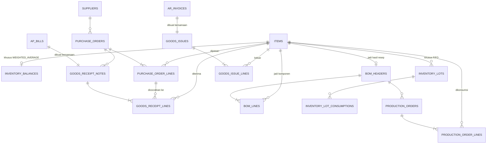

# Inventory — Schema (Finalized)

Fase 5 roadmap. Ref konsep bisnis: `docs/domain/human/inventory.md` + `docs/domain/ai/inventory.md`. Ref seed/skenario: `docs/story/inventory.md`. Ref schema yang di-reuse: `docs/architecture/data/journal-entry-schema.md` (RPC `create_journal_entry`, fungsi `set_updated_at()`+`block_edit_delete()`), `docs/architecture/data/ap-schema.md` (`ap_bills`+`create_ap_bill`, **0 perubahan**), `docs/architecture/data/ar-schema.md` (`ar_invoices`+`create_ar_invoice`, **0 perubahan**). Migration: `supabase/migrations/0012_inventory_schema.sql`.

DDL final di bawah, ERD & keputusan desain gak berubah dari revisi sebelumnya.

## Keputusan Desain

- **`ap_bills`/`ar_invoices` tetap lump-sum, gak diubah sama sekali.** Rincian barang (qty & harga satuan) ditaruh di tabel baru (`goods_receipt_notes`/`goods_issues`) yang **nunjuk balik** ke bill/invoice yang sudah ada, bukan mengubah strukturnya. Alasan: dua tabel itu immutable & sudah punya data histori — mengubah strukturnya berarti migrasi data lama + bongkar UI yang sudah jalan, resiko besar buat manfaat yang bisa dicapai tanpa itu.
- **Goods Receipt Note (GRN) dan Bill dibuat bersamaan** (1 RPC, 1 langkah) — asumsi proses pembelian informal (nota = bukti kirim + tagihan sekaligus, gak ada jeda waktu antara barang datang dan tagihan resmi). Ini menghindari kebutuhan akun perantara "Barang Diterima Belum Ditagih" (GR/IR clearing) yang dipakai ERP besar buat kasus barang datang duluan tagihan nyusul — dicatat sebagai scope-debt kalau nanti dibutuhkan.
- **3-way matching cuma di sisi pembelian (PO → GRN → Bill), gak ada Sales Order di sisi jual.** Sisi jual cuma 2 dokumen: Invoice (sudah ada) + Goods Issue (baru, dibuat bersamaan dengan invoice, sama pola GRN+Bill). Sales Order (mirror PO) dicatat scope-debt — di luar scope Inventory, itu ranah modul Procurement/Sales (Fase 9).
- **Metode costing (FIFO/Weighted Average) ditentukan per `items.costing_method`**, bukan 1 metode global — mendukung dua-duanya sekaligus di sistem yang sama, item berbeda boleh pakai metode berbeda.
- **`inventory_lots` cuma dipakai item FIFO. `inventory_balances` cuma dipakai item WEIGHTED_AVERAGE.** Nama keduanya sengaja disamain prefix-nya (`inventory_`) — dua-duanya "sejenis" (nyimpen state costing), cuma beda mekanisme sesuai metode. Ini satu-satunya state **tersimpan** (bukan derived) di seluruh modul Inventory — beda dari pola dominan project ini (status AR/AP selalu derived dari query). Alasannya: rata-rata berjalan (`new_avg = (qty_before×avg_before + qty_in×unit_cost_in) / (qty_before+qty_in)`) itu rekursif — gak bisa diringkas jadi 1 agregat SQL sederhana kayak `SUM(debit)-SUM(credit)` atau `SUM(allocations)`, harus dihitung incremental tiap transaksi. FIFO sebaliknya tetap ngikutin pola derived: qty tersisa per lot = `qty_in - SUM(inventory_lot_consumptions.qty)`, gak perlu kolom `qty_remaining` tersimpan.
- **Penamaan tabel: master data gak pakai prefix modul, transaksional pakai.** Pola ini udah established di AR/AP (`customers`/`suppliers` polos, tapi `ar_invoices`/`ap_bills` pakai prefix). `items` konsisten sama pola itu (master data, polos). `inventory_lots`, `inventory_lot_consumptions`, `inventory_balances` konsisten pakai prefix `inventory_` (transaksional/state). Tabel lain (`purchase_orders`, `goods_receipt_notes`, `bom_headers`, `production_orders`, `goods_issues`, dst) gak butuh prefix tambahan — namanya udah unik & jelas sendiri, gak ada modul lain yang bisa nabrak makna.
- **BOM (`bom_headers`/`bom_lines`) adalah master data mutable**, bukan transaksional immutable — resep boleh direvisi. Ini aman karena `production_orders`/`production_order_lines` **snapshot** qty & biaya aktual pas produksi terjadi (gak look-up ulang ke `bom_lines` di kemudian hari) — pola sama seperti `due_date` di AR/AP yang snapshot dari `payment_term_days` pas insert, gak retroaktif kalau master data berubah belakangan.
- **Purchase Order gak bikin journal entry.** PO murni komitmen/rencana, belum ada pertukaran aset/liability — journal entry baru muncul pas GRN+Bill dibuat.

## ERD



## Entity — Master Data

### `items`

Master data barang yang di-track Inventory — bisa bahan baku (`RAW_MATERIAL`) atau barang jadi (`FINISHED_GOOD`). Kolom penting:
- `costing_method` — `FIFO` atau `WEIGHTED_AVERAGE`, ditentukan per item, konsisten (gak boleh gonta-ganti tanpa revaluasi formal, ref `inventory.md` constraint #2).
- `uom` — satuan (kg, gram, pcs, dst), murni informasi tampilan/dokumentasi, gak ada konversi antar-satuan di scope ini.
- `inventory_account_id` — FK ke `accounts` (COA), akun **kontrol** (misal "Persediaan Bahan Baku" / "Persediaan Barang Jadi"). Satu akun ini menaungi banyak item sekaligus — detail per-item hidup di subledger Inventory (`items`+lot/balance), bukan sebagai akun terpisah per item di COA (pola sama `ar_invoices`/`customers`: 1 akun "Piutang Usaha" menaungi banyak customer).
- `archived_at` — pola sama `customers`/`suppliers` (`state-naming-convention.md`), item lama gak boleh dihapus keras.

```sql
create table items (
  id uuid primary key default gen_random_uuid(),
  name text not null,
  item_type text not null check (item_type in ('RAW_MATERIAL','FINISHED_GOOD')),
  costing_method text not null check (costing_method in ('FIFO','WEIGHTED_AVERAGE')),
  uom text not null,
  inventory_account_id uuid not null references accounts(id),
  archived_at timestamptz,
  created_at timestamptz not null default now(),
  updated_at timestamptz not null default now()
);

create trigger items_set_updated_at
  before update on items
  for each row execute function set_updated_at();
```

### `inventory_balances`

**Cuma ada baris buat item `WEIGHTED_AVERAGE`.** Nyimpen `qty_on_hand` dan `avg_cost` yang di-update tiap ada penerimaan (avg_cost berubah) atau konsumsi/penjualan (qty_on_hand berkurang, avg_cost tetap). Ini pengecualian sengaja dari pola "derived, bukan stored" yang dipegang di modul lain (lihat "Keputusan Desain" di atas kenapa gak bisa di-derive). PK-nya `item_id` sendiri (bukan `id` terpisah) — struktural mastiin maksimal 1 baris per item, gak butuh `unique` constraint tambahan.

```sql
create table inventory_balances (
  item_id uuid primary key references items(id),
  qty_on_hand numeric(14,3) not null default 0 check (qty_on_hand >= 0),
  avg_cost numeric(14,2) not null default 0,
  updated_at timestamptz not null default now()
);
```

## Entity — Procurement (PO → GRN+Bill)

### `purchase_orders` + `purchase_order_lines`

Komitmen pesan ke supplier — **belum ada journal entry**. Header (`supplier_id`, `po_date`, `expected_date`, `source_ref`) + lines (`item_id`, `qty_ordered`, `unit_cost_expected`). Status (`OPEN`/`PARTIALLY_RECEIVED`/`FULLY_RECEIVED`/`CANCELLED`) derived dari perbandingan `SUM(goods_receipt_lines.qty_received)` per line vs `qty_ordered` — pola sama status invoice AR/AP. Immutable (reuse `block_edit_delete`) — koreksi PO cukup bikin PO baru, gak ada retur/edit di scope ini.

```sql
create table purchase_orders (
  id uuid primary key default gen_random_uuid(),
  supplier_id uuid not null references suppliers(id),
  po_date date not null,
  expected_date date,
  source_ref text not null,
  created_by uuid references auth.users(id),
  created_at timestamptz not null default now()
);

create trigger purchase_orders_block_edit_delete
  before update or delete on purchase_orders
  for each row execute function block_edit_delete();

create table purchase_order_lines (
  id uuid primary key default gen_random_uuid(),
  purchase_order_id uuid not null references purchase_orders(id) on delete cascade,
  item_id uuid not null references items(id),
  qty_ordered numeric(14,3) not null check (qty_ordered > 0),
  unit_cost_expected numeric(14,2) not null check (unit_cost_expected > 0)
);

create trigger purchase_order_lines_block_edit_delete
  before update or delete on purchase_order_lines
  for each row execute function block_edit_delete();
```

### `goods_receipt_notes` + `goods_receipt_lines`

Bukti penerimaan fisik — **wajib nunjuk `po_id` (3-way matching) dan `bill_id` (dibuat bersamaan)**. Kolom `delivery_note_ref` (nomor Surat Jalan dari supplier) murni referensi teks, gak jadi entity/ledger tersendiri — Surat Jalan itu dokumen fisik, bukan kejadian akuntansi yang butuh tracking state sendiri. Lines mencatat `qty_received` & `unit_cost` **riil** (bisa beda dari `unit_cost_expected` di PO line — selisih ini informasional/reporting, gak diblokir keras, cuma qty yang dijaga trigger anti-over-receipt terhadap `purchase_order_lines.qty_ordered`). Immutable (reuse `block_edit_delete`), sama pola `ar_invoices`/`ap_bills`.

Insert `goods_receipt_lines` inilah yang **memicu** penambahan Persediaan: bikin baris baru di `inventory_lots` (item FIFO) atau update `inventory_balances` (item Weighted Average).

```sql
create table goods_receipt_notes (
  id uuid primary key default gen_random_uuid(),
  purchase_order_id uuid not null references purchase_orders(id),
  bill_id uuid not null references ap_bills(id),
  delivery_note_ref text,
  receipt_date date not null,
  created_by uuid references auth.users(id),
  created_at timestamptz not null default now()
);

create trigger goods_receipt_notes_block_edit_delete
  before update or delete on goods_receipt_notes
  for each row execute function block_edit_delete();

create table goods_receipt_lines (
  id uuid primary key default gen_random_uuid(),
  grn_id uuid not null references goods_receipt_notes(id) on delete cascade,
  po_line_id uuid not null references purchase_order_lines(id),
  item_id uuid not null references items(id),
  qty_received numeric(14,3) not null check (qty_received > 0),
  unit_cost numeric(14,2) not null check (unit_cost > 0)
);

create trigger goods_receipt_lines_block_edit_delete
  before update or delete on goods_receipt_lines
  for each row execute function block_edit_delete();
```

Trigger anti-over-receipt — menolak `qty_received` yang bikin total penerimaan per PO line ngelewatin `qty_ordered`:

```sql
create function goods_receipt_lines_no_over_receipt() returns trigger as $$
declare
  v_qty_ordered numeric;
  v_qty_received numeric;
begin
  select qty_ordered into v_qty_ordered from purchase_order_lines where id = new.po_line_id;
  select coalesce(sum(qty_received), 0) into v_qty_received
    from goods_receipt_lines where po_line_id = new.po_line_id;

  if v_qty_received + new.qty_received > v_qty_ordered then
    raise exception 'Penerimaan line % melebihi qty_ordered (sisa %, coba terima %)',
      new.po_line_id, v_qty_ordered - v_qty_received, new.qty_received;
  end if;

  return new;
end;
$$ language plpgsql;

create trigger goods_receipt_lines_no_over_receipt_trigger
  before insert on goods_receipt_lines
  for each row execute function goods_receipt_lines_no_over_receipt();
```

## Entity — Costing Mechanism

Dua tabel di bagian ini gampang keketuker karena sekilas kelihatan "ngurus hal yang sama". Bedanya paling gampang diinget lewat **arah**, bukan lewat modul asalnya:

| Tabel | Arah | Fungsi |
|---|---|---|
| `inventory_lots` | **MASUK** — qty item bertambah | Nyatet setiap kali stok baru "lahir", dari mana pun asalnya |
| `inventory_lot_consumptions` | **KELUAR** — qty item berkurang | Nyatet setiap kali qty di suatu lot dipakai/dikurangi, buat alasan apa pun |

Kedua tabel ini masing-masing punya kolom tipe (`source_type` di `inventory_lots`, `consumption_type` di `inventory_lot_consumptions`) yang **sama-sama bisa bernilai "produksi"** — ini akar kebingungan yang paling sering muncul, jadi sengaja dua value itu dikasih nama **beda & eksplisit arahnya**, bukan dipakein 1 kata generik `PRODUCTION` di kedua tempat:

| Kejadian | Tabel yang kesentuh | Value | Kenapa |
|---|---|---|---|
| Bahan baku diterima dari supplier (GRN) | `inventory_lots` | `PURCHASE_RECEIPT` | Lot **lahir** dari penerimaan pembelian |
| Barang jadi dihasilkan dari production order | `inventory_lots` | `PRODUCTION_OUTPUT` | Lot **lahir** dari hasil produksi |
| Bahan baku dipakai buat jalanin resep | `inventory_lot_consumptions` | `PRODUCTION_INPUT` | Qty bahan baku **dipakai sebagai input** produksi |
| Barang jadi keluar karena terjual | `inventory_lot_consumptions` | `SALES_ISSUE` | Qty barang jadi **keluar karena dijual** |

Satu production order selalu menyentuh 2 baris di 2 tabel berbeda sekaligus: 1 baris `PRODUCTION_INPUT` di `inventory_lot_consumptions` (bahan baku yang "masuk" ke proses produksi, qty-nya berkurang dari lot lama), dan 1 baris `PRODUCTION_OUTPUT` di `inventory_lots` (barang jadi yang "keluar" dari proses produksi, jadi lot baru). Sama-sama gara-gara 1 production order, tapi dari 2 arah yang berlawanan.

### `inventory_lots`

**Cuma dipakai item FIFO.** 1 baris = 1 lapisan/batch (`source_type`: `PURCHASE_RECEIPT` lewat GRN, atau `PRODUCTION_OUTPUT` lewat production order — barang jadi juga bisa FIFO). `qty_in` & `unit_cost` gak pernah berubah setelah insert (immutable). **Gak ada kolom `qty_remaining`** — dihitung derived (`qty_in - SUM(inventory_lot_consumptions.qty)` buat lot itu), pola sama status invoice AR/AP.

```sql
create table inventory_lots (
  id uuid primary key default gen_random_uuid(),
  item_id uuid not null references items(id),
  source_type text not null check (source_type in ('PURCHASE_RECEIPT','PRODUCTION_OUTPUT')),
  source_ref uuid not null,
  qty_in numeric(14,3) not null check (qty_in > 0),
  unit_cost numeric(14,2) not null check (unit_cost > 0),
  lot_date date not null,
  created_at timestamptz not null default now()
);

create trigger inventory_lots_block_edit_delete
  before update or delete on inventory_lots
  for each row execute function block_edit_delete();
```

### `inventory_lot_consumptions`

Jembatan konsumsi — 1 baris = "lot X diambil sejumlah Y buat konsumsi Z" (`consumption_type`: `PRODUCTION_INPUT` atau `SALES_ISSUE`, `consumption_ref` nunjuk ke `production_order_id` atau `goods_issue_id` — **sengaja gak di-FK**, polymorphic, bisa nunjuk ke salah satu dari dua tabel beda tergantung `consumption_type`). Trigger anti-over-consumption: total konsumsi per lot gak boleh melebihi `qty_in`-nya — pola identik `ar_payment_allocations_no_over_allocation`, cuma objeknya kuantitas barang, bukan uang.

```sql
create table inventory_lot_consumptions (
  id uuid primary key default gen_random_uuid(),
  lot_id uuid not null references inventory_lots(id),
  consumption_type text not null check (consumption_type in ('PRODUCTION_INPUT','SALES_ISSUE')),
  consumption_ref uuid not null,
  qty numeric(14,3) not null check (qty > 0),
  created_at timestamptz not null default now()
);

create trigger inventory_lot_consumptions_block_edit_delete
  before update or delete on inventory_lot_consumptions
  for each row execute function block_edit_delete();

create function inventory_lot_consumptions_no_over_consumption() returns trigger as $$
declare
  v_qty_in numeric;
  v_qty_consumed numeric;
begin
  select qty_in into v_qty_in from inventory_lots where id = new.lot_id;
  select coalesce(sum(qty), 0) into v_qty_consumed
    from inventory_lot_consumptions where lot_id = new.lot_id;

  if v_qty_consumed + new.qty > v_qty_in then
    raise exception 'Konsumsi lot % melebihi qty_in (sisa %, coba konsumsi %)',
      new.lot_id, v_qty_in - v_qty_consumed, new.qty;
  end if;

  return new;
end;
$$ language plpgsql;

create trigger inventory_lot_consumptions_no_over_consumption_trigger
  before insert on inventory_lot_consumptions
  for each row execute function inventory_lot_consumptions_no_over_consumption();
```

## Entity — Production (BOM)

### `bom_headers` + `bom_lines`

Resep — master data mutable (bukan transaksional). Header: `finished_item_id`, `output_qty` (qty barang jadi per 1 batch resep), `is_active`. Lines: `raw_material_item_id`, `qty_per_batch`. Boleh direvisi kapan pun — produksi yang sudah terjadi gak retroaktif berubah karena `production_order_lines` snapshot angka aktual, bukan look-up ulang ke sini. `bom_headers` cukup `update` (nonaktifin lewat `is_active`, gak perlu hapus baris); `bom_lines` boleh `delete` (ganti komposisi resep = hapus+tambah baris, wajar buat master data mutable).

```sql
create table bom_headers (
  id uuid primary key default gen_random_uuid(),
  finished_item_id uuid not null references items(id),
  output_qty numeric(14,3) not null check (output_qty > 0),
  is_active boolean not null default true,
  created_at timestamptz not null default now(),
  updated_at timestamptz not null default now()
);

create trigger bom_headers_set_updated_at
  before update on bom_headers
  for each row execute function set_updated_at();

create table bom_lines (
  id uuid primary key default gen_random_uuid(),
  bom_header_id uuid not null references bom_headers(id) on delete cascade,
  raw_material_item_id uuid not null references items(id),
  qty_per_batch numeric(14,3) not null check (qty_per_batch > 0)
);
```

### `production_orders` + `production_order_lines`

Kejadian produksi beneran. Header: `bom_header_id`, `qty_produced`, `production_date`, **`journal_entry_id`** (wajib, dibuat via `create_journal_entry`: Debit Persediaan Barang Jadi, Kredit Persediaan Bahan Baku, di level akun kontrol — bukan per-item). Lines: snapshot tiap bahan baku yang dikonsumsi (`item_id`, `qty_consumed`, `total_cost` — hasil dari FIFO lot consumption atau Weighted Average lookup, tergantung `costing_method` bahan itu). Immutable (reuse `block_edit_delete`).

```sql
create table production_orders (
  id uuid primary key default gen_random_uuid(),
  bom_header_id uuid not null references bom_headers(id),
  qty_produced numeric(14,3) not null check (qty_produced > 0),
  production_date date not null,
  source_ref text not null,
  journal_entry_id uuid not null references journal_entries(id),
  created_by uuid references auth.users(id),
  created_at timestamptz not null default now()
);

create trigger production_orders_block_edit_delete
  before update or delete on production_orders
  for each row execute function block_edit_delete();

create table production_order_lines (
  id uuid primary key default gen_random_uuid(),
  production_order_id uuid not null references production_orders(id) on delete cascade,
  item_id uuid not null references items(id),
  qty_consumed numeric(14,3) not null check (qty_consumed > 0),
  total_cost numeric(14,2) not null check (total_cost > 0)
);

create trigger production_order_lines_block_edit_delete
  before update or delete on production_order_lines
  for each row execute function block_edit_delete();
```

## Entity — Sales (Goods Issue → HPP)

### `goods_issues` + `goods_issue_lines`

Kebalikan GRN — barang jadi **keluar** karena terjual. Header: **wajib nunjuk `invoice_id`** (dibuat bersamaan dengan `ar_invoices`, sama pola GRN+Bill), **`journal_entry_id`** (Debit HPP, Kredit Persediaan Barang Jadi — **jurnal tambahan**, terpisah dari jurnal invoice yang sudah ada Debit Piutang/Kredit Pendapatan). Lines: `item_id` (barang jadi), `qty_issued`, `total_cost` (dari FIFO consumption atau Weighted Average, sama mekanisme `production_order_lines`). Immutable (reuse `block_edit_delete`).

```sql
create table goods_issues (
  id uuid primary key default gen_random_uuid(),
  invoice_id uuid not null references ar_invoices(id),
  journal_entry_id uuid not null references journal_entries(id),
  issue_date date not null,
  source_ref text not null,
  created_by uuid references auth.users(id),
  created_at timestamptz not null default now()
);

create trigger goods_issues_block_edit_delete
  before update or delete on goods_issues
  for each row execute function block_edit_delete();

create table goods_issue_lines (
  id uuid primary key default gen_random_uuid(),
  goods_issue_id uuid not null references goods_issues(id) on delete cascade,
  item_id uuid not null references items(id),
  qty_issued numeric(14,3) not null check (qty_issued > 0),
  total_cost numeric(14,2) not null check (total_cost > 0)
);

create trigger goods_issue_lines_block_edit_delete
  before update or delete on goods_issue_lines
  for each row execute function block_edit_delete();
```

## RPC (stock-affecting write — atomik)

### `create_purchase_order` — bikin PO + lines sekaligus

Murni insert, **gak ada journal entry** (PO cuma komitmen — lihat "Keputusan Desain").

```sql
create function create_purchase_order(
  p_supplier_id uuid, p_po_date date, p_expected_date date, p_source_ref text,
  p_lines jsonb -- array of {"item_id":uuid,"qty_ordered":numeric,"unit_cost_expected":numeric}
) returns uuid language plpgsql security invoker as $$ ... $$;
```

Full body: `supabase/migrations/0012_inventory_schema.sql`.

### `create_goods_receipt` — GRN + Bill + update Persediaan sekaligus

Titik paling padat di modul ini — 1 pemanggilan RPC memicu 4 hal atomik: (1) hitung total amount dari lines, (2) panggil `create_ap_bill` (reuse, **0 perubahan**) buat bikin bill+jurnal utang, (3) insert `goods_receipt_notes`+`goods_receipt_lines`, (4) per line: kalau item FIFO insert `inventory_lots` baru, kalau Weighted Average hitung ulang `avg_cost` & update `inventory_balances`. Trigger `goods_receipt_lines_no_over_receipt` (anti-over-receipt qty vs PO) jalan otomatis pas langkah (3).

```sql
create function create_goods_receipt(
  p_purchase_order_id uuid, p_receipt_date date, p_delivery_note_ref text,
  p_lines jsonb, -- array of {"po_line_id":uuid,"item_id":uuid,"qty_received":numeric,"unit_cost":numeric}
  p_bill_description text, p_bill_source_ref text,
  p_debit_account_id uuid, p_payable_account_id uuid
) returns uuid language plpgsql security invoker as $$ ... $$;
```

Full body: `supabase/migrations/0012_inventory_schema.sql`.

### `consume_fifo` / `consume_weighted_average` — helper konsumsi, dipakai 2 arah

Dua fungsi generik (bukan RPC yang dipanggil langsung dari client, tapi dipanggil dari dalam `create_production_order`/`create_goods_issue`) — satu-satunya tempat logika FIFO/Weighted Average konsumsi ditulis, biar production-input dan sales-issue gak duplikat logika. `consume_fifo` jalan lot demi lot (urut `lot_date`, `created_at` — yang lama duluan), insert `inventory_lot_consumptions` per lot yang kesentuh, tembus ke lot berikutnya kalau 1 lot gak cukup (persis pola Tahap 4/7 di `inventory.md`). `consume_weighted_average` cukup kurangin `qty_on_hand` langsung, `avg_cost` gak berubah pas konsumsi (cuma berubah pas penerimaan baru).

Full body: `supabase/migrations/0012_inventory_schema.sql`.

### `create_production_order` — jalankan resep + jurnal produksi sekaligus

Ambil `bom_lines` dari `bom_header_id`, hitung `batch_multiplier = qty_produced / output_qty`, konsumsi tiap bahan baku (FIFO atau Weighted Average sesuai `costing_method`-nya), total biayanya jadi jurnal (Debit Persediaan Barang Jadi, Kredit Persediaan Bahan Baku), lalu barang jadi hasil produksi masuk sebagai lot baru (`PRODUCTION_OUTPUT`, kalau item itu FIFO) atau nambah `inventory_balances` (kalau Weighted Average). **Detail teknis**: `id` production order digenerate duluan (`gen_random_uuid()`) sebelum baris headernya di-insert, dipakai sebagai `consumption_ref` pas konsumsi jalan — perlu karena `production_order_lines` (yang FK ke header) baru bisa di-insert setelah total biaya (yang butuh hasil konsumsi) diketahui buat bikin jurnal duluan; header jurnal-dulu-baris-belakangan ini pola yang sama kayak `create_ap_bill`/`create_ar_invoice`, cuma di sini urutannya lebih panjang karena ada langkah konsumsi di tengah.

```sql
create function create_production_order(
  p_bom_header_id uuid, p_qty_produced numeric, p_production_date date, p_source_ref text,
  p_finished_good_debit_account_id uuid, p_raw_material_credit_account_id uuid
) returns uuid language plpgsql security invoker as $$ ... $$;
```

Full body: `supabase/migrations/0012_inventory_schema.sql`.

### `create_goods_issue` — invoice + konsumsi barang jadi + jurnal HPP sekaligus

Panggil `create_ar_invoice` (reuse, **0 perubahan**) dulu buat jurnal Debit Piutang/Kredit Pendapatan, lalu konsumsi tiap barang jadi yang terjual (FIFO atau Weighted Average), total biayanya jadi jurnal **kedua** (Debit HPP, Kredit Persediaan Barang Jadi — titik HPP diakui, `inventory.md` Tahap 7). Trik `id`-digenerate-duluan yang sama kayak `create_production_order`.

```sql
create function create_goods_issue(
  p_customer_id uuid, p_invoice_date date, p_description text, p_source_ref text,
  p_amount numeric, p_receivable_account_id uuid, p_revenue_account_id uuid,
  p_lines jsonb, -- array of {"item_id":uuid,"qty_issued":numeric}
  p_hpp_account_id uuid, p_finished_good_account_id uuid
) returns uuid language plpgsql security invoker as $$ ... $$;
```

Full body: `supabase/migrations/0012_inventory_schema.sql`.

## RLS Policy

Pola identik AR/AP: `select` terbuka semua `authenticated`, `insert` cuma `admin`/`accountant`. Tabel transaksional (`purchase_orders`+lines, `goods_receipt_notes`+lines, `inventory_lots`, `inventory_lot_consumptions`, `production_orders`+lines, `goods_issues`+lines) **gak ada policy update/delete** (immutable, 2 lapis proteksi sama kayak journal entry — RLS default-deny + trigger `block_edit_delete`). Master data mutable dapat policy `update` juga: `items` (+`archived_at` lewat update biasa, gak ada delete), `inventory_balances` (state yang di-update RPC), `bom_headers` (+`update` doang), `bom_lines` (+`update`/`delete` — komposisi resep boleh diubah bebas).

Detail lengkap tiap tabel: `supabase/migrations/0012_inventory_schema.sql`.

## Grant

```sql
grant select, insert, update on items to authenticated;
grant select, insert, update on inventory_balances to authenticated;
grant select, insert on purchase_orders to authenticated;
grant select, insert on purchase_order_lines to authenticated;
grant select, insert on goods_receipt_notes to authenticated;
grant select, insert on goods_receipt_lines to authenticated;
grant select, insert on inventory_lots to authenticated;
grant select, insert on inventory_lot_consumptions to authenticated;
grant select, insert, update on bom_headers to authenticated;
grant select, insert, update, delete on bom_lines to authenticated;
grant select, insert on production_orders to authenticated;
grant select, insert on production_order_lines to authenticated;
grant select, insert on goods_issues to authenticated;
grant select, insert on goods_issue_lines to authenticated;
```

## Belum Termasuk (dependency / di luar scope fase ini)

Detail lengkap tiap item: `docs/scope-debt/`.

- **Akun perantara "Barang Diterima Belum Ditagih" (GR/IR clearing)** — dibutuhkan kalau GRN dan Bill perlu terjadi di waktu berbeda (barang datang duluan, tagihan resmi nyusul).
- **Sales Order** — mirror PO di sisi jual, buat 3-way matching penuh di kedua arah (saat ini cuma di procurement).
- **Purchase price variance report** — laporan read-side (harga PO vs harga GRN beda), gak butuh tabel/kolom tambahan, digarap pas UI.
- **Tenaga kerja & overhead dalam biaya produksi** — `production_order_lines` saat ini cuma dari bahan baku, belum ada alokasi biaya tenaga kerja/overhead pabrik.
