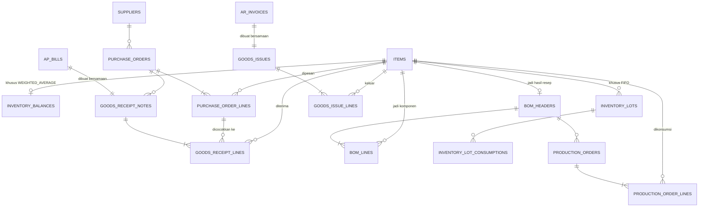

# Inventory — ERD (DDL menyusul)

Fase 5 roadmap. Ref konsep bisnis: `docs/domain/human/inventory.md` + `docs/domain/ai/inventory.md`. Ref seed/skenario: `docs/story/inventory.md`. Ref schema yang di-reuse: `docs/architecture/data/journal-entry-schema.md` (RPC `create_journal_entry`, fungsi `set_updated_at()`+`block_edit_delete()`), `docs/architecture/data/ap-schema.md` (`ap_bills`, **0 perubahan**), `docs/architecture/data/ar-schema.md` (`ar_invoices`, **0 perubahan**).

**Status dokumen ini: ERD (entity, relasi, FK, cardinality) sudah difinalkan lewat diskusi. DDL (`create table`, trigger, RPC, RLS) belum ditulis** — sesuai proses wajib `AGENTS.md` (ERD dulu, cek dampak, baru schema). Menyusul di revisi berikutnya file ini.

## Keputusan Desain

- **`ap_bills`/`ar_invoices` tetap lump-sum, gak diubah sama sekali.** Rincian barang (qty & harga satuan) ditaruh di tabel baru (`goods_receipt_notes`/`goods_issues`) yang **nunjuk balik** ke bill/invoice yang sudah ada, bukan mengubah strukturnya. Alasan: dua tabel itu immutable & sudah punya data histori — mengubah strukturnya berarti migrasi data lama + bongkar UI yang sudah jalan, resiko besar buat manfaat yang bisa dicapai tanpa itu.
- **Goods Receipt Note (GRN) dan Bill dibuat bersamaan** (1 RPC, 1 langkah) — asumsi proses pembelian informal (nota = bukti kirim + tagihan sekaligus, gak ada jeda waktu antara barang datang dan tagihan resmi). Ini menghindari kebutuhan akun perantara "Barang Diterima Belum Ditagih" (GR/IR clearing) yang dipakai ERP besar buat kasus barang datang duluan tagihan nyusul — dicatat sebagai scope-debt kalau nanti dibutuhkan.
- **3-way matching cuma di sisi pembelian (PO → GRN → Bill), gak ada Sales Order di sisi jual.** Sisi jual cuma 2 dokumen: Invoice (sudah ada) + Goods Issue (baru, dibuat bersamaan dengan invoice, sama pola GRN+Bill). Sales Order (mirror PO) dicatat scope-debt — di luar scope Inventory, itu ranah modul Procurement/Sales (Fase 9).
- **Metode costing (FIFO/Weighted Average) ditentukan per `items.costing_method`**, bukan 1 metode global — mendukung dua-duanya sekaligus di sistem yang sama, item berbeda boleh pakai metode berbeda.
- **`inventory_lots` cuma dipakai item FIFO. `inventory_balances` cuma dipakai item WEIGHTED_AVERAGE.** Nama keduanya sengaja disamain prefix-nya (`inventory_`) — dua-duanya "sejenis" (nyimpen state costing), cuma beda mekanisme sesuai metode. Ini satu-satunya state **tersimpan** (bukan derived) di seluruh modul Inventory — beda dari pola dominan project ini (status AR/AP selalu derived dari query). Alasannya: rata-rata berjalan (`new_avg = (qty_before×avg_before + qty_in×unit_cost_in) / (qty_before+qty_in)`) itu rekursif — gak bisa diringkas jadi 1 agregat SQL sederhana kayak `SUM(debit)-SUM(credit)` atau `SUM(allocations)`, harus dihitung incremental tiap transaksi. FIFO sebaliknya tetap ngikutin pola derived: qty tersisa per lot = `qty_in - SUM(inventory_lot_consumptions.qty)`, gak perlu kolom `qty_remaining` tersimpan.
- **Penamaan tabel: master data gak pakai prefix modul, transaksional pakai.** Pola ini udah established di AR/AP (`customers`/`suppliers` polos, tapi `ar_invoices`/`ap_bills` pakai prefix). `items` konsisten sama pola itu (master data, polos). `inventory_lots`, `inventory_lot_consumptions`, `inventory_balances` konsisten pakai prefix `inventory_` (transaksional/state). Tabel lain (`purchase_orders`, `goods_receipt_notes`, `bom_headers`, `production_orders`, `goods_issues`, dst) gak butuh prefix tambahan — namanya udah unik & jelas sendiri, gak ada modul lain yang bisa nabrak makna.
- **BOM (`bom_headers`/`bom_lines`) adalah master data mutable**, bukan transaksional immutable — resep boleh direvisi. Ini aman karena `production_orders`/`production_order_lines` **snapshot** qty & biaya aktual pas produksi terjadi (gak look-up ulang ke `bom_lines` di kemudian hari) — pola sama seperti `due_date` di AR/AP yang snapshot dari `payment_term_days` pas insert, gak retroaktif kalau master data berubah belakangan.
- **Purchase Order gak bikin journal entry.** PO murni komitmen/rencana, belum ada pertukaran aset/liability — journal entry baru muncul pas GRN+Bill dibuat.

## ERD

## Entity — Master Data

### `items`

Master data barang yang di-track Inventory — bisa bahan baku (`RAW_MATERIAL`) atau barang jadi (`FINISHED_GOOD`). Kolom penting:
- `costing_method` — `FIFO` atau `WEIGHTED_AVERAGE`, ditentukan per item, konsisten (gak boleh gonta-ganti tanpa revaluasi formal, ref `inventory.md` constraint #2).
- `uom` — satuan (kg, gram, pcs, dst), murni informasi tampilan/dokumentasi, gak ada konversi antar-satuan di scope ini.
- `inventory_account_id` — FK ke `accounts` (COA), akun **kontrol** (misal "Persediaan Bahan Baku" / "Persediaan Barang Jadi"). Satu akun ini menaungi banyak item sekaligus — detail per-item hidup di subledger Inventory (`items`+lot/balance), bukan sebagai akun terpisah per item di COA (pola sama `ar_invoices`/`customers`: 1 akun "Piutang Usaha" menaungi banyak customer).
- `archived_at` — pola sama `customers`/`suppliers` (`state-naming-convention.md`), item lama gak boleh dihapus keras.

### `inventory_balances`

**Cuma ada baris buat item `WEIGHTED_AVERAGE`.** Nyimpen `qty_on_hand` dan `avg_cost` yang di-update tiap ada penerimaan (avg_cost berubah) atau konsumsi/penjualan (qty_on_hand berkurang, avg_cost tetap). Ini pengecualian sengaja dari pola "derived, bukan stored" yang dipegang di modul lain (lihat "Keputusan Desain" di atas kenapa gak bisa di-derive).

## Entity — Procurement (PO → GRN+Bill)

### `purchase_orders` + `purchase_order_lines`

Komitmen pesan ke supplier — **belum ada journal entry**. Header (`supplier_id`, `po_date`, `expected_date`, `source_ref`) + lines (`item_id`, `qty_ordered`, `unit_cost_expected`). Status (`OPEN`/`PARTIALLY_RECEIVED`/`FULLY_RECEIVED`/`CANCELLED`) derived dari perbandingan `SUM(goods_receipt_lines.qty_received)` per line vs `qty_ordered` — pola sama status invoice AR/AP.

### `goods_receipt_notes` + `goods_receipt_lines`

Bukti penerimaan fisik — **wajib nunjuk `po_id` (3-way matching) dan `bill_id` (dibuat bersamaan)**. Kolom `delivery_note_ref` (nomor Surat Jalan dari supplier) murni referensi teks, gak jadi entity/ledger tersendiri — Surat Jalan itu dokumen fisik, bukan kejadian akuntansi yang butuh tracking state sendiri. Lines mencatat `qty_received` & `unit_cost` **riil** (bisa beda dari `unit_cost_expected` di PO line — selisih ini informasional/reporting, gak diblokir keras, cuma qty yang dijaga trigger anti-over-receipt terhadap `purchase_order_lines.qty_ordered`). Immutable (reuse `block_edit_delete`), sama pola `ar_invoices`/`ap_bills`.

Insert `goods_receipt_lines` inilah yang **memicu** penambahan Persediaan: bikin baris baru di `inventory_lots` (item FIFO) atau update `inventory_balances` (item Weighted Average).

## Entity — Costing Mechanism

Dua tabel di bagian ini gampang keketuker karena sekilas kelihatan "ngurus hal yang sama". Bedanya paling gampang diinget lewat **arah**, bukan lewat modul asalnya:

| Tabel | Arah | Fungsi |
|---|---|---|
| `inventory_lots` | **MASUK** — qty item bertambah | Nyatet setiap kali stok baru "lahir", dari mana pun asalnya |
| `inventory_lot_consumptions` | **KELUAR** — qty item berkurang | Nyatet setiap kali qty di suatu lot dipakai/dikurangi, buat alasan apa pun |

Kedua tabel ini masing-masing punya kolom tipe (`source_type` di `inventory_lots`, `consumption_type` di `inventory_lot_consumptions`) yang **sama-sama bisa bernilai "produksi"** — ini akar kebingungan yang paling sering muncul, jadi sengaja dua value itu dikasih nama **beda & eksplisit arahnya**, bukan dipakein 1 kata generik `PRODUCTION` di kedua tempat:

| Kejadian | Tabel yang kesentuh | Value | Kenapa |
|---|---|---|---|
| Bahan baku diterima dari supplier (GRN) | `inventory_lots` | `PURCHASE_RECEIPT` | Lot **lahir** dari penerimaan pembelian |
| Barang jadi dihasilkan dari production order | `inventory_lots` | `PRODUCTION_OUTPUT` | Lot **lahir** dari hasil produksi |
| Bahan baku dipakai buat jalanin resep | `inventory_lot_consumptions` | `PRODUCTION_INPUT` | Qty bahan baku **dipakai sebagai input** produksi |
| Barang jadi keluar karena terjual | `inventory_lot_consumptions` | `SALES_ISSUE` | Qty barang jadi **keluar karena dijual** |

Satu production order selalu menyentuh 2 baris di 2 tabel berbeda sekaligus: 1 baris `PRODUCTION_INPUT` di `inventory_lot_consumptions` (bahan baku yang "masuk" ke proses produksi, qty-nya berkurang dari lot lama), dan 1 baris `PRODUCTION_OUTPUT` di `inventory_lots` (barang jadi yang "keluar" dari proses produksi, jadi lot baru). Sama-sama gara-gara 1 production order, tapi dari 2 arah yang berlawanan.

### `inventory_lots`

**Cuma dipakai item FIFO.** 1 baris = 1 lapisan/batch (`source_type`: `PURCHASE_RECEIPT` lewat GRN, atau `PRODUCTION_OUTPUT` lewat production order — barang jadi juga bisa FIFO). `qty_in` & `unit_cost` gak pernah berubah setelah insert (immutable). **Gak ada kolom `qty_remaining`** — dihitung derived (`qty_in - SUM(inventory_lot_consumptions.qty)` buat lot itu), pola sama status invoice AR/AP.

### `inventory_lot_consumptions`

Jembatan konsumsi — 1 baris = "lot X diambil sejumlah Y buat konsumsi Z" (`consumption_type`: `PRODUCTION_INPUT` atau `SALES_ISSUE`, `consumption_ref` nunjuk ke `production_order_id` atau `goods_issue_id`). Trigger anti-over-consumption: total konsumsi per lot gak boleh melebihi `qty_in`-nya — pola identik `ar_payment_allocations_no_over_allocation`, cuma objeknya kuantitas barang, bukan uang.

## Entity — Production (BOM)

### `bom_headers` + `bom_lines`

Resep — master data mutable (bukan transaksional). Header: `finished_item_id`, `output_qty` (qty barang jadi per 1 batch resep), `is_active`. Lines: `raw_material_item_id`, `qty_per_batch`. Boleh direvisi kapan pun — produksi yang sudah terjadi gak retroaktif berubah karena `production_order_lines` snapshot angka aktual, bukan look-up ulang ke sini.

### `production_orders` + `production_order_lines`

Kejadian produksi beneran. Header: `bom_header_id`, `qty_produced`, `production_date`, **`journal_entry_id`** (wajib, dibuat via `create_journal_entry`: Debit Persediaan Barang Jadi, Kredit Persediaan Bahan Baku, di level akun kontrol — bukan per-item). Lines: snapshot tiap bahan baku yang dikonsumsi (`item_id`, `qty_consumed`, `total_cost` — hasil dari FIFO lot consumption atau Weighted Average lookup, tergantung `costing_method` bahan itu).

## Entity — Sales (Goods Issue → HPP)

### `goods_issues` + `goods_issue_lines`

Kebalikan GRN — barang jadi **keluar** karena terjual. Header: **wajib nunjuk `invoice_id`** (dibuat bersamaan dengan `ar_invoices`, sama pola GRN+Bill), **`journal_entry_id`** (Debit HPP, Kredit Persediaan Barang Jadi — **jurnal tambahan**, terpisah dari jurnal invoice yang sudah ada Debit Piutang/Kredit Pendapatan). Lines: `item_id` (barang jadi), `qty_issued`, `total_cost` (dari FIFO consumption atau Weighted Average, sama mekanisme `production_order_lines`).

## Belum Termasuk (dependency / di luar scope fase ini)

Detail lengkap tiap item: `docs/scope-debt/`.

- **Akun perantara "Barang Diterima Belum Ditagih" (GR/IR clearing)** — dibutuhkan kalau GRN dan Bill perlu terjadi di waktu berbeda (barang datang duluan, tagihan resmi nyusul).
- **Sales Order** — mirror PO di sisi jual, buat 3-way matching penuh di kedua arah (saat ini cuma di procurement).
- **Purchase price variance report** — laporan read-side (harga PO vs harga GRN beda), gak butuh tabel/kolom tambahan, digarap pas UI.
- **Tenaga kerja & overhead dalam biaya produksi** — `production_order_lines` saat ini cuma dari bahan baku, belum ada alokasi biaya tenaga kerja/overhead pabrik.
