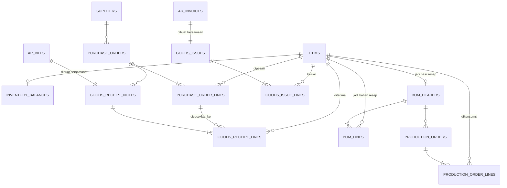

# Inventory — Struktur Data

Fase 5. Konsep bisnisnya ada di `docs/domain/inventory.md`. Skenario nyata: `docs/story/inventory.md`. Detail teknis penuh (DDL/RPC): `memory/architecture/data/inventory-schema.md`. Modul ini paling banyak tabelnya karena mencakup 3 alur sekaligus: beli bahan baku (procurement), produksi (mengubah bahan baku jadi barang jadi), dan jual (goods issue).

**Catatan:** metode costing FIFO sudah dihapus total dari sistem (migration `0038`). Sekarang cuma Rata-Rata Bergerak (Weighted Average) yang dipakai, berlaku untuk semua barang tanpa kecuali — tidak ada lagi pilihan metode per barang.

## Peta Data (ERD) — Ringkasan Semua Tabel

| Tabel | Fungsi | Terhubung ke |
|---|---|---|
| `items` | Master data barang yang dilacak — bahan baku atau barang jadi. Semua barang pakai metode hitung biaya yang sama: Rata-Rata Bergerak | `accounts` (akun kontrol Persediaan) |
| `inventory_balances` | Posisi stok tersimpan per barang — qty tersedia + harga rata-rata berjalan, satu-satunya state costing yang hidup di modul ini | `items` (1:1) |
| `purchase_orders` + `purchase_order_lines` | Komitmen pesan ke pemasok — belum ada transaksi jurnal | `suppliers`, `items` |
| `goods_receipt_notes` + `goods_receipt_lines` | Bukti barang benar-benar diterima — dibuat bersamaan dengan bill (tagihan) pemasok, memicu penambahan Persediaan | `purchase_orders`, tagihan pemasok (`ap_bills`), `items`, `inventory_balances` |
| `bom_headers` + `bom_lines` | Resep produksi: 1 barang jadi butuh bahan baku apa saja, berapa takarannya per 1 batch. Boleh direvisi kapan saja tanpa mengubah histori produksi yang sudah terjadi | `items` |
| `production_orders` + `production_order_lines` | Satu kejadian produksi nyata: mengonsumsi bahan baku sesuai resep, menghasilkan barang jadi, dan ke transaksi jurnal yang otomatis dibuat | `bom_headers`, `items`, `inventory_balances`, transaksi jurnal |
| `goods_issues` + `goods_issue_lines` | Barang jadi keluar karena terjual — dibuat bersamaan dengan invoice penjualan, dan ke transaksi jurnal khusus HPP yang otomatis dibuat | invoice penjualan (`ar_invoices`), `items`, `inventory_balances`, transaksi jurnal |

## Konsep Inti

**Peta Data (ERD)**

| Tabel | Fungsi | Terhubung ke |
|---|---|---|
| `items` | Master data barang yang dilacak — bahan baku atau barang jadi | `accounts` (akun kontrol Persediaan) |
| `inventory_balances` | Posisi stok tersimpan per barang — qty tersedia + harga rata-rata berjalan | `items` (1:1) |

**Struktur `items` & `inventory_balances`**

| Kolom | Isinya | Catatan |
|---|---|---|
| tipe barang | Bahan baku atau barang jadi | |
| satuan | Satuan tampilan (kg, pcs, dst) | Murni informasi, tidak ada konversi antar-satuan |
| akun Persediaan | Akun kontrol di COA yang menaungi barang ini | 1 akun bisa menaungi banyak barang — detail per-barang hidup di modul Inventory sendiri, bukan akun terpisah per barang |
| qty tersedia | Sisa stok saat ini | Berkurang tiap konsumsi/penjualan, bukan angka yang dihitung ulang dari histori tiap dibaca — **satu-satunya posisi di seluruh modul ini yang disimpan langsung**, bukan derived, karena harga rata-rata berjalan itu rekursif (tergantung nilai sebelumnya), tidak bisa diringkas jadi satu query agregat sederhana |
| harga rata-rata berjalan | Biaya per unit saat ini | Berubah tiap ada penerimaan barang baru (dihitung ulang dari campuran stok lama + stok masuk), tetap tidak berubah pas barang keluar/dikonsumsi |

**Metode costing: Rata-Rata Bergerak (Weighted Average), satu-satunya, berlaku ke semua barang** — sempat ada 2 metode (FIFO per-lot dan Rata-Rata Bergerak, dipilih per barang), FIFO sudah dihapus total dari sistem. Semua barang sekarang lewat mekanisme konsumsi stok yang sama.

**Alur Teknis (RPC)**

| Aksi | RPC | Efek | Guard |
|---|---|---|---|
| Konsumsi stok (dipakai submodule Produksi & Penjualan, bukan dipanggil langsung dari client) | Fungsi bersama konsumsi stok rata-rata | Mengurangi qty tersedia langsung, harga rata-rata berjalan tidak berubah saat konsumsi (cuma berubah saat penerimaan baru) — satu-satunya tempat logika konsumsi stok ditulis, dipakai bareng oleh Produksi maupun Penjualan biar tidak duplikat logika | Menolak konsumsi yang melebihi qty tersedia |

**Aturan Bisnis → RPC**

| Aturan (dari docs/domain) | Dijaga oleh |
|---|---|
| Semua barang pakai satu metode costing yang sama (Rata-Rata Bergerak) | Tidak ada lagi pilihan metode per barang — kolom pemilih metode sudah dihapus |
| Harga rata-rata berjalan dihitung incremental, bukan diringkas dari histori | Posisi stok disimpan langsung (bukan derived), di-update tiap transaksi lewat fungsi konsumsi/penerimaan bersama |
| Data master (barang) tetap boleh diubah kapan saja | Beda dari tabel transaksional lain di modul ini yang immutable — barang & posisi stoknya sendiri bukan catatan transaksi |

**Interaksi Antar Tabel**

| Tabel A | Relasi | Tabel B |
|---|---|---|
| `inventory_balances` | satu-ke-satu | `items` |
| `items` | dirujuk oleh semua submodule (Purchase Order, Produksi, Penjualan) | — |

## Purchase Order & Penerimaan Barang (3-Way Matching)

**Peta Data (ERD)**

| Tabel | Fungsi | Terhubung ke |
|---|---|---|
| `purchase_orders` + `purchase_order_lines` | Komitmen pesan ke pemasok. Belum ada transaksi jurnal — ini baru rencana, belum ada pertukaran aset | `suppliers`, `items` |
| `goods_receipt_notes` + `goods_receipt_lines` | Bukti barang benar-benar diterima. Dibuat bersamaan dengan bill (tagihan) pemasok — nota penerimaan barang dianggap sama waktunya dengan tagihan resmi, jadi tidak perlu akun perantara "barang diterima belum ditagih" | `purchase_orders`, `ap_bills`, `items`, `inventory_balances` |

**Alur Teknis (RPC)**

| Aksi | RPC | Efek | Guard |
|---|---|---|---|
| Buat Purchase Order | `create_purchase_order` | Insert header + baris pesanan. Tidak ada dampak keuangan atau stok sama sekali — baru komitmen | — |
| Catat penerimaan barang | `create_goods_receipt` | Sekaligus: (1) hitung total tagihan dari baris penerimaan, (2) buat tagihan pemasok (bill) sepadan + jurnal Debit Persediaan, Kredit Utang Usaha, (3) insert baris penerimaan, (4) update posisi stok tiap barang (harga rata-rata dihitung ulang) | Menolak penerimaan yang jumlahnya melebihi sisa yang masih dipesan di Purchase Order |

**Aturan Bisnis → RPC**

| Aturan (dari docs/domain) | Dijaga oleh |
|---|---|
| Purchase Order tidak bikin jurnal | `create_purchase_order` cuma insert data, tidak memicu transaksi jurnal apa pun |
| Penerimaan barang tidak boleh melebihi sisa qty yang dipesan | Pengaman otomatis pada baris penerimaan barang, dicek per barang terhadap Purchase Order-nya |
| Pembelian bahan baku selalu masuk Persediaan, tidak pernah ke Beban | `create_goods_receipt` selalu mendebit akun Persediaan barang itu (bukan akun Beban) saat membuat tagihan |
| Penerimaan barang tertelusur ke Purchase Order + tagihan yang menyertainya | `goods_receipt_notes` wajib menunjuk baik Purchase Order maupun tagihan (bill) yang dibuat bersamaan |

**Interaksi Antar Tabel**

| Tabel A | Relasi | Tabel B |
|---|---|---|
| `purchase_order_lines` | banyak-ke-satu | `purchase_orders` |
| `goods_receipt_lines` | banyak-ke-satu, dicocokkan ke | `purchase_order_lines` |
| `goods_receipt_notes` | satu-ke-satu | tagihan pemasok (`ap_bills`) |
| `goods_receipt_lines` | tiap baris memicu update | `inventory_balances` |

## Produksi (Bill of Materials & Production Order)

**Peta Data (ERD)**

| Tabel | Fungsi | Terhubung ke |
|---|---|---|
| `bom_headers` + `bom_lines` | Resep produksi — data master, boleh direvisi kapan saja | `items` |
| `production_orders` + `production_order_lines` | Satu kejadian produksi nyata: mengonsumsi bahan baku sesuai resep, menghasilkan barang jadi. Setiap baris menyimpan salinan angka bahan baku & biaya yang benar-benar dipakai saat itu (bukan mengacu ulang ke resep) | `bom_headers`, `items`, `inventory_balances`, transaksi jurnal |

**Alur Teknis (RPC)**

| Aksi | RPC | Efek | Guard |
|---|---|---|---|
| Jalankan Produksi | `create_production_order` | Mengambil resep (BOM), menghitung total bahan baku yang perlu dikonsumsi sesuai jumlah yang mau diproduksi, mengurangi stok tiap bahan baku dari saldo rata-rata, menambah stok barang jadi sebagai hasil produksi, mencatat jurnal Debit Persediaan Barang Jadi, Kredit Persediaan Bahan Baku sebesar total biaya bahan baku yang dikonsumsi | Menolak konsumsi bahan baku yang melebihi stok yang tersedia |

**Aturan Bisnis → RPC**

| Aturan (dari docs/domain) | Dijaga oleh |
|---|---|
| Konsumsi bahan baku tidak boleh melebihi stok tersedia | Pengaman konsumsi stok terpusat (dipakai bareng submodule Penjualan), lihat submodule "Konsep Inti" |
| Revisi resep tidak retroaktif mengubah histori produksi | `production_order_lines` menyimpan salinan qty & biaya aktual sendiri, bukan mengacu ulang ke `bom_lines` |
| Biaya produksi saat ini cuma dari bahan baku (belum tenaga kerja/overhead) | `create_production_order` menjumlahkan hasil konsumsi bahan baku saja — belum ada input biaya lain |

**Interaksi Antar Tabel**

| Tabel A | Relasi | Tabel B |
|---|---|---|
| `bom_lines` | banyak-ke-satu | `bom_headers` |
| `production_orders` | banyak-ke-satu | `bom_headers` |
| `production_order_lines` | tiap baris didahului konsumsi dari | `inventory_balances` (bahan baku) |
| `production_orders` | menghasilkan tambahan ke | `inventory_balances` (barang jadi) |

## Penjualan & Pengakuan HPP (Goods Issue)

**Peta Data (ERD)**

| Tabel | Fungsi | Terhubung ke |
|---|---|---|
| `goods_issues` + `goods_issue_lines` | Kebalikan dari penerimaan barang — barang jadi keluar karena terjual. Dibuat bersamaan dengan invoice penjualan | invoice penjualan (`ar_invoices`), `items`, `inventory_balances`, transaksi jurnal |

**Alur Teknis (RPC)**

| Aksi | RPC | Efek | Guard |
|---|---|---|---|
| Catat Penjualan (Goods Issue) | `create_goods_issue` | Menerbitkan invoice (Debit Piutang, Kredit Pendapatan), mengurangi stok barang jadi yang terjual dari saldo rata-rata, mencatat transaksi jurnal kedua khusus HPP (Debit HPP, Kredit Persediaan Barang Jadi) — titik ini HPP benar-benar diakui sebagai beban | Menolak pengurangan stok yang melebihi jumlah yang tersedia |

**Aturan Bisnis → RPC**

| Aturan (dari docs/domain) | Dijaga oleh |
|---|---|
| Pengurangan stok barang jadi tidak boleh melebihi yang tersedia | Pengaman konsumsi stok terpusat, sama mekanisme dengan submodule Produksi |
| Goods Issue tertelusur ke invoice penjualan yang dibuat bersamaan | `goods_issues` wajib menunjuk invoice-nya, keduanya dibuat dalam 1 aksi yang sama |
| Sisi jual belum punya 3-way matching (belum ada Sales Order) | Tidak ada tahap komitmen terpisah sebelum Goods Issue — langsung dibuat bersamaan invoice |

**Interaksi Antar Tabel**

| Tabel A | Relasi | Tabel B |
|---|---|---|
| `goods_issues` | satu-ke-satu | invoice penjualan (`ar_invoices`) |
| `goods_issue_lines` | tiap baris didahului konsumsi dari | `inventory_balances` |
| Retur barang (modul Piutang Usaha) | banyak-ke-satu, kebalikan pemakaian | `goods_issues` — detail penuh: `docs/architecture/ar-schema.md` |

## Aturan Otomatis yang Dijaga Sistem (ringkasan)

1. Penerimaan barang tidak boleh melebihi jumlah yang dipesan di Purchase Order.
2. Pemakaian/pengurangan stok tidak boleh melebihi jumlah yang tersedia.
3. Purchase Order, penerimaan barang, produksi, dan penjualan barang tidak pernah bisa diedit atau dihapus setelah tercatat — koreksi harus lewat pencatatan baru.
4. Data master (daftar barang, resep) tetap boleh diubah kapan saja — hanya catatan transaksi yang bersifat permanen.

## Siapa Boleh Apa

| Aksi | Siapa boleh |
|---|---|
| Melihat semua data (barang, resep, pesanan, penerimaan, produksi, penjualan) | Semua user yang sudah login |
| Mengubah data barang & resep | Role `admin` atau `accountant` |
| Membuat Purchase Order, mencatat penerimaan, mencatat produksi, mencatat penjualan | Role `admin` atau `accountant` |
| Mengedit/menghapus transaksi yang sudah tercatat | **Tidak ada seorang pun** |
