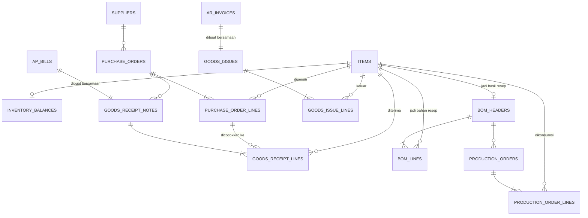

# Inventory — Struktur Data

Fase 5. Konsep bisnisnya ada di `docs/domain/inventory.md`. Skenario nyata: `docs/story/inventory.md`. Detail teknis: `memory/architecture/data/inventory-schema.md`. Modul ini paling banyak tabelnya karena mencakup 3 alur sekaligus: beli bahan baku (procurement), produksi (mengubah bahan baku jadi barang jadi), dan jual (goods issue).

**Catatan:** metode costing FIFO sudah dihapus total dari sistem (migration `0038`). Sekarang cuma Rata-Rata Bergerak (Weighted Average) yang dipakai, berlaku untuk semua barang tanpa kecuali — tidak ada lagi pilihan metode per barang.

## Peta Data (ERD)

## Tabel Master Data

| Tabel | Fungsi |
|---|---|
| `items` | Daftar barang yang dilacak — bisa bahan baku atau barang jadi. Semua barang pakai metode hitung biaya yang sama: **Rata-Rata Bergerak**. |
| `bom_headers` + `bom_lines` | Resep produksi: 1 barang jadi butuh bahan baku apa saja, berapa takarannya per 1 batch. Boleh direvisi kapan saja — resep yang direvisi tidak mengubah histori produksi yang sudah terjadi, karena tiap produksi menyimpan salinan angkanya sendiri. |

## Alur Pembelian: Purchase Order → Penerimaan Barang + Bill

| Tabel | Fungsi |
|---|---|
| `purchase_orders` + baris pesanan | Komitmen pesan ke pemasok. Belum ada transaksi jurnal — ini baru rencana, belum ada pertukaran aset. |
| `goods_receipt_notes` + baris penerimaan | Bukti barang benar-benar diterima. **Dibuat bersamaan dengan bill (tagihan) pemasok** — dalam sistem ini, nota penerimaan barang dianggap sama waktunya dengan tagihan resmi, jadi tidak perlu akun perantara "barang diterima belum ditagih". |

Penerimaan barang inilah yang **memicu** penambahan stok — begitu baris penerimaan dicatat, sistem otomatis menambah stok lewat mekanisme di bawah.

**Pengaman otomatis:** sistem menolak penerimaan yang jumlahnya melebihi sisa yang masih dipesan di Purchase Order — mencegah salah input jumlah terima yang tidak sesuai pesanan.

## Cara Sistem Melacak Nilai Stok

| Metode | Cara kerja | Tabel yang dipakai |
|---|---|---|
| **Rata-Rata Bergerak** | Sistem menyimpan satu angka "harga rata-rata berjalan" per barang, yang diperbarui setiap ada penerimaan baru. Saat barang keluar, harga rata-rata ini yang dipakai, dan tidak berubah karena pemakaian (hanya berubah karena penerimaan baru). | `inventory_balances` (saldo & harga rata-rata saat ini) |

Berlaku untuk semua barang, tanpa kecuali. Sebelumnya sistem ini juga punya metode **FIFO** (masuk duluan keluar duluan, per barang bisa pilih salah satu) lewat tabel `inventory_lots`+`inventory_lot_consumptions` — sudah dihapus total (migration `0038`) karena dianggap kompleksitas yang tidak sepadan manfaatnya untuk skala bisnis ini.

**Pengaman otomatis:** sistem menolak pemakaian/pengurangan stok yang melebihi jumlah yang tersedia (`qty_on_hand`).

## Alur Produksi

| Tabel | Fungsi |
|---|---|
| `production_orders` + baris konsumsi | Satu kejadian produksi nyata: mengonsumsi bahan baku sesuai resep, menghasilkan barang jadi. Setiap baris menyimpan salinan angka bahan baku & biaya yang benar-benar dipakai saat itu (bukan mengacu ulang ke resep, supaya resep boleh direvisi tanpa mengubah histori). |

Setiap produksi otomatis membuat transaksi jurnal: Debit Persediaan Barang Jadi, Kredit Persediaan Bahan Baku, sebesar total biaya bahan baku yang dikonsumsi (dihitung dari Rata-Rata Bergerak).

## Alur Penjualan: Goods Issue → HPP

| Tabel | Fungsi |
|---|---|
| `goods_issues` + baris keluar | Kebalikan dari penerimaan barang — barang jadi keluar karena terjual. **Dibuat bersamaan dengan invoice penjualan.** |

Setiap penjualan barang jadi menghasilkan **dua** transaksi jurnal sekaligus: satu untuk pendapatan (Debit Piutang, Kredit Pendapatan — dari modul Piutang Usaha), dan satu lagi khusus untuk mengakui Harga Pokok Penjualan (Debit HPP, Kredit Persediaan Barang Jadi) sebesar biaya barang yang keluar. Titik inilah HPP benar-benar diakui sebagai beban.

**Catatan lintas modul (retur):** master data barang punya kolom batas hari maksimal boleh diretur customer (kosong = tidak dibatasi). Kalau barang yang terjual lewat Goods Issue ini diretur, sistem membalik sebagian stok+HPP secara proporsional — detail penuh ada di `docs/architecture/ar-schema.md`.

## Aturan Otomatis yang Dijaga Sistem (ringkasan)

1. Penerimaan barang tidak boleh melebihi jumlah yang dipesan di Purchase Order.
2. Pemakaian/pengurangan stok tidak boleh melebihi jumlah yang tersedia (`qty_on_hand`).
3. Purchase Order, penerimaan barang, produksi, dan penjualan barang tidak pernah bisa diedit atau dihapus setelah tercatat — koreksi harus lewat pencatatan baru.
4. Data master (daftar barang, resep) tetap boleh diubah kapan saja — hanya catatan transaksi yang bersifat permanen.

## Cara Kerja Tiap Aksi

Empat aksi utama di modul ini, dan apa yang sistem lakukan otomatis di baliknya tiap kali aksi itu dijalankan:

- **Buat Purchase Order** — cuma menyimpan rencana pesanan (barang, jumlah, harga perkiraan). Tidak ada dampak keuangan atau stok sama sekali di langkah ini — ini baru komitmen, belum ada barang atau uang yang benar-benar berpindah.

- **Catat Penerimaan Barang** — satu aksi ini otomatis melakukan beberapa hal sekaligus, semua-atau-tidak-sama-sekali:
  1. Membuat tagihan pemasok (bill) yang sepadan.
  2. Mencatat transaksi jurnal Debit Persediaan, Kredit Utang Usaha.
  3. Menambah stok barang — memperbarui harga rata-rata berjalan.
  4. Mengecek jumlah yang diterima tidak melebihi sisa pesanan di Purchase Order (lihat "Aturan Otomatis" #1).

- **Jalankan Produksi** — satu aksi ini otomatis:
  1. Mengambil resep (BOM) dan menghitung total bahan baku yang perlu dikonsumsi sesuai jumlah yang mau diproduksi.
  2. Mengurangi stok tiap bahan baku dari saldo rata-rata — sekaligus mengecek stoknya cukup (lihat "Aturan Otomatis" #2).
  3. Menambah stok barang jadi sebagai hasil produksi.
  4. Mencatat transaksi jurnal Debit Persediaan Barang Jadi, Kredit Persediaan Bahan Baku sebesar total biaya bahan baku yang dikonsumsi.

- **Catat Penjualan (Goods Issue)** — dibuat bersamaan dengan invoice penjualan, satu aksi ini otomatis:
  1. Menerbitkan invoice (Debit Piutang, Kredit Pendapatan).
  2. Mengurangi stok barang jadi yang terjual — sekaligus mengecek stoknya cukup.
  3. Mencatat transaksi jurnal kedua khusus untuk mengakui HPP (Debit HPP, Kredit Persediaan Barang Jadi) — titik ini HPP benar-benar diakui sebagai beban.

## Siapa Boleh Apa

| Aksi | Siapa boleh |
|---|---|
| Melihat semua data (barang, resep, pesanan, penerimaan, produksi, penjualan) | Semua user yang sudah login |
| Mengubah data barang & resep | Role `admin` atau `accountant` |
| Membuat Purchase Order, mencatat penerimaan, mencatat produksi, mencatat penjualan | Role `admin` atau `accountant` |
| Mengedit/menghapus transaksi yang sudah tercatat | **Tidak ada seorang pun** |

## Belum Termasuk

- **Akun perantara "barang diterima belum ditagih"** — dibutuhkan kalau nanti barang bisa datang lebih dulu sebelum tagihan resminya datang (saat ini keduanya selalu dicatat bersamaan).
- **Sales Order** — pencocokan tiga arah (pesanan-penerimaan-tagihan) di sisi jual, cerminan dari Purchase Order di sisi beli. Saat ini pencocokan tiga arah baru ada di sisi pembelian.
- **Laporan selisih harga pembelian** — laporan pembanding antara harga di Purchase Order vs harga aktual saat diterima.
- **Biaya tenaga kerja & overhead pabrik dalam produksi** — saat ini biaya produksi hanya menghitung bahan baku, belum termasuk komponen biaya lain.
