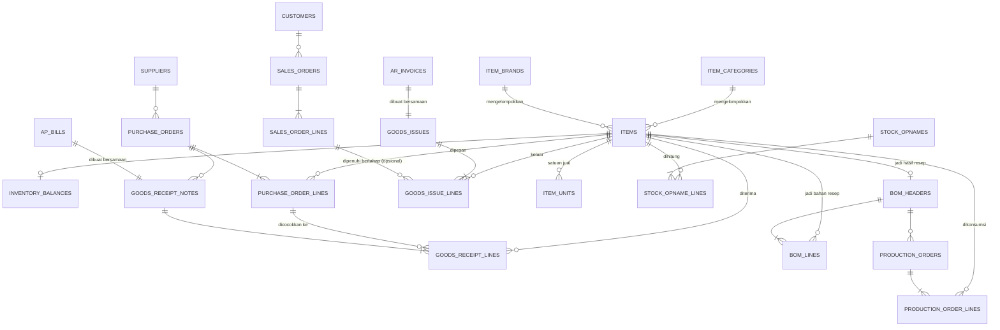

# Inventory — Struktur Data

Fase 5. Konsep bisnisnya ada di `docs/domain/inventory.md`. Skenario nyata: `docs/story/inventory.md`. Detail teknis penuh (DDL/RPC): `memory/architecture/data/inventory-schema.md`. Modul ini paling banyak tabelnya karena mencakup 3 alur sekaligus: beli bahan baku (procurement), produksi (mengubah bahan baku jadi barang jadi), dan jual (goods issue).

**Catatan:** metode costing FIFO sudah dihapus total dari sistem (migration `0038`). Sekarang cuma Rata-Rata Bergerak (Weighted Average) yang dipakai, berlaku untuk semua barang tanpa kecuali — tidak ada lagi pilihan metode per barang.

## Peta Data (ERD) — Ringkasan Semua Tabel

| Tabel | Fungsi | Terhubung ke |
|---|---|---|
| `items` | Master data barang yang dilacak — bahan baku atau barang jadi. Semua barang pakai metode hitung biaya yang sama: Rata-Rata Bergerak | `accounts` (akun kontrol Persediaan), `item_categories` (opsional), `item_brands` (opsional) |
| `item_categories` / `item_brands` | Katalog terkontrol opsional buat pengelompokan barang (mis. "Alat Makan", "Lion Star") — murni metadata deskriptif, gak nyentuh perhitungan stok/HPP | `items` (1 kategori/brand : banyak barang) |
| `item_units` | Satuan jual per barang (boleh lebih dari 1, misal per pieces atau per pack) — masing-masing punya faktor konversi ke satuan dasar & harga sendiri | `items` |
| `inventory_balances` | Posisi stok tersimpan per barang — qty tersedia + harga rata-rata berjalan, satu-satunya state costing yang hidup di modul ini | `items` (1:1) |
| `purchase_orders` + `purchase_order_lines` | Komitmen pesan ke pemasok — belum ada transaksi jurnal | `suppliers`, `items` |
| `goods_receipt_notes` + `goods_receipt_lines` | Bukti barang benar-benar diterima — dibuat bersamaan dengan bill (tagihan) pemasok, memicu penambahan Persediaan | `purchase_orders`, tagihan pemasok (`ap_bills`), `items`, `inventory_balances` |
| `bom_headers` + `bom_lines` | Resep produksi: 1 barang jadi butuh bahan baku apa saja, berapa takarannya per 1 batch. Boleh direvisi kapan saja tanpa mengubah histori produksi yang sudah terjadi | `items` |
| `production_orders` + `production_order_lines` | Satu kejadian produksi nyata: mengonsumsi bahan baku sesuai resep, menghasilkan barang jadi, dan ke transaksi jurnal yang otomatis dibuat | `bom_headers`, `items`, `inventory_balances`, transaksi jurnal |
| `goods_issues` + `goods_issue_lines` | Barang jadi keluar karena terjual — dibuat bersamaan dengan invoice penjualan, dan ke transaksi jurnal khusus HPP yang otomatis dibuat | invoice penjualan (`ar_invoices`), `items`, `inventory_balances`, transaksi jurnal |
| `sales_orders` + `sales_order_lines` | Komitmen pesan dari customer — cerminan Purchase Order di sisi jual, belum ada transaksi jurnal. **Opsional**, bukan wajib | `customers`, `items` |
| `stock_opnames` + `stock_opname_lines` | Sesi hitung fisik gudang — posisi stok disesuaikan langsung ke hasil hitung, selisih diakui sebagai beban/pendapatan | `items`, `inventory_balances`, transaksi jurnal (1 per baris yang ada selisih) |

## Konsep Inti

**Peta Data (ERD)**

| Tabel | Fungsi | Terhubung ke |
|---|---|---|
| `items` | Master data barang yang dilacak — bahan baku atau barang jadi | `accounts` (akun kontrol Persediaan) |
| `inventory_balances` | Posisi stok tersimpan per barang — qty tersedia + harga rata-rata berjalan | `items` (1:1) |

**Struktur `items` & `inventory_balances`**

| Kolom | Isinya | Catatan |
|---|---|---|
| tipe barang | Bahan baku atau barang jadi | |
| satuan dasar | Satuan tampilan (kg, pcs, dst), dipakai semua pelacakan stok/biaya | Murni informasi, tidak ada konversi antar-satuan di kolom ini — satuan JUAL yang beda-beda ada di `item_units`, lihat submodule "Satuan Jual & Harga" |
| akun Persediaan | Akun kontrol di COA yang menaungi barang ini | 1 akun bisa menaungi banyak barang — detail per-barang hidup di modul Inventory sendiri, bukan akun terpisah per barang |
| qty tersedia | Sisa stok saat ini | Berkurang tiap konsumsi/penjualan, bukan angka yang dihitung ulang dari histori tiap dibaca — **satu-satunya posisi di seluruh modul ini yang disimpan langsung**, bukan derived, karena harga rata-rata berjalan itu rekursif (tergantung nilai sebelumnya), tidak bisa diringkas jadi satu query agregat sederhana |
| harga rata-rata berjalan | Biaya per unit saat ini (di satuan dasar) | Berubah tiap ada penerimaan barang baru (dihitung ulang dari campuran stok lama + stok masuk), tetap tidak berubah pas barang keluar/dikonsumsi |

**Metode costing: Rata-Rata Bergerak (Weighted Average), satu-satunya, berlaku ke semua barang** — sempat ada 2 metode (FIFO per-lot dan Rata-Rata Bergerak, dipilih per barang), FIFO sudah dihapus total dari sistem. Semua barang sekarang lewat mekanisme konsumsi stok yang sama.

**Alur Teknis (RPC)**

| Aksi | RPC | Efek | Guard |
|---|---|---|---|
| Konsumsi stok (dipakai submodule Produksi & Penjualan, bukan dipanggil langsung dari client) | Fungsi bersama konsumsi stok rata-rata | Mengurangi qty tersedia langsung, harga rata-rata berjalan tidak berubah saat konsumsi (cuma berubah saat penerimaan baru) — satu-satunya tempat logika konsumsi stok ditulis, dipakai bareng oleh Produksi maupun Penjualan biar tidak duplikat logika | Menolak konsumsi yang melebihi qty tersedia |

**Aturan Bisnis → RPC**

| Aturan (dari docs/domain) | Dijaga oleh |
|---|---|
| Semua barang pakai satu metode costing yang sama (Rata-Rata Bergerak) | Tidak ada lagi pilihan metode per barang — kolom pemilih metode sudah dihapus |
| Harga rata-rata berjalan dihitung incremental, bukan diringkas dari histori | Posisi stok disimpan langsung (bukan derived), di-update tiap transaksi lewat fungsi konsumsi/penerimaan bersama |
| Data master (barang) tetap boleh diubah kapan saja | Beda dari tabel transaksional lain di modul ini yang immutable — barang & posisi stoknya sendiri bukan catatan transaksi |

**Interaksi Antar Tabel**

| Tabel A | Relasi | Tabel B |
|---|---|---|
| `inventory_balances` | satu-ke-satu | `items` |
| `items` | dirujuk oleh semua submodule (Purchase Order, Produksi, Penjualan) | — |

## Purchase Order & Penerimaan Barang (3-Way Matching)

**Peta Data (ERD)**

| Tabel | Fungsi | Terhubung ke |
|---|---|---|
| `purchase_orders` + `purchase_order_lines` | Komitmen pesan ke pemasok. Belum ada transaksi jurnal — ini baru rencana, belum ada pertukaran aset | `suppliers`, `items` |
| `goods_receipt_notes` + `goods_receipt_lines` | Bukti barang benar-benar diterima. Dibuat bersamaan dengan bill (tagihan) pemasok — nota penerimaan barang dianggap sama waktunya dengan tagihan resmi, jadi tidak perlu akun perantara "barang diterima belum ditagih" | `purchase_orders`, `ap_bills`, `items`, `inventory_balances` |

**Alur Teknis (RPC)**

| Aksi | RPC | Efek | Guard |
|---|---|---|---|
| Buat Purchase Order | `create_purchase_order` | Insert header + baris pesanan. Tidak ada dampak keuangan atau stok sama sekali — baru komitmen | — |
| Catat penerimaan barang | `create_goods_receipt` | Sekaligus: (1) hitung total tagihan dari baris penerimaan, (2) buat tagihan pemasok (bill) sepadan + jurnal Debit Persediaan, Kredit Utang Usaha, (3) insert baris penerimaan, (4) update posisi stok tiap barang (harga rata-rata dihitung ulang) | Menolak penerimaan yang jumlahnya melebihi sisa yang masih dipesan di Purchase Order |

**Aturan Bisnis → RPC**

| Aturan (dari docs/domain) | Dijaga oleh |
|---|---|
| Purchase Order tidak bikin jurnal | `create_purchase_order` cuma insert data, tidak memicu transaksi jurnal apa pun |
| Penerimaan barang tidak boleh melebihi sisa qty yang dipesan | Pengaman otomatis pada baris penerimaan barang, dicek per barang terhadap Purchase Order-nya |
| Pembelian bahan baku selalu masuk Persediaan, tidak pernah ke Beban | `create_goods_receipt` selalu mendebit akun Persediaan barang itu (bukan akun Beban) saat membuat tagihan |
| Penerimaan barang dari 1 PO boleh punya kategori Persediaan campur (mis. + Beban Ongkir) dan PPN Masukan | `create_goods_receipt` diperluas kategori tambahan & PPN (`docs/architecture/ap-schema.md` bagian "Kategori Campur & PPN"), mirror alur jual (Goods Issue) yang sudah lebih dulu expose kategori campur ke UI-nya |
| Penerimaan barang tertelusur ke Purchase Order + tagihan yang menyertainya | `goods_receipt_notes` wajib menunjuk baik Purchase Order maupun tagihan (bill) yang dibuat bersamaan |

**Interaksi Antar Tabel**

| Tabel A | Relasi | Tabel B |
|---|---|---|
| `purchase_order_lines` | banyak-ke-satu | `purchase_orders` |
| `goods_receipt_lines` | banyak-ke-satu, dicocokkan ke | `purchase_order_lines` |
| `goods_receipt_notes` | satu-ke-satu | tagihan pemasok (`ap_bills`) |
| `goods_receipt_lines` | tiap baris memicu update | `inventory_balances` |

## Produksi (Bill of Materials & Production Order)

**Peta Data (ERD)**

| Tabel | Fungsi | Terhubung ke |
|---|---|---|
| `bom_headers` + `bom_lines` | Resep produksi — data master, boleh direvisi kapan saja | `items` |
| `production_orders` + `production_order_lines` | Satu kejadian produksi nyata: mengonsumsi bahan baku sesuai resep, menghasilkan barang jadi. Setiap baris menyimpan salinan angka bahan baku & biaya yang benar-benar dipakai saat itu (bukan mengacu ulang ke resep) | `bom_headers`, `items`, `inventory_balances`, transaksi jurnal |

**Alur Teknis (RPC)**

| Aksi | RPC | Efek | Guard |
|---|---|---|---|
| Jalankan Produksi | `create_production_order` | Mengambil resep (BOM), menghitung total bahan baku yang perlu dikonsumsi sesuai jumlah yang mau diproduksi, mengurangi stok tiap bahan baku dari saldo rata-rata, menambah stok barang jadi sebagai hasil produksi, mencatat jurnal Debit Persediaan Barang Jadi, Kredit Persediaan Bahan Baku sebesar total biaya bahan baku yang dikonsumsi | Menolak konsumsi bahan baku yang melebihi stok yang tersedia |

**Aturan Bisnis → RPC**

| Aturan (dari docs/domain) | Dijaga oleh |
|---|---|
| Konsumsi bahan baku tidak boleh melebihi stok tersedia | Pengaman konsumsi stok terpusat (dipakai bareng submodule Penjualan), lihat submodule "Konsep Inti" |
| Revisi resep tidak retroaktif mengubah histori produksi | `production_order_lines` menyimpan salinan qty & biaya aktual sendiri, bukan mengacu ulang ke `bom_lines` |
| Biaya produksi saat ini cuma dari bahan baku (belum tenaga kerja/overhead) | `create_production_order` menjumlahkan hasil konsumsi bahan baku saja — belum ada input biaya lain |

**Interaksi Antar Tabel**

| Tabel A | Relasi | Tabel B |
|---|---|---|
| `bom_lines` | banyak-ke-satu | `bom_headers` |
| `production_orders` | banyak-ke-satu | `bom_headers` |
| `production_order_lines` | tiap baris didahului konsumsi dari | `inventory_balances` (bahan baku) |
| `production_orders` | menghasilkan tambahan ke | `inventory_balances` (barang jadi) |

## Penjualan & Pengakuan HPP (Goods Issue)

**Peta Data (ERD)**

| Tabel | Fungsi | Terhubung ke |
|---|---|---|
| `goods_issues` + `goods_issue_lines` | Kebalikan dari penerimaan barang — barang jadi keluar karena terjual. Dibuat bersamaan dengan invoice penjualan | invoice penjualan (`ar_invoices`), `items`, `inventory_balances`, transaksi jurnal |

**Alur Teknis (RPC)**

| Aksi | RPC | Efek | Guard |
|---|---|---|---|
| Catat Penjualan (Goods Issue) | `create_goods_issue` | Menerbitkan invoice (Debit Piutang, Kredit [1 atau lebih kategori Pendapatan + PPN kalau relevan] — lihat `docs/architecture/ar-schema.md` bagian "Kategori Campur & PPN"), mengurangi stok barang jadi yang terjual dari saldo rata-rata, mencatat transaksi jurnal kedua khusus HPP (Debit HPP, Kredit Persediaan Barang Jadi) — titik ini HPP benar-benar diakui sebagai beban | Menolak pengurangan stok yang melebihi jumlah yang tersedia |

**Aturan Bisnis → RPC**

| Aturan (dari docs/domain) | Dijaga oleh |
|---|---|
| Pengurangan stok barang jadi tidak boleh melebihi yang tersedia | Pengaman konsumsi stok terpusat, sama mekanisme dengan submodule Produksi |
| Goods Issue tertelusur ke invoice penjualan yang dibuat bersamaan | `goods_issues` wajib menunjuk invoice-nya, keduanya dibuat dalam 1 aksi yang sama |
| Sisi jual juga punya tahap komitmen (Sales Order), tapi sifatnya opsional | Lihat submodule "Sales Order & Pemenuhan Bertahap" di bawah |

**Interaksi Antar Tabel**

| Tabel A | Relasi | Tabel B |
|---|---|---|
| `goods_issues` | satu-ke-satu | invoice penjualan (`ar_invoices`) |
| `goods_issue_lines` | tiap baris didahului konsumsi dari | `inventory_balances` |
| `goods_issue_lines` | opsional, banyak-ke-satu, dicocokkan ke | `sales_order_lines` |
| Retur barang (modul Piutang Usaha) | banyak-ke-satu, kebalikan pemakaian | `goods_issues` — detail penuh: `docs/architecture/ar-schema.md` |

## Sales Order & Pemenuhan Bertahap

**Peta Data (ERD)**

| Tabel | Fungsi | Terhubung ke |
|---|---|---|
| `sales_orders` + `sales_order_lines` | Komitmen pesan dari customer — cerminan `purchase_orders` di sisi jual. Belum ada transaksi jurnal — ini baru rencana, belum ada barang berpindah tangan | `customers`, `items` |

**Alur Teknis (RPC)**

| Aksi | RPC | Efek | Guard |
|---|---|---|---|
| Buat Sales Order | `create_sales_order` | Insert header + baris pesanan. Tidak ada dampak keuangan atau stok sama sekali — baru komitmen | — |
| Penuhi Sales Order (sebagian atau seluruhnya) | `create_goods_issue` (**signature-nya sendiri belakangan berubah karena alasan lain sama sekali — lihat "Kategori Campur & PPN" di `docs/architecture/ar-schema.md` — tapi bagian `so_line_id` yang dibahas di sini gak kesentuh**) | Baris `p_lines` sekarang boleh menunjuk balik ke baris Sales Order. Tiap pemanggilan = 1 invoice + 1 pengurangan stok tersendiri — bisa dipanggil berkali-kali sampai seluruh qty pesanan terkirim | Menolak pengiriman yang total-nya melebihi qty yang dipesan di baris Sales Order itu |

**Aturan Bisnis → RPC**

| Aturan (dari docs/domain) | Dijaga oleh |
|---|---|
| Sales Order tidak bikin jurnal | `create_sales_order` cuma insert data, tidak memicu transaksi jurnal apa pun |
| Pengiriman terhadap satu baris Sales Order tidak boleh melebihi qty yang dipesan | Pengaman otomatis pada baris pengiriman, dicek per baris terhadap Sales Order-nya |
| Sales Order sama sekali tidak wajib | Kolom penghubung di baris Goods Issue bersifat opsional — penjualan tanpa Sales Order tetap berjalan seperti biasa |
| Tiap pengiriman sebagian mengakui piutang & pendapatan sebesar yang benar-benar dikirim saat itu | `create_goods_issue` tetap menerbitkan 1 invoice tiap kali dipanggil, bukan menunggu Sales Order terpenuhi penuh |

**Interaksi Antar Tabel**

| Tabel A | Relasi | Tabel B |
|---|---|---|
| `sales_order_lines` | banyak-ke-satu | `sales_orders` |
| `goods_issue_lines` | opsional, banyak-ke-satu, dicocokkan ke | `sales_order_lines` |

## Kategori & Brand Barang

**Peta Data (ERD)**

| Tabel | Fungsi | Terhubung ke |
|---|---|---|
| `item_categories` | Katalog kategori barang (mis. "Alat Makan") — bisa dinonaktifkan tanpa dihapus | `items` (1:banyak) |
| `item_brands` | Katalog brand/merek barang (mis. "Lion Star") — bisa dinonaktifkan tanpa dihapus | `items` (1:banyak) |

**Alur Teknis (RPC)**

Gak ada RPC — CRUD langsung lewat tabel (sama pola `items`/`item_units`), murni metadata deskriptif.

**Aturan Bisnis → RPC**

| Aturan (dari docs/domain) | Dijaga oleh |
|---|---|
| 1 barang maksimal 1 kategori & 1 brand | FK tunggal (`items.category_id`/`items.brand_id`), bukan tabel jembatan many-to-many |
| Kategori/brand opsional, gak wajib diisi | Kolom FK nullable |
| Menonaktifkan kategori/brand gak mengubah barang yang udah terlanjur dikaitkan | `archived_at` cuma nyaring pilihan buat barang BARU, gak pernah nyentuh FK yang udah ke-set |

**Interaksi Antar Tabel**

| Tabel A | Relasi | Tabel B |
|---|---|---|
| `items` | banyak-ke-satu (opsional) | `item_categories` |
| `items` | banyak-ke-satu (opsional) | `item_brands` |

## Satuan Jual & Harga (Multi Unit of Measure)

**Peta Data (ERD)**

| Tabel | Fungsi | Terhubung ke |
|---|---|---|
| `item_units` | Satuan tambahan per barang — boleh 0 baris sampai berapa pun. Persis 1 baris jadi "satuan dasar" per barang | `items` |

**Alur Teknis (RPC)**

Gak ada RPC baru — `item_units` murni data master, CRUD langsung lewat tabel (sama pola `items`/`bom_lines`), bukan lewat proses keuangan.

| Aksi | RPC | Efek | Guard |
|---|---|---|---|
| Input qty pakai satuan bukan-dasar (misal lusin/dus), di form manapun (PO, Terima Barang, Sales Order, Jual Barang, qty produksi, hasil hitung Opname) | `create_purchase_order`, `create_goods_receipt`, `create_sales_order`, `create_goods_issue`, `create_production_order`, `record_stock_opname` (**semua tidak berubah**) | Komponen UI `MultiUomQtyInput` mengonversi qty (bisa campuran beberapa satuan sekaligus) ke satuan dasar & menghitung nominal saran dari harga satuan yang diisi SEBELUM RPC dipanggil — RPC tetap menerima qty di satuan dasar & nominal final apa adanya, persis seperti sebelum fitur ini ada | — |

**Aturan Bisnis → RPC**

| Aturan (dari docs/domain) | Dijaga oleh |
|---|---|
| Satuan dasar (dipakai stok/HPP) tetap 1 per barang, gak berubah oleh satuan jual tambahan | `items.uom` tidak disentuh sama sekali — satuan jual cuma lapisan tambahan di `item_units` |
| Qty yang dikonsumsi/ditambah ke stok selalu di satuan dasar, gak peduli kombinasi satuan yang dipakai user pas input | Konversi terjadi di UI sebelum RPC dipanggil — tabel transaksional manapun (`purchase_order_lines`, `goods_receipt_lines`, `sales_order_lines`, `goods_issue_lines`, `production_order_lines`, `stock_opname_lines`) cuma pernah menyimpan qty satuan dasar |
| Harga per satuan jual independen, tidak wajib proporsional ke harga satuan dasar | `item_units.price` diisi manual per baris, gak ada perhitungan otomatis dari harga satuan lain |
| Harga cuma saran, gak retroaktif ngubah invoice yang udah terbit | Sama prinsip snapshot seperti sebelumnya — `item_units` cuma dibaca UI pas invoice BARU dibuat |
| Faktor konversi antar satuan 1 barang harus kelipatan bulat rapi (biar tampilan stok gabungan box/pack/pcs presisi) | Trigger `item_units_nested_conversion_guard` (`0025_item_units_nested_conversion_guard.sql`) — tolak insert/update kalau kombinasi faktor gak nested, berlaku di level DB (bukan cuma validasi UI) |

**Interaksi Antar Tabel**

| Tabel A | Relasi | Tabel B |
|---|---|---|
| `item_units` | banyak-ke-satu | `items` |

## Kode Scan Barang (Barcode/QR per Satuan Jual)

**Peta Data (ERD)**

Gak ada tabel baru — `item_units` (submodule sebelumnya) nambah 1 kolom `barcode` (opsional, unik lintas seluruh baris).

**Alur Teknis (RPC)**

| Aksi | RPC | Efek | Guard |
|---|---|---|---|
| Generate kode internal (barang tanpa barcode pabrik) | Fungsi nomor dokumen yang sudah ada (reuse, bukan mekanisme baru) | Kembalikan 1 teks kode baru (`SKU-2026-00001`, format sama kayak nomor dokumen lain di sistem ini) — TIDAK langsung menyimpan, UI yang update `item_units.barcode` lewat CRUD tabel biasa (sama pola `price`/`conversion_factor`) | — |
| Scan/input kode di kasir | — (query langsung, bukan RPC) | Cocokkan teks yang discan/diketik ke `item_units.barcode`, resolve ke barang+satuan+harga, isi keranjang persis kayak pilih dari katalog | Kode gak ketemu → gagal senyap, kasir tetap bisa cari manual dari katalog |

**Aturan Bisnis → RPC**

| Aturan (dari docs/domain) | Dijaga oleh |
|---|---|
| Kode scan unik lintas seluruh satuan jual | Constraint unik di kolom `barcode`, lintas seluruh tabel (bukan per-barang) |
| Kode scan gak wajib diisi, independen per satuan jual | Kolom nullable, gak ada aturan silang antar-baris dalam 1 barang |
| Kode scan gak menyentuh perhitungan stok/HPP/jurnal | Murni kolom lookup di tabel master data yang sudah ada — 0 perubahan ke RPC transaksi (`create_goods_issue`, dst) |

**Interaksi Antar Tabel**

Sama seperti submodule "Satuan Jual & Harga" — gak ada relasi baru.

## Stock Opname (Penyesuaian Stok Fisik)

**Peta Data (ERD)**

| Tabel | Fungsi | Terhubung ke |
|---|---|---|
| `stock_opnames` | Header 1 sesi hitung fisik — dokumen sumbernya sesi itu sendiri, bukan menunjuk ke transaksi lain | — |
| `stock_opname_lines` | 1 baris = 1 barang yang ADA selisihnya (barang yang hasil hitungnya pas gak menghasilkan baris apa pun) | `stock_opnames`, `items`, `inventory_balances`, transaksi jurnal (1 per baris) |

**Alur Teknis (RPC)**

| Aksi | RPC | Efek | Guard |
|---|---|---|---|
| Catat hasil hitung fisik | `record_stock_opname` | Per barang: hitung selisih (hasil hitung − catatan sistem). Selisih kurang → jurnal Debit Beban Selisih Persediaan / Kredit Persediaan; selisih lebih → Debit Persediaan / Kredit Pendapatan Selisih Persediaan. Posisi stok disesuaikan langsung ke hasil hitung (harga rata-rata TIDAK berubah) | Barang tanpa selisih dilewati, gak dicatat. Kalau seluruh sesi ternyata gak ada selisih sama sekali, seluruh percobaan ditolak |

**Aturan Bisnis → RPC**

| Aturan (dari docs/domain) | Dijaga oleh |
|---|---|
| Selisih kurang dan lebih diakui ke akun terpisah, gak digabung jadi 1 angka bersih | 2 akun beda (Beban vs Pendapatan Selisih Persediaan), dipilih otomatis sesuai arah selisih tiap barang |
| Nilai selisih dihitung dari harga rata-rata berjalan SAAT opname, bukan harga historis | Nilai per barang diambil dari posisi stok yang berlaku persis saat RPC dipanggil |
| Barang tanpa selisih gak menghasilkan pencatatan apa pun | Barang yang hasil hitungnya sama dengan catatan sistem dilewati begitu saja |
| Opname gak boleh masuk periode tertutup | Reuse aturan umum block-retroactive-period dari General Ledger |

**Interaksi Antar Tabel**

| Tabel A | Relasi | Tabel B |
|---|---|---|
| `stock_opname_lines` | banyak-ke-satu | `stock_opnames` |
| `stock_opname_lines` | tiap baris menyesuaikan | `inventory_balances` |

## Aturan Otomatis yang Dijaga Sistem (ringkasan)

1. Penerimaan barang tidak boleh melebihi jumlah yang dipesan di Purchase Order.
2. Pemakaian/pengurangan stok tidak boleh melebihi jumlah yang tersedia.
3. Pengiriman terhadap Sales Order (kalau dipakai) tidak boleh melebihi jumlah yang dipesan.
4. Purchase Order, Sales Order, penerimaan barang, produksi, dan penjualan barang tidak pernah bisa diedit atau dihapus setelah tercatat — koreksi harus lewat pencatatan baru. **Satu pengecualian**: Purchase Order dan Sales Order boleh **dibatalkan** (bukan diedit — status akhir yang gak bisa diubah lagi) selama belum ada realisasi fisik apa pun (belum ada penerimaan barang untuk PO, belum ada pengiriman barang untuk SO).
5. Data master (daftar barang, resep) tetap boleh diubah kapan saja — hanya catatan transaksi yang bersifat permanen.

## Siapa Boleh Apa

| Aksi | Siapa boleh |
|---|---|
| Melihat semua data (barang, resep, pesanan, penerimaan, produksi, penjualan) | Semua user yang sudah login |
| Mengubah data barang & resep | Role `admin` atau `accountant` |
| Membuat Purchase Order, Sales Order, mencatat penerimaan, mencatat produksi, mencatat penjualan, mencatat opname | Role `admin` atau `accountant` |
| Membatalkan Purchase Order/Sales Order (hanya kalau belum ada realisasi fisik) | Role `admin` atau `accountant` |
| Mengedit/menghapus transaksi yang sudah tercatat | **Tidak ada seorang pun** |
