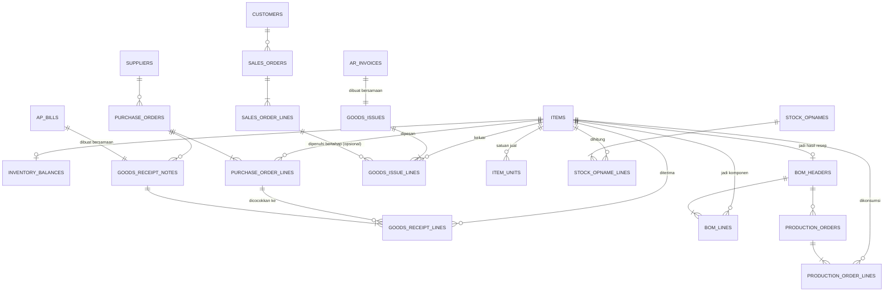

# Inventory — Schema (Finalized)

Fase 5 roadmap. Ref konsep bisnis: `docs/domain/inventory.md` + `memory/domain/inventory.md`. Ref seed/skenario: `docs/story/inventory.md`. Ref schema yang di-reuse: `memory/architecture/data/journal-entry-schema.md` (RPC `create_journal_entry`, fungsi `set_updated_at()`+`block_edit_delete()`), `memory/architecture/data/ap-schema.md` (`ap_bills`+`create_ap_bill`, **0 perubahan**), `memory/architecture/data/ar-schema.md` (`ar_invoices`+`create_ar_invoice`, **0 perubahan**). Migration: `supabase/migrations/0012_inventory_schema.sql`.

DDL final di bawah, ERD & keputusan desain gak berubah dari revisi sebelumnya.

**Update `0038_remove_fifo_costing.sql`**: metode costing FIFO dihapus total dari sistem — `inventory_lots`+`inventory_lot_consumptions` di-drop, `items.costing_method` di-drop, `consume_fifo()` di-drop. Weighted Average (`inventory_balances`) sekarang satu-satunya mekanisme costing, dipakai semua item tanpa kecuali. Bagian di bawah yang masih menyebut FIFO/lot dipertahankan sebagai jejak sejarah desain (kenapa dulu ada 2 mekanisme) tapi ditandai eksplisit sudah tidak berlaku.

Struktur module → submodule di file ini SAMA urutannya dengan `docs/architecture/inventory-schema.md` dan `memory/domain/inventory.md` (lihat `AGENTS.md` > "Format Baku: Struktur Module → Submodule").

## Konsep Inti

### Keputusan Desain

- **`ap_bills`/`ar_invoices` tetap lump-sum, gak diubah sama sekali.** Rincian barang (qty & harga satuan) ditaruh di tabel baru (`goods_receipt_notes`/`goods_issues`) yang **nunjuk balik** ke bill/invoice yang sudah ada, bukan mengubah strukturnya. Alasan: dua tabel itu immutable & sudah punya data histori — mengubah strukturnya berarti migrasi data lama + bongkar UI yang sudah jalan, resiko besar buat manfaat yang bisa dicapai tanpa itu.
- **Metode costing: Weighted Average, satu-satunya, berlaku semua item.** Sebelum migration `0038` sempat ada dua metode (FIFO per-lot + Weighted Average) yang ditentukan per `items.costing_method`; FIFO sudah dihapus total dari sistem (`0038_remove_fifo_costing.sql`) — kolom `costing_method` juga sudah di-drop karena jadi redundant (cuma ada 1 nilai yang mungkin).
- **`inventory_balances` adalah satu-satunya state costing tersimpan** (bukan derived) di seluruh modul Inventory — beda dari pola dominan project ini (status AR/AP selalu derived dari query). Alasannya: rata-rata berjalan (`new_avg = (qty_before×avg_before + qty_in×unit_cost_in) / (qty_before+qty_in)`) itu rekursif — gak bisa diringkas jadi 1 agregat SQL sederhana kayak `SUM(debit)-SUM(credit)` atau `SUM(allocations)`, harus dihitung incremental tiap transaksi.
- **Penamaan tabel: master data gak pakai prefix modul, transaksional pakai.** Pola ini udah established di AR/AP (`customers`/`suppliers` polos, tapi `ar_invoices`/`ap_bills` pakai prefix). `items` konsisten sama pola itu (master data, polos). `inventory_balances` konsisten pakai prefix `inventory_` (transaksional/state). Tabel lain (`purchase_orders`, `goods_receipt_notes`, `bom_headers`, `production_orders`, `goods_issues`, dst) gak butuh prefix tambahan — namanya udah unik & jelas sendiri, gak ada modul lain yang bisa nabrak makna.

### ERD



### `items`

Master data barang yang di-track Inventory — bisa bahan baku (`RAW_MATERIAL`) atau barang jadi (`FINISHED_GOOD`). Kolom penting:
- `uom` — satuan dasar (kg, gram, pcs, dst), dipakai semua pelacakan stok/costing (PO/GRN/BOM/production/goods issue), gak diubah oleh fitur satuan jual. Satuan JUAL ke customer (boleh beda, boleh lebih dari 1) ada di `item_units` — lihat submodule "Satuan Jual & Harga" di bawah.
- `inventory_account_id` — FK ke `accounts` (COA), akun **kontrol** (misal "Persediaan Bahan Baku" / "Persediaan Barang Jadi"). Satu akun ini menaungi banyak item sekaligus — detail per-item hidup di subledger Inventory (`items`+lot/balance), bukan sebagai akun terpisah per item di COA (pola sama `ar_invoices`/`customers`: 1 akun "Piutang Usaha" menaungi banyak customer).
- `archived_at` — pola sama `customers`/`suppliers` (`state-naming-convention.md`), item lama gak boleh dihapus keras.
- **`default_price` sempat ada** (nullable, migration `0018_items_default_price.sql`) — **di-drop lagi migration `0019_item_units_schema.sql`**, digantiin `item_units` (lihat submodule "Satuan Jual & Harga" di bawah) begitu ketauan item bisa dijual dalam >1 satuan, gak cukup 1 kolom flat per item.

```sql
create table items (
  id uuid primary key default gen_random_uuid(),
  name text not null,
  item_type text not null check (item_type in ('RAW_MATERIAL','FINISHED_GOOD')),
  uom text not null,
  inventory_account_id uuid not null references accounts(id),
  archived_at timestamptz,
  created_at timestamptz not null default now(),
  updated_at timestamptz not null default now()
);

create trigger items_set_updated_at
  before update on items
  for each row execute function set_updated_at();
```

`set_updated_at()` udah ada dari `coa-schema.md`, gak perlu bikin ulang. `default_price` (migration `0018`) dan pencabutannya (migration `0019`) sudah tercermin di bentuk final ini — `create table` di atas ditulis dalam bentuk final, sesuai konvensi schema doc (`memory/preferences/system/schema-doc-format.md`).

### `inventory_balances`

**Dipakai semua item** (sejak migration `0038` — sebelumnya cuma item `WEIGHTED_AVERAGE`, item `FIFO` punya baris di `inventory_lots`). Nyimpen `qty_on_hand` dan `avg_cost` yang di-update tiap ada penerimaan (avg_cost berubah) atau konsumsi/penjualan (qty_on_hand berkurang, avg_cost tetap). Ini pengecualian sengaja dari pola "derived, bukan stored" yang dipegang di modul lain (lihat "Keputusan Desain" di atas kenapa gak bisa di-derive). PK-nya `item_id` sendiri (bukan `id` terpisah) — struktural mastiin maksimal 1 baris per item, gak butuh `unique` constraint tambahan.

```sql
create table inventory_balances (
  item_id uuid primary key references items(id),
  qty_on_hand numeric(14,3) not null default 0 check (qty_on_hand >= 0),
  avg_cost numeric(14,2) not null default 0,
  updated_at timestamptz not null default now()
);
```

**`inventory_lots` dan `inventory_lot_consumptions` sudah dihapus total (migration `0038_remove_fifo_costing.sql`)** — dulu ada 2 tabel buat nangenin costing FIFO per-lot (`inventory_lots` buat stok "lahir", `inventory_lot_consumptions` buat stok "dipakai/keluar"), lengkap sama trigger anti-over-consumption per lot. Sekarang cuma Weighted Average yang tersisa — satu-satunya state costing yang hidup adalah `inventory_balances` di atas, gak ada lagi konsep lot/batch per item.

**Penyesuaian ke hasil hitung fisik**: RPC `record_stock_opname` (migration `0020_stock_opname_schema.sql`) langsung nyesuaiin `qty_on_hand` ke hasil hitung — satu-satunya jalur yang nulis ke `qty_on_hand` tanpa lewat transaksi lain (semua RPC lain sebelumnya selalu lewat kejadian eksplisit: GRN, goods issue, produksi, retur, write-off). `avg_cost` gak disentuh. Lihat submodule "Stock Opname" di bawah.

### Fungsi Bersama: `consume_weighted_average`

Fungsi generik (bukan RPC yang dipanggil langsung dari client, tapi dipanggil dari dalam `create_production_order`/`create_goods_issue` — submodule "Produksi" dan "Penjualan & Pengakuan HPP" di bawah) — satu-satunya tempat logika konsumsi stok ditulis, biar production-input dan sales-issue gak duplikat logika. Cukup kurangin `qty_on_hand` langsung, `avg_cost` gak berubah pas konsumsi (cuma berubah pas penerimaan baru). Sebelum migration `0038`, ada juga `consume_fifo` (jalan lot demi lot, urut `lot_date`) buat item FIFO — sudah di-drop total, `consume_weighted_average` sekarang satu-satunya jalur konsumsi buat semua item.

Full body: `supabase/migrations/0012_inventory_schema.sql`.

### RLS & Grant (Konsep Inti)

Pola identik AR/AP: `select` terbuka semua `authenticated`, `insert` cuma `admin`/`accountant`. Beda dari tabel transaksional di submodule lain — `items` dan `inventory_balances` dapat policy `update` juga: `items` (+`archived_at` lewat update biasa, gak ada delete), `inventory_balances` (state yang di-update RPC, bukan cuma insert-only).

```sql
grant select, insert, update on items to authenticated;
grant select, insert, update on inventory_balances to authenticated;
```

Detail lengkap: `supabase/migrations/0012_inventory_schema.sql`.

## Purchase Order & Penerimaan Barang (3-Way Matching)

### Keputusan Desain

- **Goods Receipt Note (GRN) dan Bill dibuat bersamaan** (1 RPC, 1 langkah) — asumsi proses pembelian informal (nota = bukti kirim + tagihan sekaligus, gak ada jeda waktu antara barang datang dan tagihan resmi). Ini menghindari kebutuhan akun perantara "Barang Diterima Belum Ditagih" (GR/IR clearing) yang dipakai ERP besar buat kasus barang datang duluan tagihan nyusul — dicatat sebagai catatan terbuka (bukan scope-debt formal, belum ada file tracking-nya) kalau nanti proses pembeliannya berkembang butuh jeda waktu.
- **3-way matching di sisi pembelian (PO → GRN → Bill) WAJIB, padanannya di sisi jual (Sales Order → Goods Issue → Invoice) OPSIONAL.** Sisi jual sekarang punya 2 jalur: langsung (Invoice + Goods Issue dibuat bersamaan, gak ada tahap komitmen — submodule "Penjualan & Pengakuan HPP") dan lewat Sales Order (komitmen duluan, pemenuhan bertahap — submodule "Sales Order & Pemenuhan Bertahap", migration `0024`). Beda dari PO yang `not null`, `goods_issue_lines.so_line_id` nullable — alasan asimetri: pembelian selalu keputusan terencana, penjualan ada yang spontan (kios) dan ada yang terencana (pesanan qty besar).
- **Purchase Order gak bikin journal entry.** PO murni komitmen/rencana, belum ada pertukaran aset/liability — journal entry baru muncul pas GRN+Bill dibuat.

### `purchase_orders` + `purchase_order_lines`

Komitmen pesan ke supplier — **belum ada journal entry**. Header (`supplier_id`, `po_date`, `expected_date`, `source_ref`) + lines (`item_id`, `qty_ordered`, `unit_cost_expected`). Status (`OPEN`/`PARTIALLY_RECEIVED`/`FULLY_RECEIVED`/`CANCELLED`) derived dari perbandingan `SUM(goods_receipt_lines.qty_received)` per line vs `qty_ordered` — pola sama status invoice AR/AP. Immutable (reuse `block_edit_delete`) — koreksi PO cukup bikin PO baru, gak ada retur/edit di scope ini.

```sql
create table purchase_orders (
  id uuid primary key default gen_random_uuid(),
  supplier_id uuid not null references suppliers(id),
  po_date date not null,
  expected_date date,
  source_ref text not null,
  created_by uuid references auth.users(id),
  created_at timestamptz not null default now()
);

create trigger purchase_orders_block_edit_delete
  before update or delete on purchase_orders
  for each row execute function block_edit_delete();

create table purchase_order_lines (
  id uuid primary key default gen_random_uuid(),
  purchase_order_id uuid not null references purchase_orders(id) on delete cascade,
  item_id uuid not null references items(id),
  qty_ordered numeric(14,3) not null check (qty_ordered > 0),
  unit_cost_expected numeric(14,2) not null check (unit_cost_expected > 0)
);

create trigger purchase_order_lines_block_edit_delete
  before update or delete on purchase_order_lines
  for each row execute function block_edit_delete();
```

### `goods_receipt_notes` + `goods_receipt_lines`

Bukti penerimaan fisik — **wajib nunjuk `po_id` (3-way matching) dan `bill_id` (dibuat bersamaan)**. Kolom `delivery_note_ref` (nomor Surat Jalan dari supplier) murni referensi teks, gak jadi entity/ledger tersendiri — Surat Jalan itu dokumen fisik, bukan kejadian akuntansi yang butuh tracking state sendiri. Lines mencatat `qty_received` & `unit_cost` **riil** (bisa beda dari `unit_cost_expected` di PO line — selisih ini informasional/reporting, gak diblokir keras, cuma qty yang dijaga trigger anti-over-receipt terhadap `purchase_order_lines.qty_ordered`). Immutable (reuse `block_edit_delete`), sama pola `ar_invoices`/`ap_bills`.

Insert `goods_receipt_lines` inilah yang **memicu** penambahan Persediaan: update `inventory_balances` (avg_cost dihitung ulang, weighted).

```sql
create table goods_receipt_notes (
  id uuid primary key default gen_random_uuid(),
  purchase_order_id uuid not null references purchase_orders(id),
  bill_id uuid not null references ap_bills(id),
  delivery_note_ref text,
  receipt_date date not null,
  created_by uuid references auth.users(id),
  created_at timestamptz not null default now()
);

create trigger goods_receipt_notes_block_edit_delete
  before update or delete on goods_receipt_notes
  for each row execute function block_edit_delete();

create table goods_receipt_lines (
  id uuid primary key default gen_random_uuid(),
  grn_id uuid not null references goods_receipt_notes(id) on delete cascade,
  po_line_id uuid not null references purchase_order_lines(id),
  item_id uuid not null references items(id),
  qty_received numeric(14,3) not null check (qty_received > 0),
  unit_cost numeric(14,2) not null check (unit_cost > 0)
);

create trigger goods_receipt_lines_block_edit_delete
  before update or delete on goods_receipt_lines
  for each row execute function block_edit_delete();
```

### Trigger `goods_receipt_lines_no_over_receipt`

Menolak `qty_received` yang bikin total penerimaan per PO line ngelewatin `qty_ordered`:

```sql
create function goods_receipt_lines_no_over_receipt() returns trigger as $$
declare
  v_qty_ordered numeric;
  v_qty_received numeric;
begin
  select qty_ordered into v_qty_ordered from purchase_order_lines where id = new.po_line_id;
  select coalesce(sum(qty_received), 0) into v_qty_received
    from goods_receipt_lines where po_line_id = new.po_line_id;

  if v_qty_received + new.qty_received > v_qty_ordered then
    raise exception 'Penerimaan line % melebihi qty_ordered (sisa %, coba terima %)',
      new.po_line_id, v_qty_ordered - v_qty_received, new.qty_received;
  end if;

  return new;
end;
$$ language plpgsql;

create trigger goods_receipt_lines_no_over_receipt_trigger
  before insert on goods_receipt_lines
  for each row execute function goods_receipt_lines_no_over_receipt();
```

### RPC `create_purchase_order` — bikin PO + lines sekaligus

Murni insert, **gak ada journal entry** (PO cuma komitmen — lihat "Keputusan Desain").

```sql
create function create_purchase_order(
  p_supplier_id uuid, p_po_date date, p_expected_date date, p_source_ref text,
  p_lines jsonb -- array of {"item_id":uuid,"qty_ordered":numeric,"unit_cost_expected":numeric}
) returns uuid language plpgsql security invoker as $$ ... $$;
```

Full body: `supabase/migrations/0012_inventory_schema.sql`.

### RPC `create_goods_receipt` — GRN + Bill + update Persediaan sekaligus

Titik paling padat di modul ini — 1 pemanggilan RPC memicu 4 hal atomik: (1) hitung total amount dari lines, (2) panggil `create_ap_bill` (reuse, **0 perubahan**) buat bikin bill+jurnal utang, (3) insert `goods_receipt_notes`+`goods_receipt_lines`, (4) per line: hitung ulang `avg_cost` (weighted) & update `inventory_balances`. Trigger `goods_receipt_lines_no_over_receipt` (anti-over-receipt qty vs PO) jalan otomatis pas langkah (3).

```sql
create function create_goods_receipt(
  p_purchase_order_id uuid, p_receipt_date date, p_delivery_note_ref text,
  p_lines jsonb, -- array of {"po_line_id":uuid,"item_id":uuid,"qty_received":numeric,"unit_cost":numeric}
  p_bill_description text, p_bill_source_ref text,
  p_debit_account_id uuid, p_payable_account_id uuid
) returns uuid language plpgsql security invoker as $$ ... $$;
```

Full body: `supabase/migrations/0012_inventory_schema.sql`.

### RLS & Grant (Purchase Order & Penerimaan Barang)

Pola identik AR/AP: `select` terbuka semua `authenticated`, `insert` cuma `admin`/`accountant`. Keempat tabel ini transaksional — **gak ada policy `update`/`delete`** (immutable, 2 lapis proteksi sama kayak journal entry — RLS default-deny + trigger `block_edit_delete`).

```sql
grant select, insert on purchase_orders to authenticated;
grant select, insert on purchase_order_lines to authenticated;
grant select, insert on goods_receipt_notes to authenticated;
grant select, insert on goods_receipt_lines to authenticated;
```

Detail lengkap: `supabase/migrations/0012_inventory_schema.sql`.

## Produksi (Bill of Materials & Production Order)

### Keputusan Desain

- **BOM (`bom_headers`/`bom_lines`) adalah master data mutable**, bukan transaksional immutable — resep boleh direvisi. Ini aman karena `production_orders`/`production_order_lines` **snapshot** qty & biaya aktual pas produksi terjadi (gak look-up ulang ke `bom_lines` di kemudian hari) — pola sama seperti `due_date` di AR/AP yang snapshot dari `payment_term_days` pas insert, gak retroaktif kalau master data berubah belakangan.

### `bom_headers` + `bom_lines`

Resep — master data mutable (bukan transaksional). Header: `finished_item_id`, `output_qty` (qty barang jadi per 1 batch resep), `is_active`. Lines: `raw_material_item_id`, `qty_per_batch`. Boleh direvisi kapan pun — produksi yang sudah terjadi gak retroaktif berubah karena `production_order_lines` snapshot angka aktual, bukan look-up ulang ke sini. `bom_headers` cukup `update` (nonaktifin lewat `is_active`, gak perlu hapus baris); `bom_lines` boleh `delete` (ganti komposisi resep = hapus+tambah baris, wajar buat master data mutable).

```sql
create table bom_headers (
  id uuid primary key default gen_random_uuid(),
  finished_item_id uuid not null references items(id),
  output_qty numeric(14,3) not null check (output_qty > 0),
  is_active boolean not null default true,
  created_at timestamptz not null default now(),
  updated_at timestamptz not null default now()
);

create trigger bom_headers_set_updated_at
  before update on bom_headers
  for each row execute function set_updated_at();

create table bom_lines (
  id uuid primary key default gen_random_uuid(),
  bom_header_id uuid not null references bom_headers(id) on delete cascade,
  raw_material_item_id uuid not null references items(id),
  qty_per_batch numeric(14,3) not null check (qty_per_batch > 0)
);
```

### `production_orders` + `production_order_lines`

Kejadian produksi beneran. Header: `bom_header_id`, `qty_produced`, `production_date`, **`journal_entry_id`** (wajib, dibuat via `create_journal_entry`: Debit Persediaan Barang Jadi, Kredit Persediaan Bahan Baku, di level akun kontrol — bukan per-item). Lines: snapshot tiap bahan baku yang dikonsumsi (`item_id`, `qty_consumed`, `total_cost` — hasil dari Weighted Average lookup, via `consume_weighted_average` di submodule "Konsep Inti"). Immutable (reuse `block_edit_delete`).

**Scope biaya produksi**: `production_order_lines` saat ini cuma menghitung dari bahan baku yang dikonsumsi (`consume_weighted_average`) — belum ada alokasi biaya tenaga kerja langsung atau overhead pabrik, walau secara prinsip *full absorption costing* keduanya wajib ikut masuk HPP. Butuh mekanisme alokasi terpisah yang belum dibangun.

```sql
create table production_orders (
  id uuid primary key default gen_random_uuid(),
  bom_header_id uuid not null references bom_headers(id),
  qty_produced numeric(14,3) not null check (qty_produced > 0),
  production_date date not null,
  source_ref text not null,
  journal_entry_id uuid not null references journal_entries(id),
  created_by uuid references auth.users(id),
  created_at timestamptz not null default now()
);

create trigger production_orders_block_edit_delete
  before update or delete on production_orders
  for each row execute function block_edit_delete();

create table production_order_lines (
  id uuid primary key default gen_random_uuid(),
  production_order_id uuid not null references production_orders(id) on delete cascade,
  item_id uuid not null references items(id),
  qty_consumed numeric(14,3) not null check (qty_consumed > 0),
  total_cost numeric(14,2) not null check (total_cost > 0)
);

create trigger production_order_lines_block_edit_delete
  before update or delete on production_order_lines
  for each row execute function block_edit_delete();
```

### RPC `create_production_order` — jalankan resep + jurnal produksi sekaligus

Ambil `bom_lines` dari `bom_header_id`, hitung `batch_multiplier = qty_produced / output_qty`, konsumsi tiap bahan baku (Weighted Average, via `consume_weighted_average`), total biayanya jadi jurnal (Debit Persediaan Barang Jadi, Kredit Persediaan Bahan Baku), lalu barang jadi hasil produksi nambah `inventory_balances`. **Detail teknis**: `id` production order digenerate duluan (`gen_random_uuid()`) sebelum baris headernya di-insert, dipakai sebagai `consumption_ref` pas konsumsi jalan — perlu karena `production_order_lines` (yang FK ke header) baru bisa di-insert setelah total biaya (yang butuh hasil konsumsi) diketahui buat bikin jurnal duluan; header jurnal-dulu-baris-belakangan ini pola yang sama kayak `create_ap_bill`/`create_ar_invoice`, cuma di sini urutannya lebih panjang karena ada langkah konsumsi di tengah.

```sql
create function create_production_order(
  p_bom_header_id uuid, p_qty_produced numeric, p_production_date date, p_source_ref text,
  p_finished_good_debit_account_id uuid, p_raw_material_credit_account_id uuid
) returns uuid language plpgsql security invoker as $$ ... $$;
```

Full body: `supabase/migrations/0012_inventory_schema.sql`.

### RLS & Grant (Produksi)

Pola identik AR/AP: `select` terbuka semua `authenticated`, `insert` cuma `admin`/`accountant`. `production_orders`+`production_order_lines` transaksional — **gak ada policy `update`/`delete`**. `bom_headers`+`bom_lines` beda — master data mutable, dapat policy `update` juga; `bom_lines` malah dapat `delete` juga (komposisi resep boleh diubah bebas, hapus+tambah baris).

```sql
grant select, insert, update on bom_headers to authenticated;
grant select, insert, update, delete on bom_lines to authenticated;
grant select, insert on production_orders to authenticated;
grant select, insert on production_order_lines to authenticated;
```

Detail lengkap: `supabase/migrations/0012_inventory_schema.sql`.

## Penjualan & Pengakuan HPP (Goods Issue)

### `goods_issues` + `goods_issue_lines`

Kebalikan GRN — barang jadi **keluar** karena terjual. Header: **wajib nunjuk `invoice_id`** (dibuat bersamaan dengan `ar_invoices`, sama pola GRN+Bill), **`journal_entry_id`** (Debit HPP, Kredit Persediaan Barang Jadi — **jurnal tambahan**, terpisah dari jurnal invoice yang sudah ada Debit Piutang/Kredit Pendapatan). Lines: `item_id` (barang jadi), `qty_issued`, `total_cost` (dari Weighted Average, sama mekanisme `production_order_lines`, via `consume_weighted_average` di submodule "Konsep Inti"). Immutable (reuse `block_edit_delete`).

```sql
create table goods_issues (
  id uuid primary key default gen_random_uuid(),
  invoice_id uuid not null references ar_invoices(id),
  journal_entry_id uuid not null references journal_entries(id),
  issue_date date not null,
  source_ref text not null,
  created_by uuid references auth.users(id),
  created_at timestamptz not null default now()
);

create trigger goods_issues_block_edit_delete
  before update or delete on goods_issues
  for each row execute function block_edit_delete();

create table goods_issue_lines (
  id uuid primary key default gen_random_uuid(),
  goods_issue_id uuid not null references goods_issues(id) on delete cascade,
  item_id uuid not null references items(id),
  qty_issued numeric(14,3) not null check (qty_issued > 0),
  total_cost numeric(14,2) not null check (total_cost > 0),
  so_line_id uuid references sales_order_lines(id) -- nullable, migration 0024, lihat submodule "Sales Order & Pemenuhan Bertahap"
);

create trigger goods_issue_lines_block_edit_delete
  before update or delete on goods_issue_lines
  for each row execute function block_edit_delete();
```

### RPC `create_goods_issue` — invoice + konsumsi barang jadi + jurnal HPP sekaligus (terakhir di-extend `0025`)

Panggil `create_ar_invoice` (reuse) dulu buat jurnal Debit Piutang/Kredit Pendapatan, lalu konsumsi tiap barang jadi yang terjual (Weighted Average), total biayanya jadi jurnal **kedua** (Debit HPP, Kredit Persediaan Barang Jadi — titik HPP diakui, `inventory.md` submodule "Penjualan & Pengakuan HPP"). Trik `id`-digenerate-duluan yang sama kayak `create_production_order`.

**Signature TETAP SAMA sejak `0024`** (nambah key opsional `so_line_id` di `p_lines`, lihat submodule "Sales Order" di bawah) tapi **berubah lagi di `0025`** — beda kelasnya: bukan nambah key opsional dalam jsonb, tapi ganti parameter level fungsi (`p_amount`+`p_revenue_account_id` jadi `p_credit_lines jsonb`+`p_apply_tax`) karena `create_ar_invoice` yang dipanggilnya berubah signature (`memory/architecture/data/ar-schema.md` submodule "Compounding & PPN"). Ini breaking change yang sudah diantisipasi sejak submodule "Sales Order" ditulis (lihat catatan di situ) — `drop function` dulu baru `create function`, bukan `create or replace` biasa.

```sql
create function create_goods_issue(
  p_customer_id uuid, p_invoice_date date, p_description text, p_source_ref text,
  p_credit_lines jsonb, -- array of {"account_id":uuid,"amount":numeric} -- diteruskan ke create_ar_invoice
  p_receivable_account_id uuid,
  p_lines jsonb, -- array of {"item_id":uuid,"qty_issued":numeric,"so_line_id":uuid|null}
  p_hpp_account_id uuid, p_finished_good_account_id uuid,
  p_apply_tax boolean default false
) returns uuid language plpgsql security invoker as $$ ... $$;
```

`p_lines` (item + `so_line_id`) dan seluruh logika konsumsi stok/jurnal HPP **TIDAK berubah** — cuma bagian yang manggil `create_ar_invoice` yang disesuaikan (`p_credit_lines`+`p_apply_tax` diteruskan apa adanya).

Full body: `supabase/migrations/0004_inventory_schema.sql` — definisi terkini, sudah menyatukan riwayat evolusinya (base → nambah `so_line_id` → signature `p_credit_lines`; migration history 0001-0025 disquash jadi 9 file per modul 2026-08-10, riwayat evolusi lengkap tetap ada di git log).

### RLS & Grant (Penjualan & Pengakuan HPP)

Pola identik AR/AP: `select` terbuka semua `authenticated`, `insert` cuma `admin`/`accountant`. Transaksional — **gak ada policy `update`/`delete`** (immutable, 2 lapis proteksi sama kayak journal entry — RLS default-deny + trigger `block_edit_delete`).

```sql
grant select, insert on goods_issues to authenticated;
grant select, insert on goods_issue_lines to authenticated;
```

Detail lengkap: `supabase/migrations/0012_inventory_schema.sql`.

### Catatan Lintas Modul: Retur (AR Credit Note, migration `0021_ar_credit_notes_schema.sql`)

`inventory_lots.source_type` sempat dapat value baru `'SALES_RETURN'` (check constraint) buat fitur retur AR, tapi tabel `inventory_lots` sudah dihapus total di migration `0038`; retur sekarang langsung nambah `inventory_balances` (pool tunggal, gak ada segregasi lot retur). **Ditutup migration `0015`**: kolom `inventory_return_lines.condition` (`RESALABLE`/`DAMAGED`) balikin segregasinya secara logis — baris `DAMAGED` gak pernah nambah `inventory_balances`, cost-nya diakui `Beban Kerugian Barang Rusak` bukan ditambahkan balik jadi stok. Tabel `inventory_returns`+`inventory_return_lines` (sisi stok retur) juga hidup di migration `0021`, bukan di sini. Sempat ada juga `items.return_window_days` (batas hari retur per item, nullable) — dicabut total lewat migration `0039_ar_remove_return_window.sql`. Detail lengkap: `memory/architecture/data/ar-schema.md` bagian "AR Credit Note".

## Sales Order & Pemenuhan Bertahap — migration `0024_sales_orders_schema.sql`

### Keputusan Desain

- **Cerminan `purchase_orders` di sisi jual, tapi OPSIONAL (bukan wajib).** Beda dari PO yang `not null` di `goods_receipt_notes.purchase_order_id`, `goods_issue_lines.so_line_id` nullable — jalur `create_goods_issue` tanpa SO (jual langsung) tetap jalan 0 perubahan. Alasan asimetri: pembelian di bisnis ini selalu keputusan terencana (Bu Nur yang inisiatif), wajar dipaksa PO tiap kali; penjualan punya 2 pola sekaligus — spontan (kios walk-in) dan terencana (pesanan customer qty besar) — maksa SO buat SEMUA penjualan nambah 1 tabel+1 RPC call ekstra buat transaksi spontan yang gak butuh komitmen apa pun.
- **Gak ada journal entry di `create_sales_order`** — sama alasan PO: baru komitmen, belum ada barang berpindah tangan. Piutang & Pendapatan cuma boleh diakui pas barang beneran dikirim (revenue recognition), bukan pas SO dibuat — kalau dipaksa diakui di depan, invoice/piutang jadi overstated buat bagian yang belum tentu jadi dikirim.
- **`create_goods_issue` di-extend TANPA ubah signature (waktu itu, `0024`)** — `p_lines` (jsonb array) cuma nambah key opsional `so_line_id` per objek baris, bukan parameter baru di level fungsi. Ini `create or replace function` yang aman buat project live-linked (gak ada breaking change ke caller lama), beda dari kalau nambah parameter baru di level tanda tangan fungsi (butuh default value atau bikin overload). **Update `0025`**: signature-nya JUSTRU berubah belakangan, tapi karena alasan lain sama sekali (compounding `p_credit_lines`, lihat submodule "RPC `create_goods_issue`" di atas) — bukan gara-gara SO. Mekanisme `so_line_id` di `p_lines` sendiri gak kesentuh sama sekali oleh perubahan itu.
- **Fulfillment per pengiriman = per invoice, gak nunggu SO lunas.** Tiap kali `create_goods_issue` dipanggil dengan `so_line_id` keisi, itu jadi 1 invoice tersendiri senilai qty yang dikirim SAAT ITU — bisa dipanggil berkali-kali sampai `SUM(qty_issued)` = `qty_ordered`. Ini konsisten sama prinsip pengakuan pendapatan (diakui sebesar kewajiban yang udah terpenuhi), dan konsisten sama pola PO/GRN yang juga bisa dicicil (`0/N` penerimaan per PO line).

### `sales_orders` + `sales_order_lines`

Komitmen pesan dari customer — **belum ada journal entry**, mirror persis `purchase_orders`/`purchase_order_lines` (`customer_id` gantiin `supplier_id`, `unit_price` gantiin `unit_cost_expected`). Status (`OPEN`/`PARTIALLY_FULFILLED`/`FULLY_FULFILLED`/`CANCELLED`) derived dari perbandingan `SUM(goods_issue_lines.qty_issued)` per `so_line_id` vs `qty_ordered` — pola sama status PO. Immutable (reuse `block_edit_delete`) — koreksi pesanan cukup bikin SO baru.

```sql
create table sales_orders (
  id uuid primary key default gen_random_uuid(),
  customer_id uuid not null references customers(id),
  so_date date not null,
  expected_date date,
  source_ref text not null,
  created_by uuid references auth.users(id),
  created_at timestamptz not null default now()
);

create trigger sales_orders_block_edit_delete
  before update or delete on sales_orders
  for each row execute function block_edit_delete();

create table sales_order_lines (
  id uuid primary key default gen_random_uuid(),
  sales_order_id uuid not null references sales_orders(id) on delete cascade,
  item_id uuid not null references items(id),
  qty_ordered numeric(14,3) not null check (qty_ordered > 0),
  unit_price numeric(14,2) not null check (unit_price > 0)
);

create trigger sales_order_lines_block_edit_delete
  before update or delete on sales_order_lines
  for each row execute function block_edit_delete();
```

### Trigger `goods_issue_lines_no_over_issue`

Mirror persis `goods_receipt_lines_no_over_receipt`, cuma **skip kalau `so_line_id` null** (jalur jual langsung gak kena guard ini sama sekali):

```sql
create function goods_issue_lines_no_over_issue() returns trigger as $$
declare
  v_qty_ordered numeric;
  v_qty_issued numeric;
begin
  if new.so_line_id is null then
    return new;
  end if;

  select qty_ordered into v_qty_ordered from sales_order_lines where id = new.so_line_id;
  select coalesce(sum(qty_issued), 0) into v_qty_issued
    from goods_issue_lines where so_line_id = new.so_line_id;

  if v_qty_issued + new.qty_issued > v_qty_ordered then
    raise exception 'Pengiriman line % melebihi qty_ordered (sisa %, coba kirim %)',
      new.so_line_id, v_qty_ordered - v_qty_issued, new.qty_issued;
  end if;

  return new;
end;
$$ language plpgsql;

create trigger goods_issue_lines_no_over_issue_trigger
  before insert on goods_issue_lines
  for each row execute function goods_issue_lines_no_over_issue();
```

### RPC `create_sales_order` — bikin SO + lines sekaligus

Murni insert, **gak ada journal entry** (SO cuma komitmen — lihat "Keputusan Desain").

```sql
create function create_sales_order(
  p_customer_id uuid, p_so_date date, p_expected_date date, p_source_ref text,
  p_lines jsonb -- array of {"item_id":uuid,"qty_ordered":numeric,"unit_price":numeric}
) returns uuid language plpgsql security invoker as $$ ... $$;
```

Full body: `supabase/migrations/0004_inventory_schema.sql`.

### RLS & Grant (Sales Order & Pemenuhan Bertahap)

Pola identik `purchase_orders`/`purchase_order_lines`: `select` terbuka semua `authenticated`, `insert` cuma `admin`/`accountant`. Immutable — **gak ada policy `update`/`delete`** (RLS default-deny + `block_edit_delete`).

```sql
grant select, insert on sales_orders to authenticated;
grant select, insert on sales_order_lines to authenticated;
```

Detail lengkap: `supabase/migrations/0004_inventory_schema.sql`.

## Satuan Jual & Harga (Multi Unit of Measure) — migration `0019_item_units_schema.sql`

Ref bisnis: `docs/domain/inventory.md` + `memory/domain/inventory.md` bagian "Satuan Jual & Harga". Gantiin `items.default_price` (migration `0018`, di-drop di sini) — item bisa dijual dalam >1 satuan (misal "buah" dan "lusin"), masing-masing punya faktor konversi ke satuan dasar (`items.uom`, gak berubah — tetap dipakai semua pelacakan stok/costing) dan harga sendiri.

### Keputusan Desain

- **`items.uom` tetap 1 satuan dasar, gak diubah** — dipakai semua submodule lain (PO/GRN/BOM/production/goods issue) persis kayak sekarang. `item_units` cuma nambah lapisan "satuan JUAL ke customer", gak menggantikan satuan dasar buat pelacakan stok.
- **0 perubahan ke `create_goods_issue`/`goods_issue_lines`.** RPC ini tetap nerima qty di satuan dasar. Konversi "N satuan jual → qty satuan dasar" dan hitung "N × price satuan jual" murni logic UI, terjadi SEBELUM RPC dipanggil — bukan server-side. Ini jaga kontrak RPC/tabel transaksional gak berubah sama sekali, konsisten sama filosofi `items.default_price` sebelumnya (murni referensi, RPC tetap terima nominal final dari caller).
- **CRUD langsung lewat tabel, bukan RPC** — `item_units` itu master data mutable, mirror pola `bom_lines` (anak dari parent yang mutable, insert/update/delete bebas — beda dari tabel transaksional immutable kayak `goods_issue_lines`).
- **Base unit direpresentasikan sebagai baris `item_units` juga** (`is_base=true`, `conversion_factor=1`), bukan kolom terpisah di `items` — biar 1 sumber kebenaran buat semua harga per satuan, gak ada 2 tempat (`items.default_price` untuk base + tabel lain untuk satuan tambahan).

### `item_units`

```sql
create table item_units (
  id uuid primary key default gen_random_uuid(),
  item_id uuid not null references items(id),
  unit_label text not null,
  conversion_factor numeric(14,4) not null check (conversion_factor > 0),
  price numeric(14,2) check (price is null or price >= 0),
  is_base boolean not null default false,
  created_at timestamptz not null default now(),
  updated_at timestamptz not null default now(),
  check ((is_base and conversion_factor = 1) or not is_base),
  unique (item_id, unit_label)
);

create unique index item_units_one_base_per_item
  on item_units(item_id) where is_base;

create trigger item_units_set_updated_at
  before update on item_units
  for each row execute function set_updated_at();
```

- `conversion_factor` — berapa satuan dasar (`items.uom`) = 1 unit satuan jual ini. Baris `is_base=true` wajib `conversion_factor=1` (dijaga check constraint) dan `unit_label`-nya konvensinya harus sama persis `items.uom` (input-trust, gak ada trigger cross-table — pola sama pemilihan akun debit manual di `create_ap_bill`).
- `price` — nullable, sama alasan `default_price` dulu (gak semua item/satuan punya harga jual standar).
- `item_units_one_base_per_item` — partial unique index, mastiin maksimal 1 baris base per item (struktural, gak perlu trigger tambahan).
- Item boleh 0 baris (gak dijual langsung, misal bahan baku) sampai berapa pun baris.

### Migrasi data dari `items.default_price` (migration `0019`, sekali jalan)

```sql
insert into item_units (item_id, unit_label, conversion_factor, price, is_base)
select id, uom, 1, default_price, true
from items
where default_price is not null;

alter table items drop column default_price;
```

### RLS & Grant (Satuan Jual & Harga)

Pola sama `bom_lines` (master data mutable, anak dari item) — `select` semua `authenticated`, `insert`/`update`/`delete` cuma `admin`/`accountant`.

```sql
grant select, insert, update, delete on item_units to authenticated;
```

Full body: `supabase/migrations/0004_inventory_schema.sql`.

## Stock Opname (Penyesuaian Stok Fisik) — migration `0020_stock_opname_schema.sql` + `0021_seed_stock_opname_accounts.sql`

Ref bisnis: `docs/domain/inventory.md` + `memory/domain/inventory.md` bagian "Stock Opname". Beda mendasar dari semua submodule lain: gak menempel ke 1 transaksi tertentu (retur/write-off selalu nunjuk balik ke credit note/bill sumbernya) — dokumen sumbernya justru sesi hitung fisik itu sendiri.

### Keputusan Desain

- **Header (`stock_opnames`) gak punya `journal_entry_id`** — beda dari pola header lain di seluruh project ini (yang biasanya 1 header = 1 jurnal). Di sini jurnalnya per-baris (`stock_opname_lines.journal_entry_id`), karena tiap item dalam 1 sesi opname bisa beda arah (debit/kredit tertukar tergantung kurang/lebih) DAN beda akun Persediaan (Bahan Baku vs Barang Jadi) — gak bisa digabung jadi 1 jurnal.
- **2 akun terpisah buat 2 arah selisih** (`Beban Selisih Persediaan` / `Pendapatan Selisih Persediaan`), BUKAN 1 akun netting — keputusan bisnis eksplisit (dibahas interaktif) biar laporan tetap nunjukin rincian per item, bukan cuma hasil bersih gabungan.
- **`inventory_account_id` diterima per baris di `p_lines`** (bukan 1 parameter buat seluruh pemanggilan RPC, beda dari `create_purchase_writeoff`) — karena 1 sesi opname bisa mencakup item lintas kategori (Bahan Baku dan Barang Jadi) sekaligus dalam 1 hari hitung.
- **`avg_cost` gak pernah disentuh** — opname murni soal qty, bukan soal harga per unit. Nilai selisih dihitung dari `avg_cost` yang berlaku SAAT opname (snapshot ke `unit_cost`), bukan harga historis.

### `stock_opnames` + `stock_opname_lines`

```sql
create table stock_opnames (
  id uuid primary key default gen_random_uuid(),
  opname_date date not null,
  source_ref text not null,
  created_by uuid references auth.users(id),
  created_at timestamptz not null default now()
);

create trigger stock_opnames_block_edit_delete
  before update or delete on stock_opnames
  for each row execute function block_edit_delete();

create table stock_opname_lines (
  id uuid primary key default gen_random_uuid(),
  stock_opname_id uuid not null references stock_opnames(id) on delete cascade,
  item_id uuid not null references items(id),
  qty_system numeric(14,3) not null check (qty_system >= 0),
  qty_actual numeric(14,3) not null check (qty_actual >= 0),
  unit_cost numeric(14,2) not null check (unit_cost >= 0),
  journal_entry_id uuid not null references journal_entries(id),
  created_at timestamptz not null default now(),
  check (qty_actual <> qty_system)
);

create index stock_opname_lines_stock_opname_id_idx on stock_opname_lines(stock_opname_id);

create trigger stock_opname_lines_block_edit_delete
  before update or delete on stock_opname_lines
  for each row execute function block_edit_delete();
```

`check (qty_actual <> qty_system)` — item yang hasil hitungnya pas gak pernah punya baris di sini sama sekali (gak ada yang perlu disesuaikan/dijurnal).

### RPC `record_stock_opname`

`security invoker`, reuse `create_journal_entry` (1x per baris yang ada selisih, bukan 1x per sesi). Insert header dulu, loop tiap baris `p_lines`, kalau `variance = 0` di-skip (`continue`, gak insert apa pun). Kalau SEMUA baris ternyata `variance = 0`, `raise exception` di akhir — seluruh transaksi (termasuk insert header) di-rollback otomatis, konsisten pola "no partial write" di seluruh project ini.

```sql
create function record_stock_opname(
  p_opname_date date,
  p_source_ref text,
  p_lines jsonb, -- array of {"item_id":uuid,"qty_actual":numeric,"inventory_account_id":uuid}
  p_shortage_expense_account_id uuid,
  p_surplus_revenue_account_id uuid
) returns uuid
language plpgsql
security invoker
as $$
declare
  v_opname_id uuid;
  v_line jsonb;
  v_item_id uuid;
  v_qty_actual numeric;
  v_inventory_account_id uuid;
  v_qty_system numeric;
  v_avg_cost numeric;
  v_variance numeric;
  v_value numeric;
  v_entry_id uuid;
  v_any_line boolean := false;
begin
  insert into stock_opnames (opname_date, source_ref, created_by)
  values (p_opname_date, p_source_ref, auth.uid())
  returning id into v_opname_id;

  for v_line in select * from jsonb_array_elements(p_lines)
  loop
    v_item_id := (v_line->>'item_id')::uuid;
    v_qty_actual := (v_line->>'qty_actual')::numeric;
    v_inventory_account_id := (v_line->>'inventory_account_id')::uuid;

    select qty_on_hand, avg_cost into v_qty_system, v_avg_cost
      from inventory_balances where item_id = v_item_id;

    if not found then
      raise exception 'Item % gak punya inventory_balances', v_item_id;
    end if;

    v_variance := v_qty_actual - v_qty_system;

    if v_variance = 0 then
      continue;
    end if;

    v_value := abs(v_variance) * v_avg_cost;
    v_any_line := true;

    if v_variance < 0 then
      v_entry_id := create_journal_entry(
        p_opname_date, 'Selisih stok opname (kurang)', p_source_ref,
        jsonb_build_array(
          jsonb_build_object('account_id', p_shortage_expense_account_id, 'debit', v_value, 'credit', 0),
          jsonb_build_object('account_id', v_inventory_account_id, 'debit', 0, 'credit', v_value)
        )
      );
    else
      v_entry_id := create_journal_entry(
        p_opname_date, 'Selisih stok opname (lebih)', p_source_ref,
        jsonb_build_array(
          jsonb_build_object('account_id', v_inventory_account_id, 'debit', v_value, 'credit', 0),
          jsonb_build_object('account_id', p_surplus_revenue_account_id, 'debit', 0, 'credit', v_value)
        )
      );
    end if;

    insert into stock_opname_lines (stock_opname_id, item_id, qty_system, qty_actual, unit_cost, journal_entry_id)
    values (v_opname_id, v_item_id, v_qty_system, v_qty_actual, v_avg_cost, v_entry_id);

    update inventory_balances
      set qty_on_hand = v_qty_actual, updated_at = now()
      where item_id = v_item_id;
  end loop;

  if not v_any_line then
    raise exception 'Gak ada selisih ditemukan di opname ini -- semua item cocok, gak perlu dicatat';
  end if;

  return v_opname_id;
end;
$$;
```

### Akun baru — migration seed `0021_seed_stock_opname_accounts.sql`

`Beban Selisih Persediaan` (expense) dan `Pendapatan Selisih Persediaan` (revenue) — pola sama semua akun baru lain (di migration seed terpisah, bukan migration schema).

### RLS & Grant (Stock Opname)

Pola identik tabel transaksional lain (`goods_issues`, dst) — `select` semua `authenticated`, `insert` cuma `admin`/`accountant`, **gak ada** policy `update`/`delete` (immutable, RLS default-deny + `block_edit_delete`).

```sql
grant select, insert on stock_opnames to authenticated;
grant select, insert on stock_opname_lines to authenticated;
```

Full body: `supabase/migrations/0004_inventory_schema.sql`.
