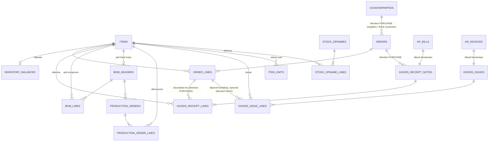

# Inventory — Schema (Finalized)

Fase 5 roadmap. Ref konsep bisnis: `docs/domain/inventory.md` + `memory/domain/inventory.md`. Ref schema yang di-reuse: `memory/architecture/data/journal-entry-schema.md` (RPC `create_journal_entry`, fungsi `set_updated_at()`+`block_edit_delete()`), `memory/architecture/data/ap-schema.md` (`ap_bills`+`create_ap_bill`, **0 perubahan**), `memory/architecture/data/ar-schema.md` (`ar_invoices`+`create_ar_invoice`, **0 perubahan**). Migration: `supabase/migrations/0012_inventory_schema.sql`.

DDL final di bawah, ERD & keputusan desain gak berubah dari revisi sebelumnya.

**Update `0038_remove_fifo_costing.sql`**: metode costing FIFO dihapus total dari sistem — `inventory_lots`+`inventory_lot_consumptions` di-drop, `items.costing_method` di-drop, `consume_fifo()` di-drop. Weighted Average (`inventory_balances`) sekarang satu-satunya mekanisme costing, dipakai semua item tanpa kecuali. Bagian di bawah yang masih menyebut FIFO/lot dipertahankan sebagai jejak sejarah desain (kenapa dulu ada 2 mekanisme) tapi ditandai eksplisit sudah tidak berlaku.

Struktur module → submodule di file ini SAMA urutannya dengan `docs/architecture/inventory-schema.md` dan `memory/domain/inventory.md` (lihat `AGENTS.md` > "Format Baku: Struktur Module → Submodule").

## Konsep Inti

### Keputusan Desain

- **`ap_bills`/`ar_invoices` tetap lump-sum, gak diubah sama sekali.** Rincian barang (qty & harga satuan) ditaruh di tabel baru (`goods_receipt_notes`/`goods_issues`) yang **nunjuk balik** ke bill/invoice yang sudah ada, bukan mengubah strukturnya. Alasan: dua tabel itu immutable & sudah punya data histori — mengubah strukturnya berarti migrasi data lama + bongkar UI yang sudah jalan, resiko besar buat manfaat yang bisa dicapai tanpa itu.
- **Metode costing: Weighted Average, satu-satunya, berlaku semua item.** Sebelum migration `0038` sempat ada dua metode (FIFO per-lot + Weighted Average) yang ditentukan per `items.costing_method`; FIFO sudah dihapus total dari sistem (`0038_remove_fifo_costing.sql`) — kolom `costing_method` juga sudah di-drop karena jadi redundant (cuma ada 1 nilai yang mungkin).
- **`inventory_balances` adalah satu-satunya state costing tersimpan lewat INCREMENTAL update tiap transaksi** (bukan dihitung ulang dari nol) di seluruh modul Inventory. Alasannya: rata-rata berjalan (`new_avg = (qty_before×avg_before + qty_in×unit_cost_in) / (qty_before+qty_in)`) itu rekursif — gak bisa diringkas jadi 1 agregat SQL sederhana kayak `SUM(debit)-SUM(credit)` atau `SUM(allocations)`, harus dihitung incremental tiap transaksi. ~~Beda dari pola dominan project ini (status AR/AP selalu derived dari query)~~ — **UPDATE migration `0053_denormalize_transactional_status.sql`, 2026-08-17**: status AR/AP/PO/SO/POS/Deposit sekarang JUGA kolom tersimpan (bukan lagi dihitung ulang tiap query), tapi mekanismenya beda dari `inventory_balances`: itu kolom **cache** dari agregat yang MASIH BISA dihitung ulang dari nol kapan aja (trigger cuma nyimpen ulang hasil `SUM`/`CASE` yang sama persis kayak sebelumnya, insertable-only jadi gak perlu incremental delta), sementara `inventory_balances.avg_cost` gak bisa dihitung ulang dari nol tanpa incremental (riwayat urutan transaksinya harus diproses berurutan). Lihat `ar-schema.md` submodule AR Invoice buat detail lengkap migration `0053`.
- **Penamaan tabel: master data gak pakai prefix modul, transaksional pakai.** Pola ini udah established di AR/AP (`customers`/`suppliers` polos, tapi `ar_invoices`/`ap_bills` pakai prefix). `items` konsisten sama pola itu (master data, polos). `inventory_balances` konsisten pakai prefix `inventory_` (transaksional/state). Tabel lain (`purchase_orders`, `goods_receipt_notes`, `bom_headers`, `production_orders`, `goods_issues`, dst) gak butuh prefix tambahan — namanya udah unik & jelas sendiri, gak ada modul lain yang bisa nabrak makna.

### ERD



`ORDERS`/`ORDER_LINES` gabungan `purchase_orders`+`sales_orders`/`purchase_order_lines`+`sales_order_lines` sejak migration `0060_orders_schema.sql` (Fase 3 order-generalization) — dibedakan kolom `direction` (`'PURCHASE'`/`'SALE'`), lihat submodule "Purchase Order & Sales Order (`orders`) + Penerimaan Barang" di bawah. `COUNTERPARTIES` gabungan `customers`+`suppliers` sejak migration `0059_counterparty_schema.sql` (Fase 1), lihat `memory/architecture/data/counterparty-schema.md`.

### `items`

Master data barang yang di-track Inventory — bisa bahan baku (`RAW_MATERIAL`) atau barang jadi (`FINISHED_GOOD`). Kolom penting:
- `uom` — satuan dasar (kg, gram, pcs, dst), dipakai semua pelacakan stok/costing (PO/GRN/BOM/production/goods issue), gak diubah oleh fitur satuan jual. Satuan JUAL ke customer (boleh beda, boleh lebih dari 1) ada di `item_units` — lihat submodule "Satuan Jual & Harga" di bawah.
- `inventory_account_id` — FK ke `accounts` (COA), akun **kontrol** (misal "Persediaan Bahan Baku" / "Persediaan Barang Jadi"). Satu akun ini menaungi banyak item sekaligus — detail per-item hidup di subledger Inventory (`items`+lot/balance), bukan sebagai akun terpisah per item di COA (pola sama `ar_invoices`/`customers`: 1 akun "Piutang Usaha" menaungi banyak customer).
- `archived_at` — pola sama `customers`/`suppliers` (`state-naming-convention.md`), item lama gak boleh dihapus keras.
- **`default_price` sempat ada** (nullable, migration `0018_items_default_price.sql`) — **di-drop lagi migration `0019_item_units_schema.sql`**, digantiin `item_units` (lihat submodule "Satuan Jual & Harga" di bawah) begitu ketauan item bisa dijual dalam >1 satuan, gak cukup 1 kolom flat per item.

```sql
create table items (
  id uuid primary key default gen_random_uuid(),
  name text not null,
  item_type text not null check (item_type in ('RAW_MATERIAL','FINISHED_GOOD')),
  uom text not null,
  inventory_account_id uuid not null references accounts(id),
  category_id uuid references item_categories(id),
  brand_id uuid references item_brands(id),
  archived_at timestamptz,
  created_at timestamptz not null default now(),
  updated_at timestamptz not null default now()
);

create trigger items_set_updated_at
  before update on items
  for each row execute function set_updated_at();
```

`set_updated_at()` udah ada dari `coa-schema.md`, gak perlu bikin ulang. `default_price` (migration `0018`) dan pencabutannya (migration `0019`) sudah tercermin di bentuk final ini — `create table` di atas ditulis dalam bentuk final, sesuai konvensi schema doc (`memory/preferences/system/schema-doc-format.md`). `category_id`/`brand_id` (nullable, migration `0023_item_categories_brands.sql`) ditambah belakangan — lihat submodule "Kategori & Brand Barang" di bawah buat definisi `item_categories`/`item_brands`.

### `inventory_balances`

**Dipakai semua item** (sejak migration `0038` — sebelumnya cuma item `WEIGHTED_AVERAGE`, item `FIFO` punya baris di `inventory_lots`). Nyimpen `qty_on_hand` dan `avg_cost` yang di-update tiap ada penerimaan (avg_cost berubah) atau konsumsi/penjualan (qty_on_hand berkurang, avg_cost tetap). Ini pengecualian sengaja dari pola "derived, bukan stored" yang dipegang di modul lain (lihat "Keputusan Desain" di atas kenapa gak bisa di-derive). PK-nya `item_id` sendiri (bukan `id` terpisah) — struktural mastiin maksimal 1 baris per item, gak butuh `unique` constraint tambahan.

```sql
create table inventory_balances (
  item_id uuid primary key references items(id),
  qty_on_hand numeric(14,3) not null default 0 check (qty_on_hand >= 0),
  avg_cost numeric(14,2) not null default 0,
  updated_at timestamptz not null default now()
);
```

**`inventory_lots` dan `inventory_lot_consumptions` sudah dihapus total (migration `0038_remove_fifo_costing.sql`)** — dulu ada 2 tabel buat nangenin costing FIFO per-lot (`inventory_lots` buat stok "lahir", `inventory_lot_consumptions` buat stok "dipakai/keluar"), lengkap sama trigger anti-over-consumption per lot. Sekarang cuma Weighted Average yang tersisa — satu-satunya state costing yang hidup adalah `inventory_balances` di atas, gak ada lagi konsep lot/batch per item.

**Penyesuaian ke hasil hitung fisik**: RPC `record_stock_opname` (migration `0020_stock_opname_schema.sql`) langsung nyesuaiin `qty_on_hand` ke hasil hitung — satu-satunya jalur yang nulis ke `qty_on_hand` tanpa lewat transaksi lain (semua RPC lain sebelumnya selalu lewat kejadian eksplisit: GRN, goods issue, produksi, retur, write-off). `avg_cost` gak disentuh. Lihat submodule "Stock Opname" di bawah.

### Fungsi Bersama: `consume_weighted_average`

Fungsi generik (bukan RPC yang dipanggil langsung dari client, tapi dipanggil dari dalam `create_production_order`/`create_goods_issue` — submodule "Produksi" dan "Penjualan & Pengakuan HPP" di bawah) — satu-satunya tempat logika konsumsi stok ditulis, biar production-input dan sales-issue gak duplikat logika. Cukup kurangin `qty_on_hand` langsung, `avg_cost` gak berubah pas konsumsi (cuma berubah pas penerimaan baru). Sebelum migration `0038`, ada juga `consume_fifo` (jalan lot demi lot, urut `lot_date`) buat item FIFO — sudah di-drop total, `consume_weighted_average` sekarang satu-satunya jalur konsumsi buat semua item.

Full body: `supabase/migrations/0012_inventory_schema.sql`.

### RLS & Grant (Konsep Inti)

Pola identik AR/AP: `select` terbuka semua `authenticated`, `insert` cuma `admin`/`accountant`. Beda dari tabel transaksional di submodule lain — `items` dan `inventory_balances` dapat policy `update` juga: `items` (+`archived_at` lewat update biasa), `inventory_balances` (state yang di-update RPC, bukan cuma insert-only). Gak ada policy/grant `delete` langsung buat `items` — tapi sejak `0013_master_data_smart_delete.sql` ada jalur terkontrol lewat RPC `delete_item()` (`security definer`, submodule "Smart Delete Master Data" di `memory/architecture/data/coa-schema.md`).

```sql
grant select, insert, update on items to authenticated;
grant select, insert, update on inventory_balances to authenticated;
```

Detail lengkap: `supabase/migrations/0012_inventory_schema.sql`.

## Purchase Order & Sales Order (`orders`) + Penerimaan Barang (3-Way Matching) — migration `0060_orders_schema.sql`

### Keputusan Desain

- **`purchase_orders`+`sales_orders` digabung jadi `orders`+`order_lines` (Fase 3 order-generalization, 2026-09-04, keputusan owner).** Dibedakan kolom `direction` (`'PURCHASE'`/`'SALE'`), bukan lagi 2 tabel + 2 RPC terpisah. Baru bisa dikerjakan sekarang karena 2 prasyaratnya udah selesai: Fase 1 (`0059_counterparty_schema.sql`) bikin `orders.counterparty_id` punya 1 tabel rujukan buat kedua arah, Fase 2 (`0058_purchase_order_not_mandatory.sql`) bikin PO dan SO beneran simetris (dua-duanya opsional, dua-duanya bebas tipe item) — begitu ketiga alasan historis PO/SO dipisah (wajib/opsional, tipe item, tabel counterparty beda) tercabut semua, gak ada lagi alasan struktural buat 2 tabel terpisah.
- **Yang TETAP terpisah (gak ikut digabung): layer fulfillment + finansial di bawahnya** — `create_goods_receipt` (direction `PURCHASE`) dan `create_goods_issue` (direction `SALE`) tetap 2 RPC beda total, karena efek jurnalnya beneran beda (1 sisi cuma update Persediaan lewat `create_ap_bill`, sisi lain bikin 2 jurnal sekaligus — Piutang/Pendapatan DAN HPP/Persediaan lewat `create_ar_invoice`). Ini crux kenapa Fase 3 BUKAN generalisasi penuh seluruh alur beli/jual — cuma layer komitmen (`orders`) yang digabung, layer realisasi fisik (GRN vs Goods Issue) tetap 2 tabel/2 RPC berbeda, masing-masing dijaga trigger direction-match sendiri (submodule ini + submodule "Penjualan & Pengakuan HPP") karena gak bisa dijamin FK biasa.
- **Goods Receipt Note (GRN) dan Bill dibuat bersamaan** (1 RPC, 1 langkah) — asumsi proses pembelian informal (nota = bukti kirim + tagihan sekaligus, gak ada jeda waktu antara barang datang dan tagihan resmi). Ini menghindari kebutuhan akun perantara "Barang Diterima Belum Ditagih" (GR/IR clearing) yang dipakai ERP besar buat kasus barang datang duluan tagihan nyusul — dicatat sebagai catatan terbuka (bukan scope-debt formal, belum ada file tracking-nya) kalau nanti proses pembeliannya berkembang butuh jeda waktu.
- **3-way matching di sisi pembelian (Purchase Order → GRN → Bill) OPSIONAL** (migration `0058_purchase_order_not_mandatory.sql`, 2026-09-03), mirror padanannya di sisi jual (Sales Order → Goods Issue → Invoice) yang udah opsional dari awal. Goods Receipt/Goods Issue boleh dibuat langsung tanpa order sama sekali (beli/jual dadakan) — kedua sisi simetris penuh soal opsionalitas.
- **`orders` gak bikin journal entry**, kedua arah. Order murni komitmen/rencana, belum ada pertukaran aset/liability — journal entry baru muncul pas GRN+Bill (`direction='PURCHASE'`) atau Goods Issue+Invoice (`direction='SALE'`) dibuat.

### `orders` + `order_lines`

Komitmen pesan ke supplier (`direction='PURCHASE'`) atau dari customer (`direction='SALE'`) — **belum ada journal entry**. Header (`counterparty_id`, `direction`, `order_date`, `expected_date`, `source_ref`, `cancelled_at`, `status`) + lines (`item_id`, `qty_ordered`, `unit_price`) — 1 struktur buat kedua arah, gantiin `purchase_orders`/`purchase_order_lines` (kolom `unit_cost_expected` dulu, sekarang `unit_price`) dan `sales_orders`/`sales_order_lines`. `status` (`OPEN`/`PARTIALLY_RECEIVED`|`PARTIALLY_FULFILLED`/`FULLY_RECEIVED`|`FULLY_FULFILLED`/`CANCELLED`, tergantung `direction`) kolom asli sejak awal tabel ini ada — Fase 3 dibangun setelah `0053_denormalize_transactional_status.sql`, jadi gak pernah lewat fase "derived view" kayak `purchase_orders`/`sales_orders` dulu. Lihat submodule "Status sync" di bawah.

```sql
create table orders (
  id uuid primary key default gen_random_uuid(),
  counterparty_id uuid not null references counterparties(id),
  direction text not null check (direction in ('PURCHASE','SALE')),
  order_date date not null,
  expected_date date,
  source_ref text not null,
  cancelled_at timestamptz,
  status text not null default 'OPEN',
  created_by uuid references auth.users(id),
  created_at timestamptz not null default now()
);

create index orders_counterparty_id_idx on orders(counterparty_id);
create index orders_direction_idx on orders(direction);
create index orders_order_date_idx on orders(order_date desc);
create index orders_status_idx on orders(status);

create table order_lines (
  id uuid primary key default gen_random_uuid(),
  order_id uuid not null references orders(id) on delete cascade,
  item_id uuid not null references items(id),
  qty_ordered numeric(14,3) not null check (qty_ordered > 0),
  unit_price numeric(14,2) not null check (unit_price > 0)
);

create index order_lines_order_id_idx on order_lines(order_id);
create index order_lines_item_id_idx on order_lines(item_id);
```

**Type-safety: trigger `orders_counterparty_direction_guard`** — `direction='PURCHASE'` cuma boleh nunjuk `counterparty_id` yang terdaftar role `supplier` di `counterparty_type_mapping`, `direction='SALE'` cuma boleh role `customer`. Konsepnya niru `counterparty_role_guard()` (`0059`, `memory/architecture/data/counterparty-schema.md`) tapi ditulis sebagai trigger BEFORE INSERT khusus tabel ini (bukan fungsi generik `TG_ARGV` lintas banyak tabel), karena role yang divalidasi ditentukan dari kolom `direction` di baris yang sama, bukan hardcode per tabel:

```sql
create function orders_counterparty_direction_guard() returns trigger as $$
declare
  v_required_role text;
begin
  v_required_role := case new.direction when 'PURCHASE' then 'supplier' when 'SALE' then 'customer' end;

  if not exists (
    select 1 from counterparty_type_mapping
    where counterparty_id = new.counterparty_id and role = v_required_role
  ) then
    raise exception 'Pihak % bukan % terdaftar -- gak bisa dipakai di order direction %',
      new.counterparty_id, v_required_role, new.direction;
  end if;

  return new;
end;
$$ language plpgsql;

create trigger orders_counterparty_direction_guard_trigger
  before insert on orders
  for each row execute function orders_counterparty_direction_guard();
```

**Immutability + Cancel (`cancelled_at`)** — `orders_block_edit_delete_or_cancel()` gabungan `purchase_orders_block_edit_delete_or_cancel`+`sales_orders_block_edit_delete_or_cancel` (`0024`, aturan freeze-nya sama persis, cuma nama kolom beda) jadi 1 fungsi niru pola selective-lock `accounts_published_lock` (`coa-schema.md`): bandingin tuple SEMUA kolom selain `id`/`cancelled_at`/`status`, tolak kalau ada yang berubah ATAU kalau `cancelled_at` udah keisi (sekali dibatalkan, gak bisa diapa-apain lagi termasuk dibatalkan ulang). Trigger terpisah `orders_sync_status_on_cancel` (BEFORE UPDATE) set `status='CANCELLED'` langsung begitu `cancelled_at` baru keisi — gak lewat `recompute_order_status()` (submodule "Status sync" di bawah), karena trigger immutability di atas bakal nolak update susulan apa pun begitu `cancelled_at` udah kepasang. `order_lines` TETAP full-immutable (`block_edit_delete` generik) — baris gak pernah berubah pas header dibatalkan.

```sql
create function orders_block_edit_delete_or_cancel() returns trigger as $$
begin
  if tg_op = 'DELETE' then
    raise exception 'Order gak pernah bisa dihapus';
  end if;

  if old.cancelled_at is not null then
    raise exception 'Order % udah dibatalkan, gak bisa diubah lagi', old.id;
  end if;

  if (old.counterparty_id, old.direction, old.order_date, old.expected_date, old.source_ref,
      old.created_by, old.created_at)
     is distinct from
     (new.counterparty_id, new.direction, new.order_date, new.expected_date, new.source_ref,
      new.created_by, new.created_at) then
    raise exception 'orders immutable kecuali cancelled_at/status';
  end if;

  return new;
end;
$$ language plpgsql;

create trigger orders_block_edit_delete
  before update or delete on orders
  for each row execute function orders_block_edit_delete_or_cancel();

create trigger orders_sync_status_on_cancel_trigger
  before update on orders
  for each row execute function orders_sync_status_on_cancel();

create trigger order_lines_block_edit_delete
  before update or delete on order_lines
  for each row execute function block_edit_delete();
```

### RPC `create_order` / `cancel_order` — gantiin `create_purchase_order`+`create_sales_order`, `cancel_purchase_order`+`cancel_sales_order`

`create_order` terima `p_direction` eksplisit (`raise exception` kalau bukan `'PURCHASE'`/`'SALE'`), insert header + lines sekaligus. Murni insert, **gak ada journal entry** (order cuma komitmen — lihat "Keputusan Desain"). `cancel_order` baca `direction` lebih dulu, baru branch guard-nya: `PURCHASE` cek `goods_receipt_lines` (via `order_lines`) udah ada realisasi apa belum, `SALE` cek `goods_issue_lines` — mirror persis `cancel_purchase_order`/`cancel_sales_order` (`0024`), cuma sekarang 1 fungsi. `security invoker`, murni stempel status — **gak bikin/balikin jurnal apa pun** (order emang gak pernah punya jurnal, beda dari `cancel_ar_invoice`/`cancel_ap_bill` yang bikin reversing entry).

```sql
create function create_order(
  p_direction text,
  p_counterparty_id uuid,
  p_order_date date,
  p_expected_date date,
  p_source_ref text,
  p_lines jsonb -- array of {"item_id":uuid,"qty_ordered":numeric,"unit_price":numeric}
) returns uuid language plpgsql security invoker as $$ ... $$;

create function cancel_order(p_order_id uuid) returns void
  language plpgsql security invoker as $$ ... $$;
```

Full body: `supabase/migrations/0060_orders_schema.sql`.

### `goods_receipt_notes` + `goods_receipt_lines`

Bukti penerimaan fisik — **`bill_id` selalu wajib** (dibuat bersamaan, tiap GRN pasti punya tagihan), **`order_id` opsional sejak `0058`** (nullable, kolom di-rename dari `purchase_order_id` di migration `0060` — GRN boleh berdiri sendiri tanpa order, kasus beli dadakan). Kolom `delivery_note_ref` (nomor Surat Jalan dari supplier) murni referensi teks, gak jadi entity/ledger tersendiri. Lines mencatat `qty_received` & `unit_cost` **riil** — kalau baris nunjuk order line (`order_line_id`, di-rename dari `po_line_id` di `0060`, keisi), bisa beda dari `unit_price` di order line (selisih ini informasional/reporting, gak diblokir keras, cuma qty yang dijaga trigger anti-over-receipt terhadap `order_lines.qty_ordered`); kalau `order_line_id` NULL (jalur langsung), gak ada pembanding sama sekali, item/qty/harga input manual sepenuhnya. Immutable (reuse `block_edit_delete`), sama pola `ar_invoices`/`ap_bills`.

**Trigger `goods_receipt_notes_order_direction_guard` (baru, migration `0060`)** — `goods_receipt_notes.order_id`, kalau diisi, cuma boleh nunjuk `orders` dengan `direction='PURCHASE'`. Gak bisa dijamin FK biasa (FK cuma jamin ID-nya ada, gak jamin kolom lain di baris yang ditunjuk sesuai), butuh trigger sendiri — pola sama proteksi type-safety Fase 1 (`counterparty_role_guard`). `NULL` tetap lolos (jalur langsung tanpa order).

Insert `goods_receipt_lines` inilah yang **memicu** penambahan Persediaan: update `inventory_balances` (avg_cost dihitung ulang, weighted) — mekanisme ini identik di kedua jalur (dari order/langsung).

```sql
create table goods_receipt_notes (
  id uuid primary key default gen_random_uuid(),
  order_id uuid references orders(id), -- dulu purchase_order_id -> purchase_orders(id), rename migration 0060
  bill_id uuid not null references ap_bills(id),
  delivery_note_ref text,
  receipt_date date not null,
  created_by uuid references auth.users(id),
  created_at timestamptz not null default now()
);

create trigger goods_receipt_notes_block_edit_delete
  before update or delete on goods_receipt_notes
  for each row execute function block_edit_delete();

create function goods_receipt_notes_order_direction_guard() returns trigger as $$
begin
  if new.order_id is null then
    return new;
  end if;

  if not exists (select 1 from orders where id = new.order_id and direction = 'PURCHASE') then
    raise exception 'Order % bukan Purchase Order -- gak bisa dipakai di goods receipt', new.order_id;
  end if;

  return new;
end;
$$ language plpgsql;

create trigger goods_receipt_notes_order_direction_guard_trigger
  before insert on goods_receipt_notes
  for each row execute function goods_receipt_notes_order_direction_guard();

create table goods_receipt_lines (
  id uuid primary key default gen_random_uuid(),
  grn_id uuid not null references goods_receipt_notes(id) on delete cascade,
  order_line_id uuid references order_lines(id), -- dulu po_line_id -> purchase_order_lines(id), rename migration 0060
  item_id uuid not null references items(id),
  qty_received numeric(14,3) not null check (qty_received > 0),
  unit_cost numeric(14,2) not null check (unit_cost > 0)
);

create trigger goods_receipt_lines_block_edit_delete
  before update or delete on goods_receipt_lines
  for each row execute function block_edit_delete();
```

### Trigger `goods_receipt_lines_no_over_receipt` (ditulis ulang `0058`, kolom disesuaikan `0060`)

Menolak `qty_received` yang bikin total penerimaan per order line ngelewatin `qty_ordered` — **skip total kalau `order_line_id` NULL** (jalur langsung tanpa order gak punya apa pun buat dibandingkan), mirror persis pola `goods_issue_lines_no_over_issue` (submodule "Penjualan & Pengakuan HPP" di bawah) yang udah skip kalau `order_line_id` null. Signature trigger function gak berubah dari `0058` — `0060` cuma `create or replace` isi body-nya (ganti referensi `purchase_order_lines`/`po_line_id` jadi `order_lines`/`order_line_id`), aman tanpa `drop function`:

```sql
create function goods_receipt_lines_no_over_receipt() returns trigger as $$
declare
  v_qty_ordered numeric;
  v_qty_received numeric;
  v_item_name text;
begin
  if new.order_line_id is null then
    return new;
  end if;

  select qty_ordered into v_qty_ordered from order_lines where id = new.order_line_id;
  select coalesce(sum(qty_received), 0) into v_qty_received
    from goods_receipt_lines where order_line_id = new.order_line_id;

  if v_qty_received + new.qty_received > v_qty_ordered then
    select name into v_item_name from items where id = new.item_id;
    raise exception 'Penerimaan item "%" melebihi qty dipesan (sisa %, coba terima %)',
      v_item_name, v_qty_ordered - v_qty_received, new.qty_received;
  end if;

  return new;
end;
$$ language plpgsql;

create trigger goods_receipt_lines_no_over_receipt_trigger
  before insert on goods_receipt_lines
  for each row execute function goods_receipt_lines_no_over_receipt();
```

### RPC `create_goods_receipt` — GRN + Bill + update Persediaan sekaligus

Titik paling padat di modul ini — 1 pemanggilan RPC memicu 4 hal atomik: (1) resolve `v_supplier_id` (dari order kalau `p_order_id` diisi — WAJIB `direction='PURCHASE'`, dicek langsung di body RPC ini juga selain trigger `goods_receipt_notes_order_direction_guard` — dari `p_supplier_id` manual kalau enggak), hitung total amount dari lines + gabung sama `p_extra_debit_lines` kalau ada, (2) panggil `create_ap_bill` (reuse) buat bikin bill+jurnal utang, ikut kirim `p_apply_tax`, (3) insert `goods_receipt_notes`+`goods_receipt_lines`, (4) per line: hitung ulang `avg_cost` (weighted) & update `inventory_balances`. Trigger `goods_receipt_lines_no_over_receipt` jalan otomatis pas langkah (3).

**Kategori Campur & PPN (migration `0012_grn_compound_ppn.sql`)** — 2 param di akhir signature (`p_extra_debit_lines` default `null`, `p_apply_tax` default `false`), additive, gak berubah lagi sejak itu.

**Guard cancel (migration `0024`, sekarang `cancel_order`)** — order yang UDAH dibatalkan gak bisa lagi jadi dasar GRN baru, dicek awal body (`if exists (... orders where id = p_order_id and cancelled_at is not null) then raise exception ...`).

**Param rename `0060`, BUKAN perubahan signature struktural** — `p_purchase_order_id` jadi `p_order_id` (tipe/urutan param lain gak berubah), `p_lines` isinya `order_line_id` gantiin `po_line_id`. `create or replace` langsung, gak perlu `drop function` (beda dari perubahan `0058` yang nambah/ubah daftar parameter beneran, WAJIB `drop function if exists` dulu — pelajaran dari bug `0011`/`0012` `create_ap_bill` yang udah pernah kejadian persis di project ini).

**Catatan validasi supplier jalur langsung (gak berubah dari `0058`)** — body ini masih cek `not exists (select 1 from suppliers where id = p_supplier_id)`, nunjuk ke tabel `suppliers` LEGACY yang belum di-drop (`0059`, lihat `memory/architecture/data/counterparty-schema.md`), BUKAN `counterparties`. Perilaku ini gak disentuh migration `0060` (bukan bagian dari Fase 3 — warisan langsung dari `0058`), dicatat di sini biar gak dikira kelupaan pas baca ulang.

```sql
create function create_goods_receipt(
  p_order_id uuid, -- dulu p_purchase_order_id, rename migration 0060, nullable sejak 0058
  p_receipt_date date, p_delivery_note_ref text,
  p_lines jsonb, -- array of {"order_line_id":uuid|null,"item_id":uuid,"qty_received":numeric,"unit_cost":numeric}
  p_bill_description text, p_bill_source_ref text,
  p_debit_account_id uuid, p_payable_account_id uuid,
  p_extra_debit_lines jsonb default null, -- array of {"account_id":uuid,"amount":numeric} -- Beban tambahan (ongkir, dst), BUKAN kategori Persediaan
  p_apply_tax boolean default false,
  p_supplier_id uuid default null -- wajib diisi kalau p_order_id NULL
) returns uuid language plpgsql security invoker as $$ ... $$;
```

Full body: `supabase/migrations/0004_inventory_schema.sql` (definisi awal) → `supabase/migrations/0012_grn_compound_ppn.sql` (kategori campur & PPN) → `supabase/migrations/0058_purchase_order_not_mandatory.sql` (PO opsional) → `supabase/migrations/0060_orders_schema.sql` (rename ke `orders`/`order_lines`, bentuk final saat ini).

### RLS & Grant (Purchase Order & Sales Order + Penerimaan Barang)

Pola identik AR/AP: `select` terbuka semua `authenticated`, `insert` cuma `admin`/`accountant`. `order_lines`/`goods_receipt_notes`/`goods_receipt_lines` tetap **gak ada policy `update`/`delete`** (immutable total, 2 lapis proteksi — RLS default-deny + trigger `block_edit_delete`). `orders` dapat 1 policy `update` (role gate sama pola `insert`), tapi kolom mana yang boleh berubah dijaga trigger `orders_block_edit_delete_or_cancel()`, BUKAN `WITH CHECK` per-kolom (pola sama `accounts_update`/`accounts_published_lock` di `coa-schema.md`).

```sql
grant select, insert, update on orders to authenticated; -- update cuma buat cancelled_at/status (dijaga trigger)
grant select, insert on order_lines to authenticated;
grant select, insert on goods_receipt_notes to authenticated;
grant select, insert on goods_receipt_lines to authenticated;
```

### `purchase_orders_with_status` / `sales_orders_with_status` — TETAP 2 view, terfilter `direction`, di atas 1 tabel `orders` (migration `0060`, deviasi sengaja dari rencana awal)

Rencana awal Fase 3 (order-generalization) nyebut 1 view gabungan `orders_with_status`. Migration `0060` sengaja PAKAI 2 view terfilter `direction` di atas 1 tabel `orders`, bukan 1 view gabungan — biar `queries.ts` existing (`apps/erp/src/lib/purchase-orders/queries.ts` + `.../sales-orders/queries.ts`) tetap query `FROM` nama view yang sama, cuma nama kolom yang berubah, DAN biar list page `/purchase-orders`/`/sales-orders` tetap 2 halaman terpisah — keputusan UI yang dipertahankan sengaja, bukan keharusan DB (lihat `memory/domain/inventory.md` submodule ini kenapa).

```sql
create view purchase_orders_with_status
  with (security_invoker = true) as
select id, counterparty_id, direction, order_date, expected_date, source_ref, created_at,
       cancelled_at, status
from orders
where direction = 'PURCHASE';

create view sales_orders_with_status
  with (security_invoker = true) as
select id, counterparty_id, direction, order_date, expected_date, source_ref, created_at,
       cancelled_at, status
from orders
where direction = 'SALE';

grant select on purchase_orders_with_status to authenticated;
grant select on sales_orders_with_status to authenticated;
```

View status LAMA (`0034_purchase_order_status_view.sql`/`0035_sales_order_status_view.sql`, sempat `select` polos di atas kolom `status` yang didenormalisasi `0053`) di-`drop` eksplisit di migration `0060` sebelum tabel lama ikut di-`drop`, digantikan versi di atas — nama & bentuk kolom identik, cuma sumbernya sekarang `orders` terfilter, bukan `purchase_orders`/`sales_orders` polos.

### Status sync — `recompute_order_status` gabungan `recompute_purchase_order_status`+`recompute_sales_order_status`

1 fungsi, branch di dalam berdasar `direction` (karena "sumber realisasi" beda — `goods_receipt_lines` vs `goods_issue_lines` — walau formula `CASE`-nya identik): `cancelled_at` menang duluan (langsung `return`, karena `orders_block_edit_delete_or_cancel` nolak SEMUA update lanjutan begitu `cancelled_at` kepasang, termasuk dari fungsi ini kalau gak di-skip), baru `bool_and()` per baris `order_lines` dibandingkan realisasinya. `PURCHASE` → `OPEN`/`PARTIALLY_RECEIVED`/`FULLY_RECEIVED`; `SALE` → `OPEN`/`PARTIALLY_FULFILLED`/`FULLY_FULFILLED`. Dipicu trigger `AFTER INSERT` di 3 tabel: `order_lines` (`order_lines_sync_order_status_trigger`), `goods_receipt_lines` (`goods_receipt_lines_sync_order_status_trigger`, skip kalau `order_line_id` null), `goods_issue_lines` (`goods_issue_lines_sync_order_status_trigger`, skip kalau `order_line_id` null) — trigger lama `goods_receipt_lines_sync_po_status_trigger`/`goods_issue_lines_sync_so_status_trigger` (`0053`) di-drop & diganti (nempel di tabel yang TETAP ADA, bodinya masih nunjuk tabel lama yang bakal hilang).

```sql
create function recompute_order_status(p_order_id uuid) returns void as $$
declare
  v_direction text;
  v_cancelled_at timestamptz;
  v_all_done boolean;
  v_none_done boolean;
  v_status text;
begin
  select direction, cancelled_at into v_direction, v_cancelled_at from orders where id = p_order_id;
  if not found then
    return;
  end if;

  if v_cancelled_at is not null then
    return;
  end if;

  if v_direction = 'PURCHASE' then
    select
      coalesce(bool_and(coalesce(gr.received, 0) >= ol.qty_ordered - 0.0005), true),
      coalesce(bool_and(coalesce(gr.received, 0) <= 0.0005), true)
      into v_all_done, v_none_done
    from order_lines ol
    left join lateral (
      select sum(grl.qty_received) as received
      from goods_receipt_lines grl
      where grl.order_line_id = ol.id
    ) gr on true
    where ol.order_id = p_order_id;

    v_status := case
      when v_all_done then 'FULLY_RECEIVED'
      when v_none_done then 'OPEN'
      else 'PARTIALLY_RECEIVED'
    end;
  else
    select
      coalesce(bool_and(coalesce(gi.issued, 0) >= ol.qty_ordered - 0.0005), true),
      coalesce(bool_and(coalesce(gi.issued, 0) <= 0.0005), true)
      into v_all_done, v_none_done
    from order_lines ol
    left join lateral (
      select sum(gil.qty_issued) as issued
      from goods_issue_lines gil
      where gil.order_line_id = ol.id
    ) gi on true
    where ol.order_id = p_order_id;

    v_status := case
      when v_all_done then 'FULLY_FULFILLED'
      when v_none_done then 'OPEN'
      else 'PARTIALLY_FULFILLED'
    end;
  end if;

  update orders set status = v_status where id = p_order_id;
end;
$$ language plpgsql security definer set search_path = public;
```

Full body (backfill data lama dari `purchase_orders`/`sales_orders`, DDL, RPC lengkap): `supabase/migrations/0060_orders_schema.sql`.

## Produksi (Bill of Materials & Production Order)

### Keputusan Desain

- **BOM (`bom_headers`/`bom_lines`) adalah master data mutable**, bukan transaksional immutable — resep boleh direvisi. Ini aman karena `production_orders`/`production_order_lines` **snapshot** qty & biaya aktual pas produksi terjadi (gak look-up ulang ke `bom_lines` di kemudian hari) — pola sama seperti `due_date` di AR/AP yang snapshot dari `payment_term_days` pas insert, gak retroaktif kalau master data berubah belakangan.

### `bom_headers` + `bom_lines`

Resep — master data mutable (bukan transaksional). Header: `finished_item_id`, `output_qty` (qty barang jadi per 1 batch resep), `is_active`. Lines: `raw_material_item_id`, `qty_per_batch`. Boleh direvisi kapan pun — produksi yang sudah terjadi gak retroaktif berubah karena `production_order_lines` snapshot angka aktual, bukan look-up ulang ke sini. `bom_headers` cukup `update` (nonaktifin lewat `is_active`, gak perlu hapus baris); `bom_lines` boleh `delete` (ganti komposisi resep = hapus+tambah baris, wajar buat master data mutable).

```sql
create table bom_headers (
  id uuid primary key default gen_random_uuid(),
  finished_item_id uuid not null references items(id),
  output_qty numeric(14,3) not null check (output_qty > 0),
  is_active boolean not null default true,
  created_at timestamptz not null default now(),
  updated_at timestamptz not null default now()
);

create trigger bom_headers_set_updated_at
  before update on bom_headers
  for each row execute function set_updated_at();

create table bom_lines (
  id uuid primary key default gen_random_uuid(),
  bom_header_id uuid not null references bom_headers(id) on delete cascade,
  raw_material_item_id uuid not null references items(id),
  qty_per_batch numeric(14,3) not null check (qty_per_batch > 0)
);
```

### `production_orders` + `production_order_lines`

Kejadian produksi beneran. Header: `bom_header_id`, `qty_produced`, `production_date`, **`journal_entry_id`** (wajib, dibuat via `create_journal_entry`: Debit Persediaan Barang Jadi, Kredit Persediaan Bahan Baku, di level akun kontrol — bukan per-item). Lines: snapshot tiap bahan baku yang dikonsumsi (`item_id`, `qty_consumed`, `total_cost` — hasil dari Weighted Average lookup, via `consume_weighted_average` di submodule "Konsep Inti"). Immutable (reuse `block_edit_delete`).

**Scope biaya produksi**: `production_order_lines` saat ini cuma menghitung dari bahan baku yang dikonsumsi (`consume_weighted_average`) — belum ada alokasi biaya tenaga kerja langsung atau overhead pabrik, walau secara prinsip *full absorption costing* keduanya wajib ikut masuk HPP. Butuh mekanisme alokasi terpisah yang belum dibangun.

```sql
create table production_orders (
  id uuid primary key default gen_random_uuid(),
  bom_header_id uuid not null references bom_headers(id),
  qty_produced numeric(14,3) not null check (qty_produced > 0),
  production_date date not null,
  source_ref text not null,
  journal_entry_id uuid not null references journal_entries(id),
  created_by uuid references auth.users(id),
  created_at timestamptz not null default now()
);

create trigger production_orders_block_edit_delete
  before update or delete on production_orders
  for each row execute function block_edit_delete();

create table production_order_lines (
  id uuid primary key default gen_random_uuid(),
  production_order_id uuid not null references production_orders(id) on delete cascade,
  item_id uuid not null references items(id),
  qty_consumed numeric(14,3) not null check (qty_consumed > 0),
  total_cost numeric(14,2) not null check (total_cost > 0)
);

create trigger production_order_lines_block_edit_delete
  before update or delete on production_order_lines
  for each row execute function block_edit_delete();
```

### RPC `create_production_order` — jalankan resep + jurnal produksi sekaligus

Ambil `bom_lines` dari `bom_header_id`, hitung `batch_multiplier = qty_produced / output_qty`, konsumsi tiap bahan baku (Weighted Average, via `consume_weighted_average`), total biayanya jadi jurnal (Debit Persediaan Barang Jadi, Kredit Persediaan Bahan Baku), lalu barang jadi hasil produksi nambah `inventory_balances`. **Detail teknis**: `id` production order digenerate duluan (`gen_random_uuid()`) sebelum baris headernya di-insert, dipakai sebagai `consumption_ref` pas konsumsi jalan — perlu karena `production_order_lines` (yang FK ke header) baru bisa di-insert setelah total biaya (yang butuh hasil konsumsi) diketahui buat bikin jurnal duluan; header jurnal-dulu-baris-belakangan ini pola yang sama kayak `create_ap_bill`/`create_ar_invoice`, cuma di sini urutannya lebih panjang karena ada langkah konsumsi di tengah.

```sql
create function create_production_order(
  p_bom_header_id uuid, p_qty_produced numeric, p_production_date date, p_source_ref text,
  p_finished_good_debit_account_id uuid, p_raw_material_credit_account_id uuid
) returns uuid language plpgsql security invoker as $$ ... $$;
```

Full body: `supabase/migrations/0012_inventory_schema.sql`.

### RLS & Grant (Produksi)

Pola identik AR/AP: `select` terbuka semua `authenticated`, `insert` cuma `admin`/`accountant`. `production_orders`+`production_order_lines` transaksional — **gak ada policy `update`/`delete`**. `bom_headers`+`bom_lines` beda — master data mutable, dapat policy `update` juga; `bom_lines` malah dapat `delete` juga (komposisi resep boleh diubah bebas, hapus+tambah baris).

```sql
grant select, insert, update on bom_headers to authenticated;
grant select, insert, update, delete on bom_lines to authenticated;
grant select, insert on production_orders to authenticated;
grant select, insert on production_order_lines to authenticated;
```

Detail lengkap: `supabase/migrations/0012_inventory_schema.sql`.

## Penjualan & Pengakuan HPP (Goods Issue)

### `goods_issues` + `goods_issue_lines`

Kebalikan GRN — barang jadi **keluar** karena terjual. Header: **wajib nunjuk `invoice_id`** (dibuat bersamaan dengan `ar_invoices`, sama pola GRN+Bill), **`journal_entry_id`** (Debit HPP, Kredit Persediaan Barang Jadi — **jurnal tambahan**, terpisah dari jurnal invoice yang sudah ada Debit Piutang/Kredit Pendapatan). Lines: `item_id` (barang jadi), `qty_issued`, `total_cost` (dari Weighted Average, sama mekanisme `production_order_lines`, via `consume_weighted_average` di submodule "Konsep Inti"). Immutable (reuse `block_edit_delete`).

```sql
create table goods_issues (
  id uuid primary key default gen_random_uuid(),
  invoice_id uuid not null references ar_invoices(id),
  journal_entry_id uuid not null references journal_entries(id),
  issue_date date not null,
  source_ref text not null,
  created_by uuid references auth.users(id),
  created_at timestamptz not null default now()
);

create trigger goods_issues_block_edit_delete
  before update or delete on goods_issues
  for each row execute function block_edit_delete();

create table goods_issue_lines (
  id uuid primary key default gen_random_uuid(),
  goods_issue_id uuid not null references goods_issues(id) on delete cascade,
  item_id uuid not null references items(id),
  qty_issued numeric(14,3) not null check (qty_issued > 0),
  total_cost numeric(14,2) not null check (total_cost > 0),
  order_line_id uuid references order_lines(id) -- nullable, migration 0024 (so_line_id), rename dari `sales_order_lines(id)` migration 0060, lihat submodule "Purchase Order & Sales Order (`orders`) + Penerimaan Barang"
);

create trigger goods_issue_lines_block_edit_delete
  before update or delete on goods_issue_lines
  for each row execute function block_edit_delete();
```

### Trigger `goods_issue_lines_order_direction_guard` (baru, migration `0060`)

Mirror `goods_receipt_notes_order_direction_guard` (submodule "Purchase Order & Sales Order (`orders`) + Penerimaan Barang" di atas), arah kebalik: `goods_issue_lines.order_line_id`, kalau diisi, cuma boleh nunjuk baris `order_lines` dari order dengan `direction='SALE'`. `NULL` tetap lolos (jalur jual langsung tanpa Sales Order).

```sql
create function goods_issue_lines_order_direction_guard() returns trigger as $$
begin
  if new.order_line_id is null then
    return new;
  end if;

  if not exists (
    select 1 from order_lines ol join orders o on o.id = ol.order_id
    where ol.id = new.order_line_id and o.direction = 'SALE'
  ) then
    raise exception 'Baris order % bukan dari Sales Order -- gak bisa dipakai di goods issue', new.order_line_id;
  end if;

  return new;
end;
$$ language plpgsql;

create trigger goods_issue_lines_order_direction_guard_trigger
  before insert on goods_issue_lines
  for each row execute function goods_issue_lines_order_direction_guard();
```

### Trigger `goods_issue_lines_no_over_issue` (kolom disesuaikan `0060`)

Mirror persis `goods_receipt_lines_no_over_receipt`, cuma **skip kalau `order_line_id` null** (jalur jual langsung gak kena guard ini sama sekali). Signature trigger function gak berubah dari sebelumnya — `0060` cuma `create or replace` isi body-nya (ganti referensi `sales_order_lines`/`so_line_id` jadi `order_lines`/`order_line_id`):

```sql
create function goods_issue_lines_no_over_issue() returns trigger as $$
declare
  v_qty_ordered numeric;
  v_qty_issued numeric;
  v_item_name text;
begin
  if new.order_line_id is null then
    return new;
  end if;

  select qty_ordered into v_qty_ordered from order_lines where id = new.order_line_id;
  select coalesce(sum(qty_issued), 0) into v_qty_issued
    from goods_issue_lines where order_line_id = new.order_line_id;

  if v_qty_issued + new.qty_issued > v_qty_ordered then
    select name into v_item_name from items where id = new.item_id;
    raise exception 'Pengiriman item "%" melebihi qty dipesan di Sales Order (sisa %, coba kirim %)',
      v_item_name, v_qty_ordered - v_qty_issued, new.qty_issued;
  end if;

  return new;
end;
$$ language plpgsql;

create trigger goods_issue_lines_no_over_issue_trigger
  before insert on goods_issue_lines
  for each row execute function goods_issue_lines_no_over_issue();
```

### RPC `create_goods_issue` — invoice + konsumsi barang jadi + jurnal HPP sekaligus

Panggil `create_ar_invoice` (reuse) dulu buat jurnal Debit Piutang/Kredit Pendapatan, lalu konsumsi tiap barang jadi yang terjual (Weighted Average), total biayanya jadi jurnal **kedua** (Debit HPP, Kredit Persediaan Barang Jadi — titik HPP diakui, `inventory.md` submodule "Penjualan & Pengakuan HPP"). Trik `id`-digenerate-duluan yang sama kayak `create_production_order`. Awal body sekarang juga cek langsung (selain trigger `goods_issue_lines_order_direction_guard`) — kalau ada baris `p_lines` yang nunjuk `order_line_id` dari order yang udah `cancelled_at`, `raise exception` sebelum lanjut.

**Riwayat signature**: `p_lines` nambah key opsional `so_line_id` per baris (`0024`, gak ubah signature level fungsi) → parameter level fungsi berubah jadi `p_credit_lines`+`p_apply_tax` gantiin `p_amount`+`p_revenue_account_id` (`0025`, alasannya `create_ar_invoice` yang dipanggilnya berubah signature — `memory/architecture/data/ar-schema.md` submodule "Compounding & PPN", `drop function` dulu karena breaking) → key `so_line_id` di `p_lines` di-rename jadi `order_line_id` (`0060`, cuma rename isi jsonb, bukan parameter level fungsi, `create or replace` aman).

```sql
create function create_goods_issue(
  p_customer_id uuid, p_invoice_date date, p_description text, p_source_ref text,
  p_credit_lines jsonb, -- array of {"account_id":uuid,"amount":numeric} -- diteruskan ke create_ar_invoice
  p_receivable_account_id uuid,
  p_lines jsonb, -- array of {"item_id":uuid,"qty_issued":numeric,"order_line_id":uuid|null}
  p_hpp_account_id uuid, p_finished_good_account_id uuid,
  p_apply_tax boolean default false
) returns uuid language plpgsql security invoker as $$ ... $$;
```

`p_lines` (item + `order_line_id`) dan seluruh logika konsumsi stok/jurnal HPP **TIDAK berubah** oleh rename `0060` — cuma nama key jsonb yang berubah.

Full body: `supabase/migrations/0004_inventory_schema.sql` (base) → `0024_sales_orders_schema.sql` (nambah `so_line_id`) → `0025_compound_transactional_entries_schema.sql` (`p_credit_lines`) → `0060_orders_schema.sql` (rename `so_line_id` → `order_line_id`, bentuk final saat ini).

### RLS & Grant (Penjualan & Pengakuan HPP)

Pola identik AR/AP: `select` terbuka semua `authenticated`, `insert` cuma `admin`/`accountant`. Transaksional — **gak ada policy `update`/`delete`** (immutable, 2 lapis proteksi sama kayak journal entry — RLS default-deny + trigger `block_edit_delete`).

```sql
grant select, insert on goods_issues to authenticated;
grant select, insert on goods_issue_lines to authenticated;
```

Detail lengkap: `supabase/migrations/0012_inventory_schema.sql`.

### Catatan Lintas Modul: Retur (AR Credit Note, migration `0021_ar_credit_notes_schema.sql`)

`inventory_lots.source_type` sempat dapat value baru `'SALES_RETURN'` (check constraint) buat fitur retur AR, tapi tabel `inventory_lots` sudah dihapus total di migration `0038`; retur sekarang langsung nambah `inventory_balances` (pool tunggal, gak ada segregasi lot retur). **Ditutup migration `0015`**: kolom `inventory_return_lines.condition` (`RESALABLE`/`DAMAGED`) balikin segregasinya secara logis — baris `DAMAGED` gak pernah nambah `inventory_balances`, cost-nya diakui `Beban Kerugian Barang Rusak` bukan ditambahkan balik jadi stok. Tabel `inventory_returns`+`inventory_return_lines` (sisi stok retur) juga hidup di migration `0021`, bukan di sini. Sempat ada juga `items.return_window_days` (batas hari retur per item, nullable) — dicabut total lewat migration `0039_ar_remove_return_window.sql`. Detail lengkap: `memory/architecture/data/ar-schema.md` bagian "AR Credit Note".

**Sales Order** — tahap komitmen sebelum Goods Issue ini, sudah digabung jadi `orders`/`order_lines` (`direction='SALE'`) sejak migration `0060`. Detail lengkap (DDL, RPC `create_order`/`cancel_order`, view `sales_orders_with_status`): submodule "Purchase Order & Sales Order (`orders`) + Penerimaan Barang (3-Way Matching)" di atas.

## Kategori & Brand Barang — migration `0023_item_categories_brands.sql`

Ref bisnis: `docs/domain/inventory.md` + `memory/domain/inventory.md` bagian "Kategori & Brand Barang". Katalog terkontrol opsional buat pengelompokan barang pas jumlahnya udah banyak — pola identik `ar_invoice_charge_types`/`ap_bill_expense_categories`/`pos_charge_types`, bedanya gak ada `account_id` (kategori/brand bukan konsep akuntansi).

### Keputusan Desain

- **Katalog terkontrol (FK), bukan teks bebas** — nyegah variasi penulisan ("Lion Star" vs "lion star") yang bikin filter/grouping meleset. Sama alasan kenapa `ChargeLinesEditor` dkk pakai katalog, bukan input bebas.
- **2 tabel independen** (`item_categories`, `item_brands`), bukan 1 tabel serba-guna dengan kolom `type` — kategori dan brand konsepnya beda (jenis barang vs merek/pemasok lini produk), gak ada alasan buat digabung, dan misahnya bikin masing-masing bisa berkembang independen kalau nanti butuh kolom tambahan yang beda.
- **FK tunggal (`items.category_id`/`items.brand_id`), bukan tabel jembatan many-to-many** — scope sekarang cuma "1 barang 1 kategori/brand", bukan sistem tagging multi-kategori. Kalau nanti beneran butuh multi-kategori, itu perubahan struktural terpisah (bukan sekadar nambah baris), didesain ulang pas ada bukti kebutuhan.
- **Nullable, gak ada backfill wajib** — barang existing otomatis `NULL` di kedua kolom, tetap valid, gak collect error apa pun.
- **CRUD langsung lewat tabel** (sama `item_units`), gak ada RPC — murni metadata deskriptif, 0 sentuhan ke jurnal/RPC transaksi manapun.

### `item_categories` + `item_brands`

```sql
create table item_categories (
  id uuid primary key default gen_random_uuid(),
  name text not null,
  archived_at timestamptz,
  created_at timestamptz not null default now(),
  updated_at timestamptz not null default now()
);

create table item_brands (
  id uuid primary key default gen_random_uuid(),
  name text not null,
  archived_at timestamptz,
  created_at timestamptz not null default now(),
  updated_at timestamptz not null default now()
);

create trigger item_categories_set_updated_at
  before update on item_categories
  for each row execute function set_updated_at();

create trigger item_brands_set_updated_at
  before update on item_brands
  for each row execute function set_updated_at();

alter table items add column category_id uuid references item_categories(id);
alter table items add column brand_id uuid references item_brands(id);
```

- `archived_at` — pola sama `items`/`customers`/`suppliers` (`state-naming-convention.md`), baris lama gak boleh dihapus keras kalau udah pernah dipakai barang manapun (walau gak ada FK `restrict` eksplisit — `archived_at` cukup buat nyaring pilihan, item lama yang masih nunjuk ke baris nonaktif tetap valid dibaca).
- `items.category_id`/`items.brand_id` — nullable, `references` polos (bukan `not null`), gak ada `on delete` khusus (baris katalog gak pernah di-hard-delete, cuma diarsipkan, jadi gak ada skenario FK jadi dangling).

### RLS & Grant (Kategori & Brand Barang)

Pola sama persis `ar_invoice_charge_types`/`ap_bill_expense_categories`/`pos_charge_types` (katalog master data) — BUKAN pola `item_units` (yang admin+accountant, ada delete). `select` semua `authenticated`, `insert`/`update` **admin doang** (owner yang setup katalog). **Gak ada policy `delete`** — nonaktifkan pakai `archived_at`.

```sql
alter table item_categories enable row level security;
alter table item_brands enable row level security;

create policy item_categories_select on item_categories for select using (auth.role() = 'authenticated');
create policy item_categories_insert on item_categories for insert with check (
  exists (select 1 from user_roles ur where ur.user_id = auth.uid() and ur.role_name = 'admin')
);
create policy item_categories_update on item_categories for update using (
  exists (select 1 from user_roles ur where ur.user_id = auth.uid() and ur.role_name = 'admin')
);

create policy item_brands_select on item_brands for select using (auth.role() = 'authenticated');
create policy item_brands_insert on item_brands for insert with check (
  exists (select 1 from user_roles ur where ur.user_id = auth.uid() and ur.role_name = 'admin')
);
create policy item_brands_update on item_brands for update using (
  exists (select 1 from user_roles ur where ur.user_id = auth.uid() and ur.role_name = 'admin')
);

grant select, insert, update on item_categories to authenticated;
grant select, insert, update on item_brands to authenticated;
```

Full body: `supabase/migrations/0023_item_categories_brands.sql`.

## Satuan Jual & Harga (Multi Unit of Measure) — migration `0019_item_units_schema.sql`

Ref bisnis: `docs/domain/inventory.md` + `memory/domain/inventory.md` bagian "Satuan Jual & Harga". Gantiin `items.default_price` (migration `0018`, di-drop di sini) — item bisa punya >1 satuan (misal "buah" dan "lusin"), masing-masing punya faktor konversi ke satuan dasar (`items.uom`, gak berubah — tetap dipakai semua pelacakan stok/costing) dan harga sendiri. Skema di bawah gak berubah sejak `0019` — perluasan ke input multi-satuan simultan di semua form transaksi murni perubahan UI, lihat "Keputusan Desain" poin terakhir.

### Keputusan Desain

- **`items.uom` tetap 1 satuan dasar, gak diubah** — dipakai semua submodule lain (PO/GRN/BOM/production/goods issue) persis kayak sekarang. `item_units` cuma nambah lapisan satuan tambahan per item, gak menggantikan satuan dasar buat pelacakan stok.
- **0 perubahan ke RPC transaksi manapun.** `create_purchase_order`, `create_goods_receipt`, `create_sales_order`, `create_goods_issue`, `create_production_order`, `record_stock_opname` semua tetap nerima qty di satuan dasar. Konversi "N satuan → qty satuan dasar" dan hitung "N × price satuan" murni logic UI, terjadi SEBELUM RPC dipanggil — bukan server-side. Ini jaga kontrak RPC/tabel transaksional gak berubah sama sekali, konsisten sama filosofi `items.default_price` sebelumnya (murni referensi, RPC tetap terima nominal final dari caller).
- **CRUD langsung lewat tabel, bukan RPC** — `item_units` itu master data mutable, mirror pola `bom_lines` (anak dari parent yang mutable, insert/update/delete bebas — beda dari tabel transaksional immutable kayak `goods_issue_lines`).
- **Base unit direpresentasikan sebagai baris `item_units` juga** (`is_base=true`, `conversion_factor=1`), bukan kolom terpisah di `items` — biar 1 sumber kebenaran buat semua harga per satuan, gak ada 2 tempat (`items.default_price` untuk base + tabel lain untuk satuan tambahan).
- **Input UI di-generalisasi ke semua form qty-per-item (`components/ui/multi-uom-qty-input.tsx`, UI-only, 0 perubahan skema)** — awalnya cuma Goods Issue/POS punya dropdown 1-satuan; sekarang PO, Goods Receipt, Sales Order, Goods Issue, qty produksi Production Order, dan qty hasil hitung Stock Opname semua pakai komponen yang sama: input simultan per satuan (`Σ(qty_input × conversion_factor)` dijumlah jadi 1 qty satuan dasar). Item tanpa baris `is_base` di `item_units` dapat 1 kolom sintetis (satuan dasar `items.uom`) dari komponen ini — bukan insert baris baru, murni fallback tampilan. Detail: `memory/domain/inventory.md` submodule "Satuan Jual & Harga".

### `item_units`

```sql
create table item_units (
  id uuid primary key default gen_random_uuid(),
  item_id uuid not null references items(id),
  unit_label text not null,
  conversion_factor numeric(14,4) not null check (conversion_factor > 0),
  price numeric(14,2) check (price is null or price >= 0),
  is_base boolean not null default false,
  created_at timestamptz not null default now(),
  updated_at timestamptz not null default now(),
  check ((is_base and conversion_factor = 1) or not is_base),
  unique (item_id, unit_label)
);

create unique index item_units_one_base_per_item
  on item_units(item_id) where is_base;

create trigger item_units_set_updated_at
  before update on item_units
  for each row execute function set_updated_at();
```

- `conversion_factor` — berapa satuan dasar (`items.uom`) = 1 unit satuan jual ini. Baris `is_base=true` wajib `conversion_factor=1` (dijaga check constraint) dan `unit_label`-nya konvensinya harus sama persis `items.uom` (input-trust, gak ada trigger cross-table — pola sama pemilihan akun debit manual di `create_ap_bill`).
- `price` — nullable, sama alasan `default_price` dulu (gak semua item/satuan punya harga jual standar).
- `item_units_one_base_per_item` — partial unique index, mastiin maksimal 1 baris base per item (struktural, gak perlu trigger tambahan).
- Item boleh 0 baris (gak dijual langsung, misal bahan baku) sampai berapa pun baris.

### Migrasi data dari `items.default_price` (migration `0019`, sekali jalan)

```sql
insert into item_units (item_id, unit_label, conversion_factor, price, is_base)
select id, uom, 1, default_price, true
from items
where default_price is not null;

alter table items drop column default_price;
```

### RLS & Grant (Satuan Jual & Harga)

Pola sama `bom_lines` (master data mutable, anak dari item) — `select` semua `authenticated`, `insert`/`update`/`delete` cuma `admin`/`accountant`.

```sql
grant select, insert, update, delete on item_units to authenticated;
```

Full body: `supabase/migrations/0004_inventory_schema.sql`.

### Nested Conversion Factor Guard — migration `0025_item_units_nested_conversion_guard.sql`

Syarat data buat `memory/domain/inventory.md` submodule "Stock Display UOM Breakdown" (tampilan stok breakdown greedy box/pack/pcs, `apps/erp/src/lib/stock-display.ts` + `apps/pos/src/lib/stock-display.ts`) bisa diandalkan — breakdown greedy (`floor(sisa/factor)` diulang dari satuan terbesar ke terkecil) cuma presisi kalau `conversion_factor` antar satuan 1 item **nested rapi** (tiap angka kelipatan bulat dari angka di bawahnya, mis. pcs=1, pack=12, box=144 — bukan pcs=1, pack=12, box=100). Trigger ini pengaman DB level (berlaku walau insert/update langsung dari Supabase Studio, bukan cuma lewat UI aplikasi) — beda dari kebanyakan constraint `item_units` lain yang input-trust (lihat `unit_label` vs `items.uom` di submodule sebelumnya).

```sql
create function check_item_units_nested_conversion() returns trigger
language plpgsql
as $$
declare
  factors numeric(14,4)[];
  f numeric(14,4);
  prev numeric(14,4);
begin
  perform 1 from item_units where item_id = new.item_id and id is distinct from new.id for update;

  select array_agg(conversion_factor order by conversion_factor)
    into factors
  from item_units
  where item_id = new.item_id
    and id is distinct from new.id;

  factors := array_append(factors, new.conversion_factor);
  select array_agg(x order by x) into factors from unnest(factors) x;

  prev := null;
  foreach f in array factors loop
    if prev is not null and f <> prev and mod(f, prev) <> 0 then
      raise exception 'Faktor konversi satuan harus kelipatan bulat dari satuan lain di item yang sama (nested rapi) -- % bukan kelipatan %', f, prev;
    end if;
    prev := f;
  end loop;

  return new;
end;
$$;

create trigger item_units_nested_conversion_guard
  before insert or update of conversion_factor on item_units
  for each row execute function check_item_units_nested_conversion();
```

- **`for update` row lock di baris sibling item yang sama** — item_units master data low-traffic (murah), tapi tanpa lock 2 transaksi concurrent bisa lolos validasi masing-masing sendiri-sendiri padahal kombinasi akhirnya gak nested (mis. transaksi A nambah factor 5 dan transaksi B nambah factor 7 bersamaan ke item yang sama-sama cuma punya factor 1 — masing-masing "nested" terhadap 1, tapi 5 dan 7 gak nested satu sama lain).
- **Migration ini juga jalanin backfill check** (`do $$ ... $$` block, dieksekusi sekali pas migration apply) yang scan SEMUA item existing yang udah punya >1 baris `item_units` — kalau ada yang udah gak nested SEBELUM migration ini, `raise exception` dan migration gagal total (bukan silently pass, biar ketauan sekarang bukan kejutan nanti pas ada yang iseng nambah/edit satuan lain buat item itu dan ke-trigger nyalahin baris yang gak terkait).
- Trigger cuma fire `before insert or update of conversion_factor` — update kolom lain (`unit_label`, `price`, `is_base`, `barcode`) gak memicu re-validasi (gak perlu, faktor konversinya gak berubah).

Full body: `supabase/migrations/0025_item_units_nested_conversion_guard.sql`.

## Kode Scan Barang (Barcode/QR per Satuan Jual) — migration `0021_item_unit_barcode.sql` + `0022_item_unit_barcode_reuse_document_numbering.sql`

Ref bisnis: `docs/domain/inventory.md` + `memory/domain/inventory.md` bagian "Kode Scan Barang (Barcode/QR per Satuan Jual)". Nambah kolom identitas scan buat kasir POS — ditaruh di `item_units` (satuan jual), bukan `items`, karena kemasan fisik beda (dus/pcs/pack) biasanya punya barcode/label beda-beda di dunia nyata.

### Keputusan Desain

- **Level `item_units`, bukan `items`** — 1 barang boleh dijual >1 satuan (submodule sebelumnya), tiap satuan kemasan fisiknya beda, jadi kodenya juga wajib bisa beda-beda per satuan. Taruh di `items` cuma bisa nampung 1 kode per barang, gak bisa bedain scan dus vs scan pcs.
- **Nullable & opsional per baris, independen** — gak ada aturan "kalau 1 satuan barang X punya kode, semua satuan barang X harus punya". Barang yang gak pernah discan (dijual manual/timbang/katalog) boleh kosong selamanya.
- **`unique` global lintas tabel, BUKAN scoped per item** — barcode dus produk A gak boleh sama barcode pcs produk B, itu aturan dunia nyata lookup barcode (1 kode = 1 identitas tunggal, gak peduli barang apa).
- **Gak ada validasi format** (bukan EAN-13/UPC checksum) — kolom nerima teks apa aja. Kode bisa 2 sumber (barcode pabrik discan apa adanya, atau kode internal digenerate sistem) tapi dari sisi kolom SAMA PERSIS, cuma string yang dicocokkan pas lookup.
- **Format kode internal `SKU-2026-00001`, REUSE `generate_document_number()`** (`memory/architecture/data/document-numbering-schema.md`) — revisi `0022`, gantiin percobaan pertama (sequence bespoke `item_unit_barcode_seq`, format `SKU-000001` polos, migration `0021`). Percobaan pertama sengaja MENGHINDARI reuse itu dengan alasan "kode ini identitas master data permanen, beda dari nomor dokumen transaksi yang reset tahunan" — alasan itu keliru mencampur 2 hal: reset-nya COUNTER (bagian dari cara STRING itu dibentuk) vs permanence-nya KODE YANG SUDAH JADI (sekali di-generate, `SKU-2026-00001` gak pernah berubah/reassign lagi selamanya, gak masalah biar pun counter tahun depan mulai dari 00001 lagi). Reuse ini juga bikin format konsisten sama SEMUA 29 dokumen lain di app (bukan format unik cuma buat fitur ini) — 1 mekanisme generate nomor buat seluruh sistem.
- **`doc_type = 'item_unit_barcodes'` — PENGECUALIAN dari konvensi "doc_type = nama tabel transaksional"** (lihat `document-numbering-schema.md`) — gak ada tabel `item_unit_barcodes` beneran, kode ini nempel ke SEBAGIAN baris `item_units` yang user pilih generate on-demand, bukan otomatis 1 nomor per baris kayak 29 doc_type lain. Aman secara teknis (`generate_document_number()` cuma butuh `doc_type` buat lookup `prefix` + upsert counter berpasangan `(doc_type, year)`, gak ada dynamic SQL yang butuh tabel itu beneran exist) — direview eksplisit & dikonfirmasi `schema-reviewer` gak jadi bug, cuma penyimpangan konvensi yang perlu didokumentasikan biar gak dikira kelupaan.
- **CRUD langsung lewat tabel, konsisten sama `item_units` yang sudah ada** — `generate_document_number()` cuma ngembaliin teks kode, TIDAK langsung nulis ke `item_units`. UI yang nyimpen lewat `update` biasa (RLS `item_units_update` yang sudah ada otomatis berlaku, gak ada tabel/kolom baru yang butuh policy baru).
- **Render QR + cetak label murni fitur UI (client-side, window print terpisah)** — gak ada tabel/kolom penyimpanan gambar. QR di-generate on-the-fly (data URI) dari teks `barcode` yang sudah tersimpan, dirender di `window.open()` baru (bukan `@media print` di halaman yang sama) — native `<dialog>`/Modal gak konsisten diprint lintas browser.

### `item_units.barcode`

```sql
alter table item_units add column barcode text unique;
```

- Nullable, `unique` global (bukan scoped ke `item_id`). Postgres izinin banyak `NULL` dalam 1 kolom `unique`, jadi barang tanpa kode gak saling bentrok satu sama lain.
- Kode internal digenerate lewat `generate_document_number('item_unit_barcodes')` (fungsi yang sudah ada, `memory/architecture/data/document-numbering-schema.md`) — dipanggil dari client (`supabase.rpc('generate_document_number', { p_doc_type: 'item_unit_barcodes' })`), hasilnya (teks) dipakai UI buat `update item_units set barcode = <hasil> where id = <row>` — bukan RPC yang langsung nulis ke `item_units`, konsisten sama pola CRUD `item_units` yang sudah ada.
- Seed baris baru di `document_number_types` (migration `0022`): `('item_unit_barcodes', 'SKU', 'Kode Scan Barang (item_units.barcode)')`.

### Riwayat: percobaan pertama (migration `0021`, sudah di-drop migration `0022`)

Migration `0021` awalnya bikin sequence bespoke `item_unit_barcode_seq` + fungsi `generate_item_unit_barcode()` (`security invoker`, `language sql`, format `SKU-000001`). Migration `0022` men-`drop function`+`drop sequence` keduanya — gak ada objek lain yang mereferensikannya (dicek eksplisit lewat schema-reviewer sebelum drop), jadi aman. Disimpan di sini sebagai riwayat evolusi keputusan, bukan mekanisme yang masih berlaku — kalau lihat referensi ke `item_unit_barcode_seq`/`generate_item_unit_barcode()` di tempat lain (git history, PR lama), itu udah digantikan total.

Full body: `supabase/migrations/0021_item_unit_barcode.sql` (kolom + percobaan pertama, sudah di-drop) + `supabase/migrations/0022_item_unit_barcode_reuse_document_numbering.sql` (mekanisme final).

## Stock Opname (Penyesuaian Stok Fisik) — migration `0020_stock_opname_schema.sql` + `0021_seed_stock_opname_accounts.sql`

Ref bisnis: `docs/domain/inventory.md` + `memory/domain/inventory.md` bagian "Stock Opname". Beda mendasar dari semua submodule lain: gak menempel ke 1 transaksi tertentu (retur/write-off selalu nunjuk balik ke credit note/bill sumbernya) — dokumen sumbernya justru sesi hitung fisik itu sendiri.

### Keputusan Desain

- **Header (`stock_opnames`) gak punya `journal_entry_id`** — beda dari pola header lain di seluruh project ini (yang biasanya 1 header = 1 jurnal). Di sini jurnalnya per-baris (`stock_opname_lines.journal_entry_id`), karena tiap item dalam 1 sesi opname bisa beda arah (debit/kredit tertukar tergantung kurang/lebih) DAN beda akun Persediaan (Bahan Baku vs Barang Jadi) — gak bisa digabung jadi 1 jurnal.
- **2 akun terpisah buat 2 arah selisih** (`Beban Selisih Persediaan` / `Pendapatan Selisih Persediaan`), BUKAN 1 akun netting — keputusan bisnis eksplisit (dibahas interaktif) biar laporan tetap nunjukin rincian per item, bukan cuma hasil bersih gabungan.
- **`inventory_account_id` diterima per baris di `p_lines`** (bukan 1 parameter buat seluruh pemanggilan RPC, beda dari `create_purchase_writeoff`) — karena 1 sesi opname bisa mencakup item lintas kategori (Bahan Baku dan Barang Jadi) sekaligus dalam 1 hari hitung.
- **`avg_cost` gak pernah disentuh** — opname murni soal qty, bukan soal harga per unit. Nilai selisih dihitung dari `avg_cost` yang berlaku SAAT opname (snapshot ke `unit_cost`), bukan harga historis.

### `stock_opnames` + `stock_opname_lines`

```sql
create table stock_opnames (
  id uuid primary key default gen_random_uuid(),
  opname_date date not null,
  source_ref text not null,
  created_by uuid references auth.users(id),
  created_at timestamptz not null default now()
);

create trigger stock_opnames_block_edit_delete
  before update or delete on stock_opnames
  for each row execute function block_edit_delete();

create table stock_opname_lines (
  id uuid primary key default gen_random_uuid(),
  stock_opname_id uuid not null references stock_opnames(id) on delete cascade,
  item_id uuid not null references items(id),
  qty_system numeric(14,3) not null check (qty_system >= 0),
  qty_actual numeric(14,3) not null check (qty_actual >= 0),
  unit_cost numeric(14,2) not null check (unit_cost >= 0),
  journal_entry_id uuid not null references journal_entries(id),
  created_at timestamptz not null default now(),
  check (qty_actual <> qty_system)
);

create index stock_opname_lines_stock_opname_id_idx on stock_opname_lines(stock_opname_id);

create trigger stock_opname_lines_block_edit_delete
  before update or delete on stock_opname_lines
  for each row execute function block_edit_delete();
```

`check (qty_actual <> qty_system)` — item yang hasil hitungnya pas gak pernah punya baris di sini sama sekali (gak ada yang perlu disesuaikan/dijurnal).

### RPC `record_stock_opname`

`security invoker`, reuse `create_journal_entry` (1x per baris yang ada selisih, bukan 1x per sesi). Insert header dulu, loop tiap baris `p_lines`, kalau `variance = 0` di-skip (`continue`, gak insert apa pun). Kalau SEMUA baris ternyata `variance = 0`, `raise exception` di akhir — seluruh transaksi (termasuk insert header) di-rollback otomatis, konsisten pola "no partial write" di seluruh project ini.

```sql
create function record_stock_opname(
  p_opname_date date,
  p_source_ref text,
  p_lines jsonb, -- array of {"item_id":uuid,"qty_actual":numeric,"inventory_account_id":uuid}
  p_shortage_expense_account_id uuid,
  p_surplus_revenue_account_id uuid
) returns uuid
language plpgsql
security invoker
as $$
declare
  v_opname_id uuid;
  v_line jsonb;
  v_item_id uuid;
  v_qty_actual numeric;
  v_inventory_account_id uuid;
  v_qty_system numeric;
  v_avg_cost numeric;
  v_variance numeric;
  v_value numeric;
  v_entry_id uuid;
  v_any_line boolean := false;
begin
  insert into stock_opnames (opname_date, source_ref, created_by)
  values (p_opname_date, p_source_ref, auth.uid())
  returning id into v_opname_id;

  for v_line in select * from jsonb_array_elements(p_lines)
  loop
    v_item_id := (v_line->>'item_id')::uuid;
    v_qty_actual := (v_line->>'qty_actual')::numeric;
    v_inventory_account_id := (v_line->>'inventory_account_id')::uuid;

    select qty_on_hand, avg_cost into v_qty_system, v_avg_cost
      from inventory_balances where item_id = v_item_id;

    if not found then
      raise exception 'Item % gak punya inventory_balances', v_item_id;
    end if;

    v_variance := v_qty_actual - v_qty_system;

    if v_variance = 0 then
      continue;
    end if;

    v_value := abs(v_variance) * v_avg_cost;
    v_any_line := true;

    if v_variance < 0 then
      v_entry_id := create_journal_entry(
        p_opname_date, 'Selisih stok opname (kurang)', p_source_ref,
        jsonb_build_array(
          jsonb_build_object('account_id', p_shortage_expense_account_id, 'debit', v_value, 'credit', 0),
          jsonb_build_object('account_id', v_inventory_account_id, 'debit', 0, 'credit', v_value)
        )
      );
    else
      v_entry_id := create_journal_entry(
        p_opname_date, 'Selisih stok opname (lebih)', p_source_ref,
        jsonb_build_array(
          jsonb_build_object('account_id', v_inventory_account_id, 'debit', v_value, 'credit', 0),
          jsonb_build_object('account_id', p_surplus_revenue_account_id, 'debit', 0, 'credit', v_value)
        )
      );
    end if;

    insert into stock_opname_lines (stock_opname_id, item_id, qty_system, qty_actual, unit_cost, journal_entry_id)
    values (v_opname_id, v_item_id, v_qty_system, v_qty_actual, v_avg_cost, v_entry_id);

    update inventory_balances
      set qty_on_hand = v_qty_actual, updated_at = now()
      where item_id = v_item_id;
  end loop;

  if not v_any_line then
    raise exception 'Gak ada selisih ditemukan di opname ini -- semua item cocok, gak perlu dicatat';
  end if;

  return v_opname_id;
end;
$$;
```

### Akun baru — migration seed `0021_seed_stock_opname_accounts.sql`

`Beban Selisih Persediaan` (expense) dan `Pendapatan Selisih Persediaan` (revenue) — pola sama semua akun baru lain (di migration seed terpisah, bukan migration schema).

### RLS & Grant (Stock Opname)

Pola identik tabel transaksional lain (`goods_issues`, dst) — `select` semua `authenticated`, `insert` cuma `admin`/`accountant`, **gak ada** policy `update`/`delete` (immutable, RLS default-deny + `block_edit_delete`).

```sql
grant select, insert on stock_opnames to authenticated;
grant select, insert on stock_opname_lines to authenticated;
```

Full body: `supabase/migrations/0004_inventory_schema.sql`.

## Kartu Stok / Riwayat Mutasi per Item (Inventory Movement Ledger) — migration `0042_inventory_movements_schema.sql`

Ref bisnis: `docs/domain/inventory.md` + `memory/domain/inventory.md` bagian "Kartu Stok / Riwayat Mutasi per Item". **Status: schema+RPC+backfill+UI selesai** (migration `0042`-`0052`, halaman `/items/[id]`).

### Keputusan Desain

- **Tabel ledger terpusat baru (`inventory_movements`), BUKAN view gabungan** — keputusan arsitektur eksplisit (dibahas 2026-08-16 & 2026-08-17): baca riwayat lebih cepat & konsisten jangka panjang (1 tabel rapi, gak perlu buka ±10 tabel tiap query), ditukar biaya awal lebih besar (harus ubah ±9-10 RPC + backfill).
- **Saldo berjalan derived, BUKAN kolom tersimpan** — gak ada kolom `running_balance`. Dibaca lewat pola opening-balance (agregat `SUM(qty)` sampai cutoff) + halaman (baris di halaman itu doang), mirror persis `report_account_ledger_opening_balance` (General Ledger, migration `0041`). Dipilih ketimbang kolom tersimpan demi akurasi (gak ada risiko nilai tersimpan diam-diam menyimpang dari data mutasi asli, terutama karena logic insert disebar ke ±9-10 RPC berbeda — makin banyak tempat yang bisa salah nulis, makin penting saldo selalu dihitung ulang dari sumber asli, bukan dipercaya dari nilai yang di-maintain manual tiap RPC).
- **`qty` bertanda** (positif=masuk, negatif=keluar), bukan kolom `direction` terpisah — supaya `SUM(qty)` langsung jadi saldo, gak perlu `CASE WHEN` di tiap query.
- **11 kolom penunjuk sumber nullable, tepat 1 terisi per baris** (`check num_nonnulls(...) = 1`) — kolom mana yang terisi = jenis mutasinya, gak perlu kolom `source_type` teks terpisah yang rawan salah ketik pas disalin ke ±9-10 RPC. **Awalnya 10 kolom (migration `0042`)**, nambah jadi 11 di migration `0046` — lihat gap `purchase_replacement_lines` di bawah.
- **Composite FK `(source_id, item_id) REFERENCES tabel_sumber(id, item_id)`, bukan FK 1 kolom** — FK 1 kolom cuma jamin "ID ada di tabel yang benar", gak jamin `item_id` di movement cocok sama `item_id` di baris sumber yang ditunjuk (kelas bug yang rawan muncul karena logic insert disebar ke banyak RPC — misal variabel ID header ketuker sama ID baris). Composite FK bikin Postgres sendiri yang jamin pasangan itu match, gak perlu trigger custom.
- **`production_orders.item_id` kolom baru** — sebelumnya item hasil produksi cuma didapat gak langsung lewat `bom_header_id -> bom_headers.finished_item_id`. Ditambah (backfill dari situ) supaya composite FK ke `production_orders` bisa seragam kayak 9 sumber lain, bukan dikecualikan pakai trigger validasi terpisah. **`create_production_order` diperbaiki di migration yang sama** (`create or replace`, signature tetap sama) supaya ngisi kolom ini — WAJIB atomik sama penambahan kolom, kalau enggak RPC ini gagal total begitu kolom jadi `NOT NULL` (ketauan `schema-reviewer` sebelum apply, bukan pas production order pertama coba dibuat).
- **Index `item_id` di 10 tabel sumber TIDAK diperlukan** — beda dari draf awal (poin 3, sebelum ditutup) yang mengasumsikan desain "view gabungan" (query langsung ke 10 tabel tiap kartu stok dibuka). Karena desain akhirnya tabel ledger terpisah, halaman kartu stok cuma pernah query `inventory_movements` sendiri — 10 tabel sumber cuma disentuh sekali pas backfill (full table scan, gak butuh index) dan lewat composite FK (yang butuh `unique(id, item_id)`, bukan index performa baca).
- **Gap ditemukan & ditutup: `purchase_replacement_lines` (migration `0046`)** — tabel dari RPC `create_purchase_replacement` ("Opsi B — tukar barang" di retur ke supplier) gak pernah masuk daftar ±10 tabel sumber asli, ketauan pas nulis migration RPC #4. RPC ini secara fisik ngeluarin barang rusak DAN masukin barang pengganti (net ke `qty_on_hand` nol karena item sama, tapi 2 kejadian fisik nyata) — kalau gak dicatat, kartu stok item itu gak akan pernah nunjukin kejadian tukar-barang ini sama sekali. Ditutup: kolom ke-11 `purchase_replacement_line_id` ditambah + composite FK + CHECK diperluas (dicari lewat `pg_constraint`/`pg_get_constraintdef` yang match `%num_nonnulls%`, BUKAN nama yang ditebak — constraint aslinya gak dikasih nama eksplisit pas `0042`). **Satu-satunya sumber yang 1 baris = 2 baris ledger** (bukan 1:1 kayak 10 sumber lain) — `purchase_replacement_line_id` yang sama dipakai di kedua baris (1 qty negatif buat barang rusak keluar, 1 qty positif buat barang pengganti masuk), sah karena CHECK `num_nonnulls=1` dicek PER BARIS LEDGER, bukan per baris sumber.

### `inventory_movements`

1 baris = 1 kejadian mutasi qty 1 item, ditulis sebagai efek samping dari RPC transaksi yang sudah ada (bukan RPC baru berdiri sendiri).

DDL di bawah bentuk FINAL (11 kolom, sudah termasuk gap `purchase_replacement_line_id` yang ditutup migration `0046`) — bukan snapshot awal `0042` (10 kolom). Riwayat penambahan kolom ke-11 didokumentasikan di bullet "Gap ditemukan & ditutup" di atas.

```sql
create table inventory_movements (
  id uuid primary key default gen_random_uuid(),
  item_id uuid not null references items(id),
  movement_date date not null,
  qty numeric(14,3) not null check (qty <> 0),
  created_at timestamptz not null default now(),

  goods_receipt_line_id uuid,
  production_order_id uuid,
  inventory_return_line_id uuid,
  stock_opname_line_id uuid,
  goods_issue_line_id uuid,
  pos_sale_line_id uuid,
  production_order_line_id uuid,
  purchase_return_line_id uuid,
  purchase_writeoff_line_id uuid,
  warranty_replacement_line_id uuid,
  purchase_replacement_line_id uuid, -- migration 0046, lihat "Gap ditemukan & ditutup" di atas

  foreign key (goods_receipt_line_id, item_id) references goods_receipt_lines(id, item_id),
  foreign key (production_order_id, item_id) references production_orders(id, item_id),
  foreign key (inventory_return_line_id, item_id) references inventory_return_lines(id, item_id),
  foreign key (stock_opname_line_id, item_id) references stock_opname_lines(id, item_id),
  foreign key (goods_issue_line_id, item_id) references goods_issue_lines(id, item_id),
  foreign key (pos_sale_line_id, item_id) references pos_sale_lines(id, item_id),
  foreign key (production_order_line_id, item_id) references production_order_lines(id, item_id),
  foreign key (purchase_return_line_id, item_id) references purchase_return_lines(id, item_id),
  foreign key (purchase_writeoff_line_id, item_id) references purchase_writeoff_lines(id, item_id),
  foreign key (warranty_replacement_line_id, item_id) references warranty_replacement_lines(id, item_id),
  foreign key (purchase_replacement_line_id, item_id) references purchase_replacement_lines(id, item_id),

  check (
    num_nonnulls(
      goods_receipt_line_id, production_order_id, inventory_return_line_id,
      stock_opname_line_id, goods_issue_line_id, pos_sale_line_id,
      production_order_line_id, purchase_return_line_id, purchase_writeoff_line_id,
      warranty_replacement_line_id, purchase_replacement_line_id
    ) = 1
  )
);

create index inventory_movements_item_id_movement_date_id_idx
  on inventory_movements(item_id, movement_date, id);

create trigger inventory_movements_block_edit_delete
  before update or delete on inventory_movements
  for each row execute function block_edit_delete();
```

- `movement_date` — tanggal transaksi ASLI dari tabel sumbernya (misal `receipt_date` GRN, `production_date`, dst), bukan `created_at` insert — bisa beda kalau ada input mundur. Ini kolom yang dipakai opening-balance query, bukan `created_at`.
- Composite FK otomatis "lolos" (skip validasi) kalau salah satu kolom pasangannya `NULL` (perilaku default `MATCH SIMPLE` Postgres) — jadi 9 dari 10 FK selalu trivially satisfied per baris, cuma 1 FK yang kolom penunjuknya terisi yang benar-benar divalidasi. Dikombinasikan sama `check(num_nonnulls(...)=1)`, ini yang jamin tepat 1 FK "aktif" per baris — dikonfirmasi `schema-reviewer` valid secara semantik Postgres.
- Index `(item_id, movement_date, id)` — dipakai opening-balance (`WHERE item_id=... AND movement_date < cutoff`) dan pagination halaman (`ORDER BY movement_date, id WHERE item_id=...`), kolom `id` ikut buat tie-break deterministik kalau ada >1 mutasi item yang sama di tanggal yang sama.

### Unique `(id, item_id)` di 10 tabel sumber — prasyarat composite FK

`id` di tiap tabel sumber sudah unique (PK) — menambah `item_id` sebagai kolom kedua gak mungkin memunculkan duplikat baru, cuma menyediakan target yang bisa ditunjuk composite FK di atas.

```sql
alter table goods_receipt_lines add constraint goods_receipt_lines_id_item_id_key unique (id, item_id);
alter table production_orders add constraint production_orders_id_item_id_key unique (id, item_id);
alter table inventory_return_lines add constraint inventory_return_lines_id_item_id_key unique (id, item_id);
alter table stock_opname_lines add constraint stock_opname_lines_id_item_id_key unique (id, item_id);
alter table goods_issue_lines add constraint goods_issue_lines_id_item_id_key unique (id, item_id);
alter table pos_sale_lines add constraint pos_sale_lines_id_item_id_key unique (id, item_id);
alter table production_order_lines add constraint production_order_lines_id_item_id_key unique (id, item_id);
alter table purchase_return_lines add constraint purchase_return_lines_id_item_id_key unique (id, item_id);
alter table purchase_writeoff_lines add constraint purchase_writeoff_lines_id_item_id_key unique (id, item_id);
alter table warranty_replacement_lines add constraint warranty_replacement_lines_id_item_id_key unique (id, item_id);
```

### `production_orders.item_id` — kolom baru + perbaikan `create_production_order`

```sql
alter table production_orders add column item_id uuid references items(id);

update production_orders po
set item_id = bh.finished_item_id
from bom_headers bh
where po.bom_header_id = bh.id;

alter table production_orders alter column item_id set not null;
```

Backfill aman dari risiko orphan — `bom_header_id` sejak awal (`0004_inventory_schema.sql`) selalu `not null references bom_headers(id)` dan gak pernah dilonggarkan di migration manapun, `bom_headers` gak pernah hard-delete (cuma `is_active`) — jadi JOIN backfill dijamin match semua baris existing.

`create_production_order` (`create or replace`, signature tetap sama) diperbaiki di migration yang sama supaya ngisi `item_id` di `INSERT INTO production_orders` pakai `v_finished_item_id` yang sudah dihitung dari `bom_headers` sejak awal fungsi — sebelumnya dihitung tapi cuma dipakai buat `inventory_balances`, gak pernah ditulis balik ke header.

### RLS & Grant (Kartu Stok)

Pola identik tabel transaksional lain (`goods_issues`, `stock_opname_lines`, dst) — `select` semua `authenticated`, `insert` cuma `admin`/`accountant` (baris ledger cuma lahir dari RPC transaksi yang sudah role-gated; RPC `create_pos_sale` yang `security definer` tetap bisa insert lewat privilege pemilik fungsi, gak butuh role `cashier` eksplisit di sini). **Gak ada** policy `update`/`delete` — immutable total, 2 lapis proteksi (RLS default-deny + trigger `block_edit_delete`).

```sql
grant select, insert on inventory_movements to authenticated;
```

### Rencana Bertahap — RPC & Backfill (Selesai)

Migration `0042` cuma schema dasar. RPC yang ditambah 1 blok `INSERT INTO inventory_movements` (additive, `create or replace`, gak ubah signature) menyusul bertahap, migration terpisah per RPC (atau kelompok kecil yang berkaitan), direview `schema-reviewer` satu-satu, urutan dari risiko paling rendah ke paling tinggi:

1. ✅ `create_purchase_writeoff` (barang rusak, insidental) — migration `0043_inventory_movements_purchase_writeoff.sql`, sudah diapply.
2. ✅ `create_warranty_replacement` (klaim garansi, jarang) — migration `0044_inventory_movements_warranty_replacement.sql`, sudah diapply.
3. ✅ `record_stock_opname` (periodik, tapi kompleks — 1 RPC bisa hasilkan movement IN maupun OUT tergantung tanda `variance` per baris) — migration `0045_inventory_movements_stock_opname.sql`, sudah diapply.
4. ✅ `create_ap_credit_note` + `create_purchase_replacement` (retur ke supplier, 2 opsi saling eksklusif) — migration `0046_inventory_movements_purchase_return_replacement.sql`, sudah diapply. Sekalian nutup gap `purchase_replacement_lines` (kolom ke-11, lihat "Keputusan Desain" di atas).
5. ✅ `create_ar_credit_note` (retur dari customer) — migration `0047_inventory_movements_ar_credit_note.sql`, sudah diapply. Cuma kondisi `RESALABLE` yang masuk ledger (konsisten sama `inventory_balances` yang juga cuma disentuh kondisi itu) — baris `DAMAGED` gak pernah insert ke `inventory_movements`.
6. ✅ `create_goods_receipt` (pembelian, cukup rutin) — migration `0048_inventory_movements_goods_receipt.sql`, sudah diapply. Body disalin dari definisi terkini (`0024`, sudah 2x di-extend dari awal — `0012` PPN + `0024` guard cancel PO), bukan definisi awal `0004` yang sudah usang.
7. ✅ `create_production_order` (paling kompleks — 1 pemanggilan hasilkan 1 baris IN [barang jadi] + N baris OUT [tiap bahan baku dikonsumsi] sekaligus) — migration `0049_inventory_movements_production_order.sql`, sudah diapply. Body disalin dari definisi terkini di `0042` (yang sudah memperbaiki bug `item_id` production_orders), bukan dari `0004`.
8. ✅ `create_goods_issue` + `create_pos_sale` (transaksi paling sering/harian — disentuh PALING TERAKHIR, setelah pola insert-nya terbukti aman di RPC lain) — migration `0050_inventory_movements_goods_issue_pos_sale.sql`, sudah diapply. `create_pos_sale` `security definer` — insert ke `inventory_movements` tetap jalan lewat privilege pemilik fungsi walau role `cashier` gak punya akses insert langsung (pola sama `pos_sales`/`pos_sale_lines`).

**Seluruh 8 RPC (10 fungsi total, termasuk `create_ap_credit_note`+`create_purchase_replacement` sebagai 1 langkah dan `create_goods_issue`+`create_pos_sale` sebagai 1 langkah) sudah selesai.** Backfill data historis (11 skrip `INSERT INTO inventory_movements SELECT ... FROM <tabel_sumber>`, independen satu sama lain, dijaga `NOT EXISTS` per kolom sumber) + query rekonsiliasi (`SUM(inventory_movements.qty)` per item vs `inventory_balances.qty_on_hand`) sudah diapply migration `0051_inventory_movements_backfill.sql` — lolos tanpa mismatch.

**RPC ke-9, ditutup belakangan: `void_pos_sale`** — gap ditemukan lewat review `0051` (bukan bagian dari 8 RPC yang disepakati di awal, sengaja jadi item terpisah, `memory/scope-debt/void-pos-sale-inventory-movement-gap.md`). Ditutup migration `0056_void_pos_sale_inventory_movement_compensation.sql`. Beda dari 8 RPC di atas: ini bukan RPC yang *menciptakan* mutasi baru, tapi yang *membatalkan* mutasi lama — loop per `pos_sale_lines` milik sale yang di-void, insert 1 baris `inventory_movements` per baris (qty **positif** = kompensasi/pemulihan) nunjuk ke `pos_sale_line_id` yang SAMA dengan baris OUT asli dari `create_pos_sale` (pola "1 baris sumber = banyak baris ledger" sama persis `purchase_replacement_lines`, `check num_nonnulls=1` dicek per baris ledger bukan per baris sumber). Gak butuh backfill — dicek ke DB live sebelum migration ini ditulis, belum pernah ada riwayat void POS sale sama sekali.

Full body: `supabase/migrations/0042_inventory_movements_schema.sql`.
